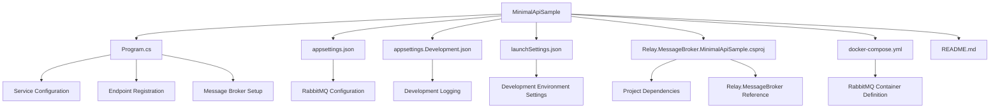
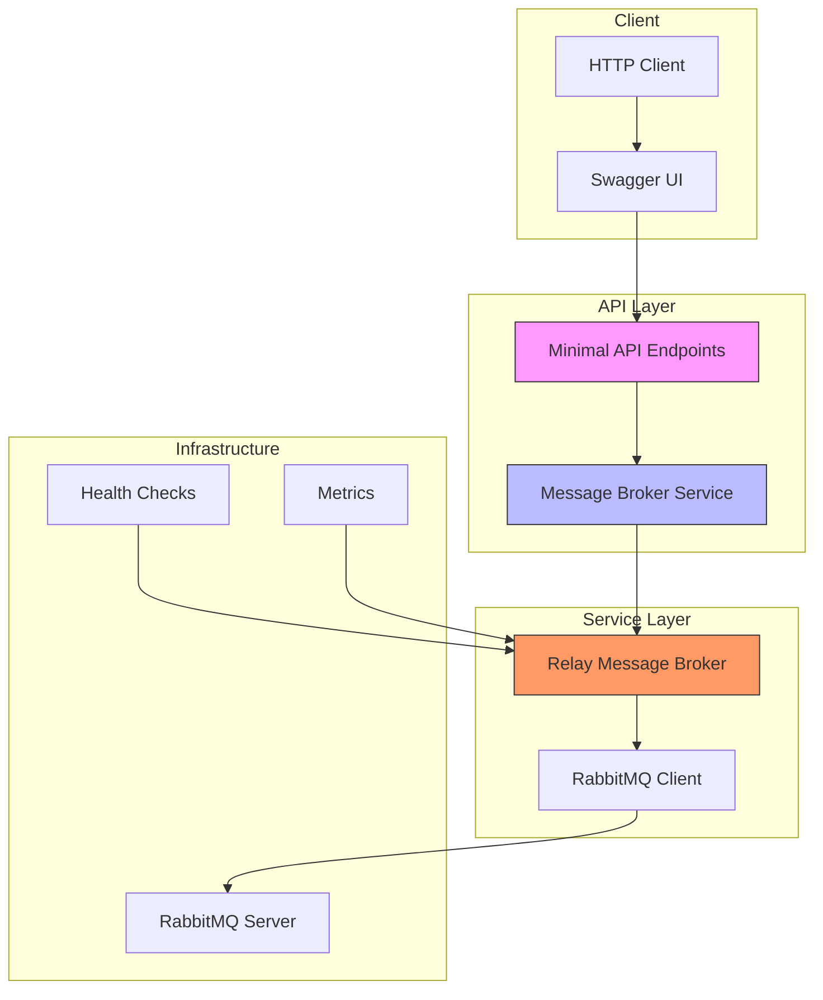
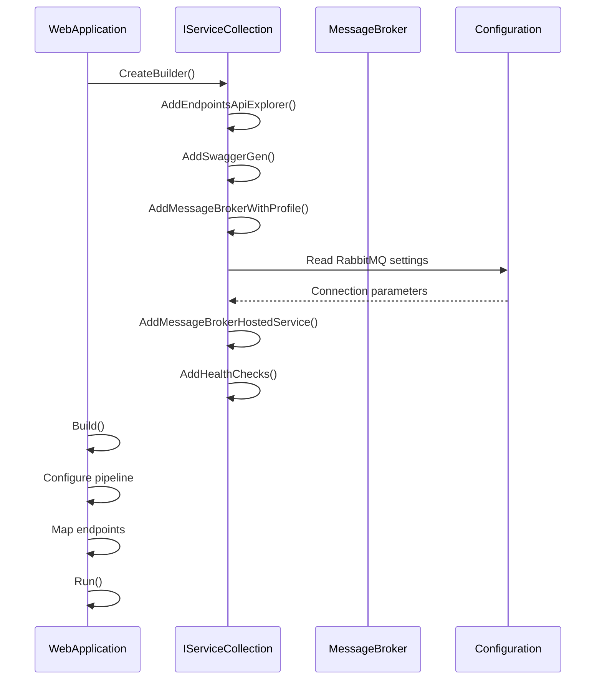
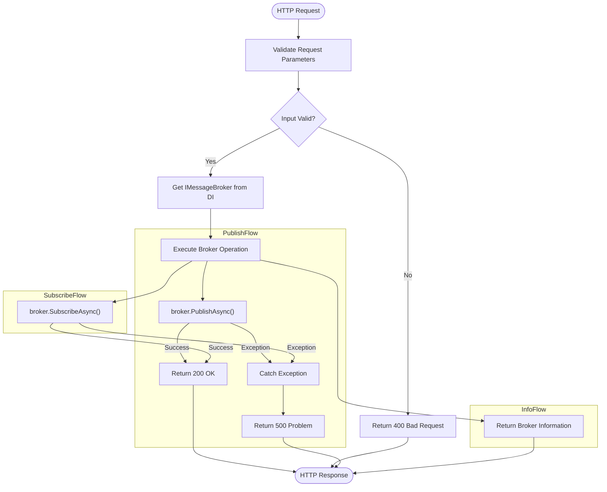
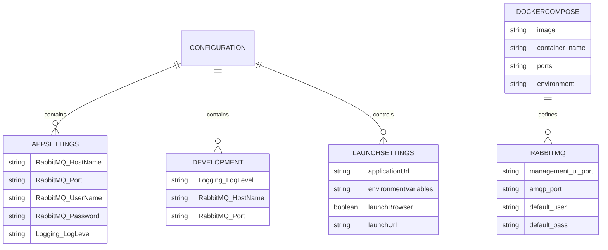
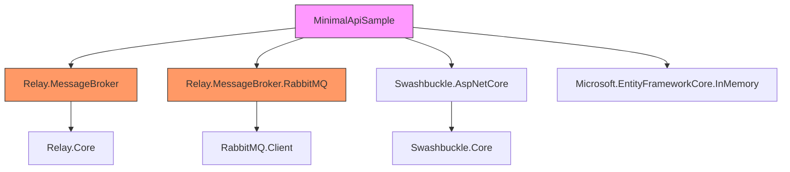

# Minimal API Sample

<cite>
**Referenced Files in This Document**   
- [Program.cs](file://samples/MinimalApiSample/Program.cs)
- [README.md](file://samples/MinimalApiSample/README.md)
- [Relay.MessageBroker.MinimalApiSample.csproj](file://samples/MinimalApiSample/Relay.MessageBroker.MinimalApiSample.csproj)
- [appsettings.json](file://samples/MinimalApiSample/appsettings.json)
- [docker-compose.yml](file://samples/MinimalApiSample/docker-compose.yml)
- [launchSettings.json](file://samples/MinimalApiSample/Properties/launchSettings.json)
</cite>

## Table of Contents
1. [Introduction](#introduction)
2. [Project Structure](#project-structure)
3. [Core Components](#core-components)
4. [Architecture Overview](#architecture-overview)
5. [Detailed Component Analysis](#detailed-component-analysis)
6. [Dependency Analysis](#dependency-analysis)
7. [Performance Considerations](#performance-considerations)
8. [Troubleshooting Guide](#troubleshooting-guide)
9. [Conclusion](#conclusion)

## Introduction
The Minimal API Sample demonstrates how to integrate Relay with ASP.NET Core Minimal APIs, showcasing a clean and efficient approach to building message-driven applications. This sample focuses on simplicity, performance, and developer experience by leveraging the Minimal API pattern with Relay's message broker capabilities. The implementation highlights how to configure, register, and use message brokers with minimal code while maintaining robust functionality for production scenarios.

The sample uses RabbitMQ as the message broker and includes comprehensive features such as health checks, Swagger documentation, connection pooling, and metrics. It serves as a practical example of how to set up a lightweight yet powerful message processing system using modern .NET patterns and Relay's extensive feature set.

## Project Structure
The Minimal API Sample follows a straightforward structure optimized for clarity and ease of use. The project is organized with essential configuration files, source code, and operational scripts that work together to create a complete message broker integration example.

**Diagram sources**
- [Program.cs](file://samples/MinimalApiSample/Program.cs#L1-L130)
- [appsettings.json](file://samples/MinimalApiSample/appsettings.json#L1-L17)
- [docker-compose.yml](file://samples/MinimalApiSample/docker-compose.yml#L1-L24)

**Section sources**
- [Program.cs](file://samples/MinimalApiSample/Program.cs#L1-L130)
- [Relay.MessageBroker.MinimalApiSample.csproj](file://samples/MinimalApiSample/Relay.MessageBroker.MinimalApiSample.csproj#L1-L19)

## Core Components
The Minimal API Sample consists of several core components that work together to provide a complete message broker integration. The main components include the Program.cs file which contains all the configuration and endpoint registration, configuration files for different environments, and infrastructure components for message broker connectivity.

The implementation leverages ASP.NET Core Minimal APIs to create a concise and readable codebase that focuses on essential functionality. Key components include service registration for the message broker, endpoint definitions for publishing and subscribing to messages, health check integration, and Swagger documentation setup.

The sample demonstrates how to use Relay's profile-based configuration system, allowing developers to quickly set up different operational modes (Development, Production, HighThroughput) with appropriate feature sets and performance characteristics.

**Section sources**
- [Program.cs](file://samples/MinimalApiSample/Program.cs#L1-L130)
- [appsettings.json](file://samples/MinimalApiSample/appsettings.json#L1-L17)
- [launchSettings.json](file://samples/MinimalApiSample/Properties/launchSettings.json#L1-L26)

## Architecture Overview
The Minimal API Sample implements a clean architecture that integrates Relay's message broker capabilities with ASP.NET Core's Minimal API pattern. The architecture follows a layered approach with clear separation between configuration, service registration, and endpoint implementation.

**Diagram sources**
- [Program.cs](file://samples/MinimalApiSample/Program.cs#L1-L130)
- [docker-compose.yml](file://samples/MinimalApiSample/docker-compose.yml#L1-L24)

## Detailed Component Analysis

### Message Broker Configuration and Service Registration
The sample demonstrates how to configure and register the Relay message broker service within the ASP.NET Core dependency injection container. The configuration uses a profile-based approach that simplifies setup for different environments.

**Diagram sources**
- [Program.cs](file://samples/MinimalApiSample/Program.cs#L1-L130)
- [appsettings.json](file://samples/MinimalApiSample/appsettings.json#L1-L17)

**Section sources**
- [Program.cs](file://samples/MinimalApiSample/Program.cs#L1-L130)

### Endpoint Implementation and Request Handling
The sample implements several endpoints that demonstrate different aspects of message broker interaction. These include publishing messages, subscribing to message streams, and retrieving broker information.

**Diagram sources**
- [Program.cs](file://samples/MinimalApiSample/Program.cs#L50-L123)

### Configuration Management and Environment Settings
The sample demonstrates a comprehensive configuration management approach using multiple configuration sources and environment-specific settings.

**Diagram sources**
- [appsettings.json](file://samples/MinimalApiSample/appsettings.json#L1-L17)
- [appsettings.Development.json](file://samples/MinimalApiSample/appsettings.Development.json#L1-L16)
- [launchSettings.json](file://samples/MinimalApiSample/Properties/launchSettings.json#L1-L26)
- [docker-compose.yml](file://samples/MinimalApiSample/docker-compose.yml#L1-L24)

## Dependency Analysis
The Minimal API Sample has a focused set of dependencies that enable message broker functionality while maintaining a lightweight footprint. The dependency structure is designed to provide essential capabilities without unnecessary complexity.

**Diagram sources**
- [Relay.MessageBroker.MinimalApiSample.csproj](file://samples/MinimalApiSample/Relay.MessageBroker.MinimalApiSample.csproj#L1-L19)

## Performance Considerations
The Minimal API Sample is designed with performance in mind, leveraging Relay's optimization features and ASP.NET Core's efficient execution model. The implementation benefits from several performance-enhancing patterns:

- **Profile-based configuration**: The use of predefined profiles (Development, Production, HighThroughput) ensures appropriate performance characteristics for different environments
- **Connection pooling**: Built-in connection pooling reduces the overhead of establishing new connections
- **Efficient service registration**: Minimal API pattern reduces startup time and memory usage
- **Asynchronous operations**: All message broker operations use async/await pattern for non-blocking execution
- **Health checks**: Built-in health checks enable monitoring and quick failure detection

The sample also demonstrates how to configure different performance profiles based on the operational requirements, allowing developers to optimize for development convenience or production performance.

## Troubleshooting Guide
The Minimal API Sample includes several features to help diagnose and resolve common issues that may arise during development and deployment.

**Common Issues and Solutions:**

- **RabbitMQ connection problems**: Verify that RabbitMQ is running and accessible at the configured host and port. Check the connection settings in appsettings.json and ensure the credentials are correct.
- **Port conflicts**: If the application fails to start due to port conflicts, modify the applicationUrl in launchSettings.json or use a different port when running the application.
- **Missing dependencies**: Ensure all required NuGet packages are restored by running `dotnet restore` before building the application.
- **Configuration issues**: Verify that the configuration files are properly formatted and contain the required settings for the message broker.

The sample includes comprehensive logging configuration that helps identify issues by providing detailed information about message broker operations and application execution.

**Section sources**
- [README.md](file://samples/MinimalApiSample/README.md#L1-L199)
- [Program.cs](file://samples/MinimalApiSample/Program.cs#L1-L130)

## Conclusion
The Minimal API Sample provides a comprehensive demonstration of how to integrate Relay with ASP.NET Core Minimal APIs for message broker functionality. The implementation showcases a clean, efficient, and maintainable approach to building message-driven applications with minimal code complexity.

Key takeaways from this sample include:
- The simplicity of setting up message broker integration using profile-based configuration
- The power of Minimal APIs in creating concise and readable endpoint definitions
- The importance of proper configuration management across different environments
- The benefits of built-in features like health checks, Swagger documentation, and metrics

This sample serves as an excellent starting point for developers looking to implement message broker solutions in their applications, providing a solid foundation that can be extended and customized for specific requirements.