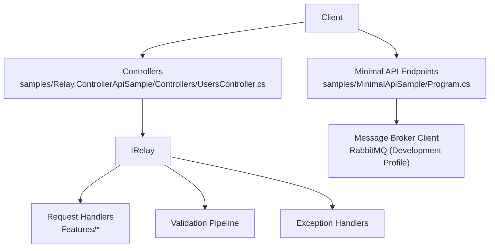
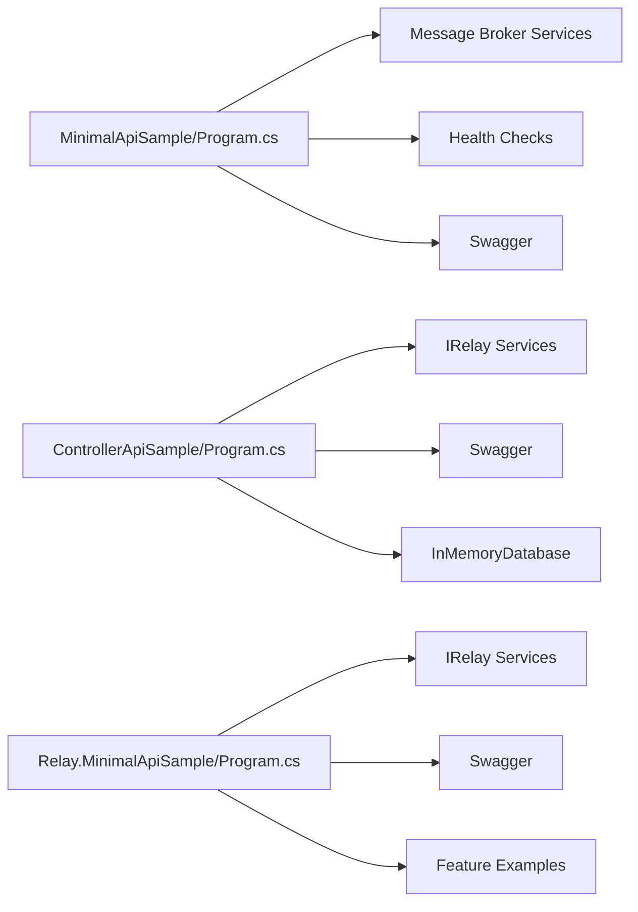

# Samples and Examples

<cite>
**Referenced Files in This Document**
- [MinimalApiSample/Program.cs](file://samples/MinimalApiSample/Program.cs)
- [MinimalApiSample/README.md](file://samples/MinimalApiSample/README.md)
- [MinimalApiSample/appsettings.json](file://samples/MinimalApiSample/appsettings.json)
- [MinimalApiSample/Relay.MessageBroker.MinimalApiSample.csproj](file://samples/MinimalApiSample/Relay.MessageBroker.MinimalApiSample.csproj)
- [Relay.ControllerApiSample/Program.cs](file://samples/Relay.ControllerApiSample/Program.cs)
- [Relay.ControllerApiSample/README.md](file://samples/Relay.ControllerApiSample/README.md)
- [Relay.ControllerApiSample/Controllers/UsersController.cs](file://samples/Relay.ControllerApiSample/Controllers/UsersController.cs)
- [Relay.ControllerApiSample/Features/Users/CreateUser.cs](file://samples/Relay.ControllerApiSample/Features/Users/CreateUser.cs)
- [Relay.ControllerApiSample/Infrastructure/InMemoryDatabase.cs](file://samples/Relay.ControllerApiSample/Infrastructure/InMemoryDatabase.cs)
- [Relay.ControllerApiSample/appsettings.json](file://samples/Relay.ControllerApiSample/appsettings.json)
- [Relay.MinimalApiSample/Program.cs](file://samples/Relay.MinimalApiSample/Program.cs)
- [Relay.MinimalApiSample/README.md](file://samples/Relay.MinimalApiSample/README.md)
- [Relay.Core.Testing.Sample/README.md](file://samples/Relay.Core.Testing.Sample/README.md)
- [Relay.Core.Testing.Sample/UserTests.cs](file://samples/Relay.Core.Testing.Sample/UserTests.cs)
- [Relay.Core.Testing.Sample/ScenarioTests.cs](file://samples/Relay.Core.Testing.Sample/ScenarioTests.cs)
</cite>

## Table of Contents
1. [Introduction](#introduction)
2. [Project Structure](#project-structure)
3. [Core Components](#core-components)
4. [Architecture Overview](#architecture-overview)
5. [Detailed Component Analysis](#detailed-component-analysis)
6. [Dependency Analysis](#dependency-analysis)
7. [Performance Considerations](#performance-considerations)
8. [Troubleshooting Guide](#troubleshooting-guide)
9. [Conclusion](#conclusion)
10. [Appendices](#appendices)

## Introduction
This section presents three distinct samples that demonstrate how to integrate the Relay framework across different ASP.NET Core hosting styles and testing strategies:
- Minimal API Sample: Shows integration with ASP.NET Core Minimal APIs and a message broker client.
- Controller API Sample: Demonstrates traditional MVC controllers with Relay’s request/response handlers and validation.
- Advanced Testing Sample: Illustrates comprehensive testing patterns using the Relay.Core.Testing framework.

Each sample highlights best practices, configuration choices, and practical guidance for running, modifying, and extending the examples.

## Project Structure
The samples are organized as separate projects under the samples directory, each with its own Program.cs, appsettings.json, and feature-specific folders. The Minimal API sample integrates a message broker client, while the Controller sample focuses on classic MVC patterns. The testing sample provides a comprehensive set of unit and scenario tests.

```mermaid
graph TB
subgraph "Minimal API Sample"
MAS_Program["samples/MinimalApiSample/Program.cs"]
MAS_Readme["samples/MinimalApiSample/README.md"]
MAS_AppSettings["samples/MinimalApiSample/appsettings.json"]
MAS_Project["samples/MinimalApiSample/Relay.MessageBroker.MinimalApiSample.csproj"]
end
subgraph "Controller API Sample"
CAS_Program["samples/Relay.ControllerApiSample/Program.cs"]
CAS_Readme["samples/Relay.ControllerApiSample/README.md"]
CAS_UsersController["samples/Relay.ControllerApiSample/Controllers/UsersController.cs"]
CAS_CreateUser["samples/Relay.ControllerApiSample/Features/Users/CreateUser.cs"]
CAS_InMemDB["samples/Relay.ControllerApiSample/Infrastructure/InMemoryDatabase.cs"]
CAS_AppSettings["samples/Relay.ControllerApiSample/appsettings.json"]
end
subgraph "Minimal API Sample (Relay.MinimalApiSample)"
RMS_Program["samples/Relay.MinimalApiSample/Program.cs"]
RMS_Readme["samples/Relay.MinimalApiSample/README.md"]
end
subgraph "Testing Sample"
TST_Readme["samples/Relay.Core.Testing.Sample/README.md"]
TST_UserTests["samples/Relay.Core.Testing.Sample/UserTests.cs"]
TST_ScenarioTests["samples/Relay.Core.Testing.Sample/ScenarioTests.cs"]
end
MAS_Program --> MAS_AppSettings
CAS_Program --> CAS_AppSettings
CAS_UsersController --> CAS_CreateUser
CAS_UsersController --> CAS_InMemDB
RMS_Program --> RMS_Readme
TST_UserTests --> TST_Readme
TST_ScenarioTests --> TST_Readme
```

**Diagram sources**
- [MinimalApiSample/Program.cs](file://samples/MinimalApiSample/Program.cs#L1-L130)
- [MinimalApiSample/README.md](file://samples/MinimalApiSample/README.md#L1-L199)
- [MinimalApiSample/appsettings.json](file://samples/MinimalApiSample/appsettings.json#L1-L17)
- [MinimalApiSample/Relay.MessageBroker.MinimalApiSample.csproj](file://samples/MinimalApiSample/Relay.MessageBroker.MinimalApiSample.csproj#L1-L19)
- [Relay.ControllerApiSample/Program.cs](file://samples/Relay.ControllerApiSample/Program.cs#L1-L47)
- [Relay.ControllerApiSample/README.md](file://samples/Relay.ControllerApiSample/README.md#L1-L424)
- [Relay.ControllerApiSample/Controllers/UsersController.cs](file://samples/Relay.ControllerApiSample/Controllers/UsersController.cs#L1-L88)
- [Relay.ControllerApiSample/Features/Users/CreateUser.cs](file://samples/Relay.ControllerApiSample/Features/Users/CreateUser.cs#L1-L10)
- [Relay.ControllerApiSample/Infrastructure/InMemoryDatabase.cs](file://samples/Relay.ControllerApiSample/Infrastructure/InMemoryDatabase.cs#L1-L71)
- [Relay.ControllerApiSample/appsettings.json](file://samples/Relay.ControllerApiSample/appsettings.json#L1-L15)
- [Relay.MinimalApiSample/Program.cs](file://samples/Relay.MinimalApiSample/Program.cs#L1-L341)
- [Relay.MinimalApiSample/README.md](file://samples/Relay.MinimalApiSample/README.md#L1-L404)
- [Relay.Core.Testing.Sample/README.md](file://samples/Relay.Core.Testing.Sample/README.md#L1-L179)
- [Relay.Core.Testing.Sample/UserTests.cs](file://samples/Relay.Core.Testing.Sample/UserTests.cs#L1-L254)
- [Relay.Core.Testing.Sample/ScenarioTests.cs](file://samples/Relay.Core.Testing.Sample/ScenarioTests.cs#L1-L207)

**Section sources**
- [MinimalApiSample/Program.cs](file://samples/MinimalApiSample/Program.cs#L1-L130)
- [Relay.ControllerApiSample/Program.cs](file://samples/Relay.ControllerApiSample/Program.cs#L1-L47)
- [Relay.MinimalApiSample/Program.cs](file://samples/Relay.MinimalApiSample/Program.cs#L1-L341)
- [Relay.Core.Testing.Sample/README.md](file://samples/Relay.Core.Testing.Sample/README.md#L1-L179)

## Core Components
- Minimal API Sample
  - Registers endpoints for publishing and subscribing to messages via a message broker client.
  - Configures health checks and Swagger/OpenAPI documentation.
  - Uses RabbitMQ with development profile settings.
  - Provides simple request/response models for publish/subscribe operations.

- Controller API Sample
  - Uses controllers to dispatch requests to handlers via IRelay.
  - Demonstrates request/response DTOs and handler implementations.
  - Integrates validation, pre/post processors, and exception handlers.
  - Uses an in-memory database for demo data.

- Advanced Testing Sample
  - Demonstrates unit tests, scenario-based tests, error handling, and performance validation.
  - Uses Relay.Core.Testing base classes and helpers to orchestrate tests.
  - Shows mocking and verification patterns for dependencies.

**Section sources**
- [MinimalApiSample/Program.cs](file://samples/MinimalApiSample/Program.cs#L1-L130)
- [MinimalApiSample/README.md](file://samples/MinimalApiSample/README.md#L1-L199)
- [Relay.ControllerApiSample/Program.cs](file://samples/Relay.ControllerApiSample/Program.cs#L1-L47)
- [Relay.ControllerApiSample/Controllers/UsersController.cs](file://samples/Relay.ControllerApiSample/Controllers/UsersController.cs#L1-L88)
- [Relay.ControllerApiSample/Features/Users/CreateUser.cs](file://samples/Relay.ControllerApiSample/Features/Users/CreateUser.cs#L1-L10)
- [Relay.ControllerApiSample/Infrastructure/InMemoryDatabase.cs](file://samples/Relay.ControllerApiSample/Infrastructure/InMemoryDatabase.cs#L1-L71)
- [Relay.Core.Testing.Sample/UserTests.cs](file://samples/Relay.Core.Testing.Sample/UserTests.cs#L1-L254)
- [Relay.Core.Testing.Sample/ScenarioTests.cs](file://samples/Relay.Core.Testing.Sample/ScenarioTests.cs#L1-L207)

## Architecture Overview
The samples showcase two complementary hosting approaches:
- Minimal API: Functional endpoints that directly call IRelay or a message broker client.
- MVC Controllers: Controllers delegate to IRelay, separating HTTP concerns from business logic.

**Diagram sources**
- [MinimalApiSample/Program.cs](file://samples/MinimalApiSample/Program.cs#L1-L130)
- [Relay.ControllerApiSample/Controllers/UsersController.cs](file://samples/Relay.ControllerApiSample/Controllers/UsersController.cs#L1-L88)
- [Relay.ControllerApiSample/Program.cs](file://samples/Relay.ControllerApiSample/Program.cs#L1-L47)

## Detailed Component Analysis

### Minimal API Sample Walkthrough
- Purpose
  - Demonstrates integration with ASP.NET Core Minimal APIs and a message broker client.
  - Provides endpoints to publish and subscribe to messages, health checks, and Swagger documentation.

- Key Components
  - Endpoint registration for publishing and subscribing to messages.
  - Health check endpoint mapped at /health.
  - Swagger/OpenAPI enabled for API documentation.
  - RabbitMQ configuration via development profile with configurable connection settings.

- Implementation Details
  - Message publishing uses a publish operation with exchange and routing key options.
  - Subscription registers a consumer callback with logging and cancellation support.
  - Broker info endpoint returns broker type, profile, and supported features.

- Configuration Choices and Rationale
  - Development profile selected for quick start and local development.
  - RabbitMQ settings loaded from appsettings.json for host, port, credentials, and virtual host.
  - Health checks and metrics included for observability.

- Running and Modifying
  - Start RabbitMQ locally using Docker.
  - Run the Minimal API sample and open Swagger UI.
  - Modify RabbitMQ settings in appsettings.json to target different environments.
  - Extend endpoints by adding new routes and handlers.

- Best Practices
  - Keep endpoints thin; delegate business logic to handlers.
  - Use structured logging for message consumption.
  - Centralize configuration in appsettings.json for environment-specific values.

- Common Questions and Issues
  - RabbitMQ connectivity failures: verify container is running and credentials are correct.
  - Port conflicts: change URLs or ports in launch settings.
  - CORS: enable CORS middleware if calling from browsers.

- Extending the Sample
  - Add authentication and authorization.
  - Integrate persistence (e.g., Entity Framework).
  - Add caching and telemetry.
  - Introduce message broker features (inbox/outbox, deduplication, backpressure).

**Section sources**
- [MinimalApiSample/Program.cs](file://samples/MinimalApiSample/Program.cs#L1-L130)
- [MinimalApiSample/README.md](file://samples/MinimalApiSample/README.md#L1-L199)
- [MinimalApiSample/appsettings.json](file://samples/MinimalApiSample/appsettings.json#L1-L17)
- [MinimalApiSample/Relay.MessageBroker.MinimalApiSample.csproj](file://samples/MinimalApiSample/Relay.MessageBroker.MinimalApiSample.csproj#L1-L19)

### Controller API Sample Walkthrough
- Purpose
  - Demonstrates traditional MVC controllers integrated with Relay’s request/response handlers.
  - Highlights validation, logging, and clean architecture with feature-based organization.

- Key Components
  - Controllers (UsersController) dispatch requests to handlers via IRelay.
  - Feature folders define request/response DTOs and handlers.
  - In-memory database seeded with sample data for demonstration.

- Implementation Details
  - Controllers accept requests and return appropriate HTTP responses.
  - Handlers implement IRequestHandler<TRequest, TResponse>.
  - Validation rules implement IValidationRule<T>.
  - Swagger/OpenAPI documentation is enabled.

- Configuration Choices and Rationale
  - Relay services registered with validation, pre/post processors, and exception handlers.
  - Logging level configured for Relay to aid debugging.
  - In-memory database registered as a singleton for demo simplicity.

- Running and Modifying
  - Restore and run the project; open Swagger UI.
  - Add new controllers and features following the existing pattern.
  - Replace in-memory database with persistent storage for production.

- Best Practices
  - Keep controllers thin; rely on IRelay for dispatching.
  - Separate DTOs from domain models.
  - Use validation rules to enforce business constraints.

- Common Questions and Issues
  - Missing handlers: ensure source generator is enabled and handlers implement the correct interfaces.
  - Validation errors: inspect validator outputs and adjust rules accordingly.
  - Handler not found: confirm handler registration and namespace conventions.

- Extending the Sample
  - Add authentication and authorization attributes.
  - Integrate persistence with Entity Framework or Dapper.
  - Add caching and distributed tracing.
  - Introduce message broker integration for asynchronous workflows.

**Section sources**
- [Relay.ControllerApiSample/Program.cs](file://samples/Relay.ControllerApiSample/Program.cs#L1-L47)
- [Relay.ControllerApiSample/README.md](file://samples/Relay.ControllerApiSample/README.md#L1-L424)
- [Relay.ControllerApiSample/Controllers/UsersController.cs](file://samples/Relay.ControllerApiSample/Controllers/UsersController.cs#L1-L88)
- [Relay.ControllerApiSample/Features/Users/CreateUser.cs](file://samples/Relay.ControllerApiSample/Features/Users/CreateUser.cs#L1-L10)
- [Relay.ControllerApiSample/Infrastructure/InMemoryDatabase.cs](file://samples/Relay.ControllerApiSample/Infrastructure/InMemoryDatabase.cs#L1-L71)
- [Relay.ControllerApiSample/appsettings.json](file://samples/Relay.ControllerApiSample/appsettings.json#L1-L15)

### Advanced Testing Sample Walkthrough
- Purpose
  - Demonstrates comprehensive testing strategies for Relay-based applications using Relay.Core.Testing.
  - Covers unit tests, scenario-based tests, error handling, and performance validation.

- Key Components
  - UserTests: Basic CRUD operations with mocking and verification.
  - ScenarioTests: Complex workflows orchestrated via scenario builders.
  - Test fixtures and helpers for DI and assertions.

- Implementation Details
  - Unit tests use mocks for repositories and services; verify interactions and outcomes.
  - Scenario tests register services and handlers, then execute multi-step workflows.
  - Error handling tests simulate exceptions and assert expected behavior.
  - Performance tests validate execution time and throughput.

- Configuration Choices and Rationale
  - Tests leverage RelayTestBase for DI setup and helper methods.
  - Scenarios encapsulate setup, execution, and assertions for readability.
  - Mock verification ensures correct dependency usage.

- Running and Modifying
  - Build and run tests with dotnet test.
  - Filter tests by category or name for targeted execution.
  - Extend scenarios to cover domain-specific workflows.

- Best Practices
  - Keep tests isolated and deterministic.
  - Use scenario templates for complex workflows.
  - Include error and performance assertions alongside success paths.

- Common Questions and Issues
  - Mock setups: ensure all dependencies are registered before test execution.
  - Scenario timeouts: adjust timing expectations for slower environments.
  - Assertion failures: verify mock verifications and expected outcomes.

- Extending the Sample
  - Add domain-specific models and handlers.
  - Create custom scenario classes for reusable workflows.
  - Integrate with CI/CD for automated test runs.

**Section sources**
- [Relay.Core.Testing.Sample/README.md](file://samples/Relay.Core.Testing.Sample/README.md#L1-L179)
- [Relay.Core.Testing.Sample/UserTests.cs](file://samples/Relay.Core.Testing.Sample/UserTests.cs#L1-L254)
- [Relay.Core.Testing.Sample/ScenarioTests.cs](file://samples/Relay.Core.Testing.Sample/ScenarioTests.cs#L1-L207)

## Dependency Analysis
The samples illustrate different dependency injection patterns and service registrations:
- Minimal API Sample
  - Adds message broker services with a development profile.
  - Registers hosted service for message broker lifecycle.
  - Enables health checks and Swagger.

- Controller API Sample
  - Adds controllers and Swagger.
  - Registers in-memory database and Relay services with validation and exception handling.
  - Maps controllers for routing.

- Minimal API Sample (Relay.MinimalApiSample)
  - Adds endpoints for users and products.
  - Registers Relay services and additional pipeline behaviors.
  - Provides feature examples demonstrating validation, caching, notifications, streaming, transactions, and AI optimization.

**Diagram sources**
- [MinimalApiSample/Program.cs](file://samples/MinimalApiSample/Program.cs#L1-L130)
- [Relay.ControllerApiSample/Program.cs](file://samples/Relay.ControllerApiSample/Program.cs#L1-L47)
- [Relay.MinimalApiSample/Program.cs](file://samples/Relay.MinimalApiSample/Program.cs#L1-L341)

**Section sources**
- [MinimalApiSample/Program.cs](file://samples/MinimalApiSample/Program.cs#L1-L130)
- [Relay.ControllerApiSample/Program.cs](file://samples/Relay.ControllerApiSample/Program.cs#L1-L47)
- [Relay.MinimalApiSample/Program.cs](file://samples/Relay.MinimalApiSample/Program.cs#L1-L341)

## Performance Considerations
- Minimal API Sample
  - Development profile enables connection pooling and metrics for observability.
  - Health checks help monitor service availability.

- Controller API Sample
  - Logging levels configured for Relay to track request timings and errors.
  - Consider enabling caching and telemetry for improved performance insights.

- Minimal API Sample (Relay.MinimalApiSample)
  - Feature examples demonstrate caching, streaming, and transactional operations that impact performance.
  - Use metrics and telemetry to identify bottlenecks.

[No sources needed since this section provides general guidance]

## Troubleshooting Guide
- Minimal API Sample
  - RabbitMQ connectivity: verify container status and logs; ensure correct host/port/credentials.
  - Port conflicts: change URLs or ports in launch settings.
  - Health check failures: review logs and broker configuration.

- Controller API Sample
  - Handler not found: confirm source generator is enabled and handlers implement IRequestHandler.
  - Validation errors: adjust validator rules and ensure DTOs match request contracts.
  - Controller routing: verify route attributes and action signatures.

- Advanced Testing Sample
  - Mock failures: ensure all dependencies are registered before test execution.
  - Scenario timeouts: adjust timing expectations for slower environments.
  - Assertion failures: verify mock verifications and expected outcomes.

**Section sources**
- [MinimalApiSample/README.md](file://samples/MinimalApiSample/README.md#L160-L199)
- [Relay.ControllerApiSample/README.md](file://samples/Relay.ControllerApiSample/README.md#L342-L424)
- [Relay.Core.Testing.Sample/README.md](file://samples/Relay.Core.Testing.Sample/README.md#L99-L179)

## Conclusion
These samples provide practical, production-ready patterns for integrating the Relay framework:
- Minimal API Sample shows a streamlined approach with message broker integration and health checks.
- Controller API Sample demonstrates traditional MVC with clean separation of concerns and validation.
- Advanced Testing Sample offers comprehensive testing strategies for reliability and maintainability.

By following the best practices and configuration choices outlined here, you can adapt these samples to your specific requirements and scale them effectively.

[No sources needed since this section summarizes without analyzing specific files]

## Appendices
- Minimal API Sample
  - RabbitMQ setup and configuration.
  - API endpoints for publishing, subscribing, and health checks.
  - Profiles and fluent configuration options.

- Controller API Sample
  - Project structure and feature-based organization.
  - Controller integration with IRelay and validation pipeline.
  - Swagger documentation and in-memory database.

- Advanced Testing Sample
  - Unit tests with mocking and verification.
  - Scenario-based tests for complex workflows.
  - Error handling and performance validation patterns.

**Section sources**
- [MinimalApiSample/README.md](file://samples/MinimalApiSample/README.md#L1-L199)
- [Relay.ControllerApiSample/README.md](file://samples/Relay.ControllerApiSample/README.md#L1-L424)
- [Relay.MinimalApiSample/README.md](file://samples/Relay.MinimalApiSample/README.md#L1-L404)
- [Relay.Core.Testing.Sample/README.md](file://samples/Relay.Core.Testing.Sample/README.md#L1-L179)