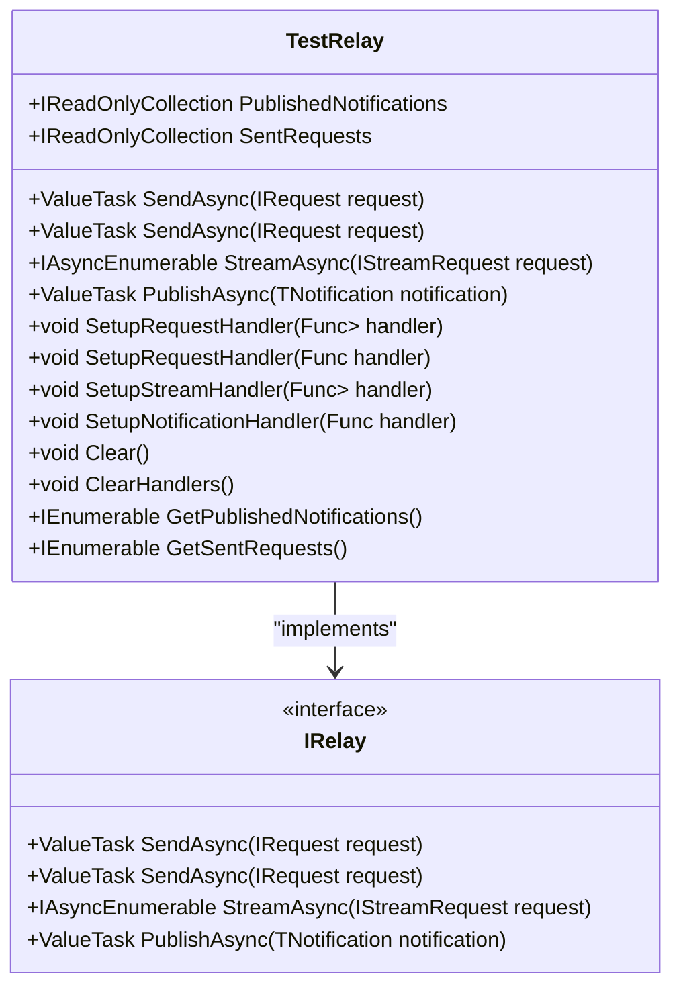
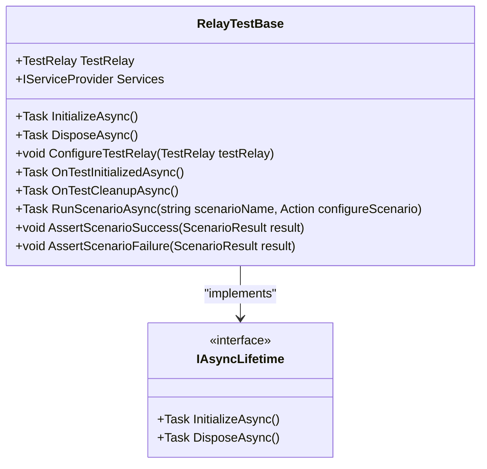
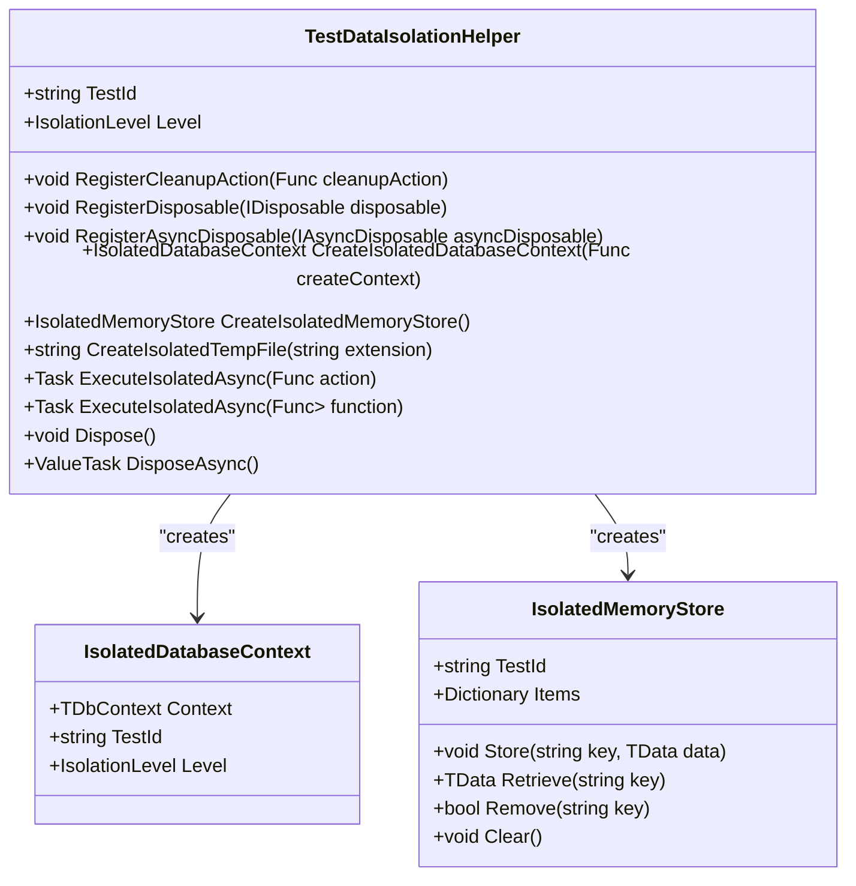
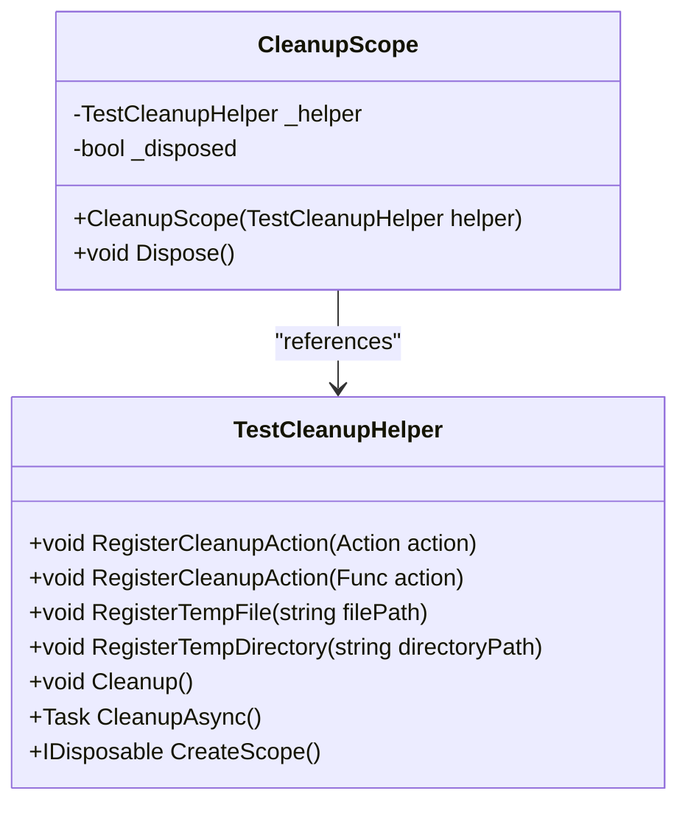
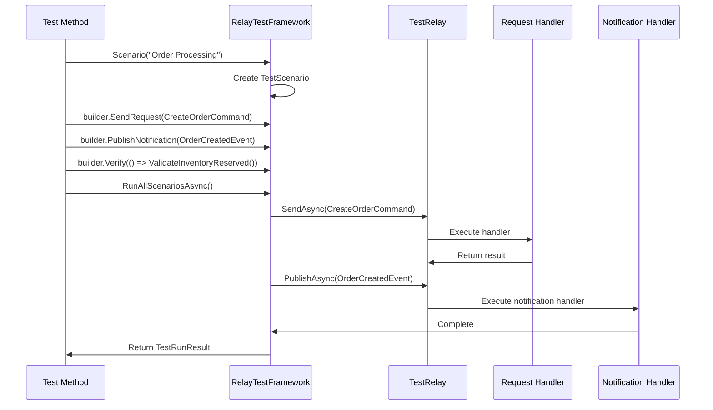
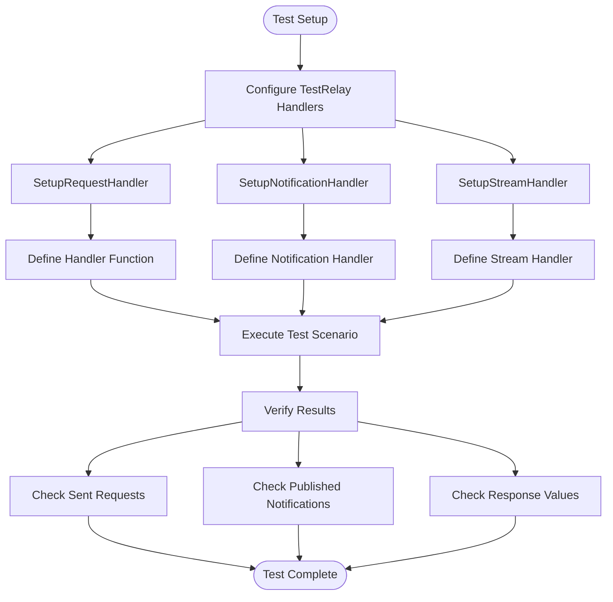

# Integration Testing

<cite>
**Referenced Files in This Document**   
- [TestRelay.cs](file://src/Relay.Core.Testing/Core/TestRelay.cs)
- [RelayTestBase.cs](file://src/Relay.Core.Testing/Core/RelayTestBase.cs)
- [RelayTestFramework.cs](file://src/Relay.Core.Testing/Core/RelayTestFramework.cs)
- [TestDataIsolationHelper.cs](file://src/Relay.Core.Testing/Helpers/TestDataIsolationHelper.cs)
- [CleanupScope.cs](file://src/Relay.Core.Testing/Helpers/CleanupScope.cs)
- [FullPipelineIntegrationTests.cs](file://tests/Relay.Core.Tests/Integration/FullPipelineIntegrationTests.cs)
- [RelayTestHarness.cs](file://tests/Relay.Core.Testing.Tests/Core/RelayTestHarness.cs)
</cite>

## Table of Contents
1. [Introduction](#introduction)
2. [TestRelay Service](#testrelay-service)
3. [Test Fixtures and Lifecycle Management](#test-fixtures-and-lifecycle-management)
4. [Data Isolation Mechanisms](#data-isolation-mechanisms)
5. [Testing Complex Interactions](#testing-complex-interactions)
6. [Handler Verification and Service Provider Customization](#handler-verification-and-service-provider-customization)
7. [Test Environment Configuration](#test-environment-configuration)
8. [Common Issues and Solutions](#common-issues-and-solutions)
9. [Conclusion](#conclusion)

## Introduction

The Relay framework provides a comprehensive integration testing infrastructure designed to validate end-to-end functionality of request flows, notification publishing, and pipeline behavior execution. This testing framework enables developers to verify complex interactions between handlers, pipelines, and external dependencies in a controlled environment. The core components include the TestRelay service for full pipeline execution, test fixtures for lifecycle management, and robust data isolation mechanisms to prevent test data contamination. This document details the implementation and usage of these capabilities, providing guidance for both beginners and experienced developers.

## TestRelay Service

The TestRelay service is a test-specific implementation of the IRelay interface that enables full pipeline execution during integration tests. It captures and records all requests, responses, and notifications, allowing for comprehensive verification of system behavior.

**Diagram sources**
- [TestRelay.cs](file://src/Relay.Core.Testing/Core/TestRelay.cs#L16-L234)

**Section sources**
- [TestRelay.cs](file://src/Relay.Core.Testing/Core/TestRelay.cs#L16-L234)
- [FullPipelineIntegrationTests.cs](file://tests/Relay.Core.Tests/Integration/FullPipelineIntegrationTests.cs#L19-L39)

## Test Fixtures and Lifecycle Management

The Relay testing framework provides several base classes and utilities for managing test lifecycle and fixture setup. The RelayTestBase class serves as the foundation for xUnit-based tests, implementing IAsyncLifetime to ensure proper initialization and cleanup.

The RelayTestFramework provides advanced testing capabilities including scenario-based testing and load testing. It coordinates the execution of multiple test scenarios and collects comprehensive results.

**Diagram sources**
- [RelayTestBase.cs](file://src/Relay.Core.Testing/Core/RelayTestBase.cs#L11-L178)
- [RelayTestFramework.cs](file://src/Relay.Core.Testing/Core/RelayTestFramework.cs#L18-L327)

**Section sources**
- [RelayTestBase.cs](file://src/Relay.Core.Testing/Core/RelayTestBase.cs#L11-L178)
- [RelayTestFramework.cs](file://src/Relay.Core.Testing/Core/RelayTestFramework.cs#L18-L327)

## Data Isolation Mechanisms

The Relay framework includes robust data isolation mechanisms to prevent test data contamination across test runs. The TestDataIsolationHelper class provides utilities for managing isolated test data contexts and ensuring proper cleanup.

The CleanupScope class works in conjunction with the TestCleanupHelper to ensure that cleanup actions are executed when the scope is disposed, preventing resource leaks.

**Diagram sources**
- [TestDataIsolationHelper.cs](file://src/Relay.Core.Testing/Helpers/TestDataIsolationHelper.cs#L13-L197)
- [CleanupScope.cs](file://src/Relay.Core.Testing/Helpers/CleanupScope.cs#L8-L26)

**Section sources**
- [TestDataIsolationHelper.cs](file://src/Relay.Core.Testing/Helpers/TestDataIsolationHelper.cs#L13-L197)
- [CleanupScope.cs](file://src/Relay.Core.Testing/Helpers/CleanupScope.cs#L8-L26)

## Testing Complex Interactions

The Relay framework enables testing of complex interactions between handlers, pipelines, and external dependencies through its scenario-based testing approach. The TestScenarioBuilder allows for the creation of multi-step test scenarios that simulate real-world usage patterns.

This approach allows for end-to-end testing of request flows, including validation of intermediate states and side effects. The framework captures all published notifications and sent requests, enabling verification of system behavior at each step.

**Diagram sources**
- [RelayTestFramework.cs](file://src/Relay.Core.Testing/Core/RelayTestFramework.cs#L18-L327)
- [TestRelay.cs](file://src/Relay.Core.Testing/Core/TestRelay.cs#L16-L234)

**Section sources**
- [RelayTestFramework.cs](file://src/Relay.Core.Testing/Core/RelayTestFramework.cs#L18-L327)
- [TestRelay.cs](file://src/Relay.Core.Testing/Core/TestRelay.cs#L16-L234)

## Handler Verification and Service Provider Customization

The Relay testing framework provides extensive capabilities for handler verification and service provider customization. The TestRelay class allows for the setup of custom handlers for specific request and notification types, enabling targeted testing of individual components.

The framework also provides assertion methods to verify that specific handlers were called and that notifications were published as expected. This enables comprehensive verification of system behavior.

**Diagram sources**
- [TestRelay.cs](file://src/Relay.Core.Testing/Core/TestRelay.cs#L16-L234)
- [RelayTestBase.cs](file://src/Relay.Core.Testing/Core/RelayTestBase.cs#L11-L178)

**Section sources**
- [TestRelay.cs](file://src/Relay.Core.Testing/Core/TestRelay.cs#L16-L234)
- [RelayTestBase.cs](file://src/Relay.Core.Testing/Core/RelayTestBase.cs#L11-L178)

## Test Environment Configuration

The Relay testing framework integrates with the configuration system to allow for customized test environments. The TestRelayOptions class provides configuration options for the test relay, including behavior customization and diagnostic settings.

The RelayTestBase class provides extension points for customizing the test environment through the ConfigureTestRelay method, which can be overridden in derived classes to set up specific test configurations. This allows for scenario-specific configuration while maintaining a consistent testing interface.

The framework also supports dependency injection through the IServiceProvider interface, enabling the injection of mock services and test-specific implementations. This facilitates testing of components with external dependencies by allowing for easy substitution of mock implementations.

**Section sources**
- [RelayTestBase.cs](file://src/Relay.Core.Testing/Core/RelayTestBase.cs#L11-L178)
- [TestRelay.cs](file://src/Relay.Core.Testing/Core/TestRelay.cs#L16-L234)

## Common Issues and Solutions

The Relay testing framework addresses several common issues in integration testing, particularly around test data contamination and resource cleanup. The TestDataIsolationHelper and CleanupScope classes provide solutions for these issues through automated cleanup and isolation mechanisms.

One common issue is test data contamination, where tests interfere with each other through shared state. The TestDataIsolationHelper addresses this by providing isolated contexts for database operations, file system operations, and in-memory data stores. Each test receives a unique TestId that is used to isolate its data, preventing interference with other tests.

Another common issue is resource leaks, where temporary files, database connections, or other resources are not properly cleaned up after tests. The CleanupScope and TestCleanupHelper classes address this by automatically executing cleanup actions when a test completes, ensuring that all resources are properly disposed of.

The framework also handles the issue of test ordering dependencies by ensuring that each test runs in an isolated environment with its own data context. This eliminates the need for tests to be run in a specific order and allows for parallel test execution.

**Section sources**
- [TestDataIsolationHelper.cs](file://src/Relay.Core.Testing/Helpers/TestDataIsolationHelper.cs#L13-L197)
- [CleanupScope.cs](file://src/Relay.Core.Testing/Helpers/CleanupScope.cs#L8-L26)

## Conclusion

The Relay framework provides a comprehensive integration testing infrastructure that enables thorough testing of complex interactions between handlers, pipelines, and external dependencies. The TestRelay service allows for full pipeline execution and comprehensive verification of system behavior, while the test fixture and lifecycle management components ensure proper setup and teardown of test environments.

The data isolation mechanisms, including the TestDataIsolationHelper and CleanupScope classes, prevent test data contamination and resource leaks, ensuring reliable and repeatable test results. The scenario-based testing approach enables the creation of complex test scenarios that simulate real-world usage patterns, while the handler verification and service provider customization capabilities allow for targeted testing of individual components.

Together, these features provide a robust foundation for integration testing in the Relay framework, enabling developers to build reliable and maintainable applications with confidence in their correctness.