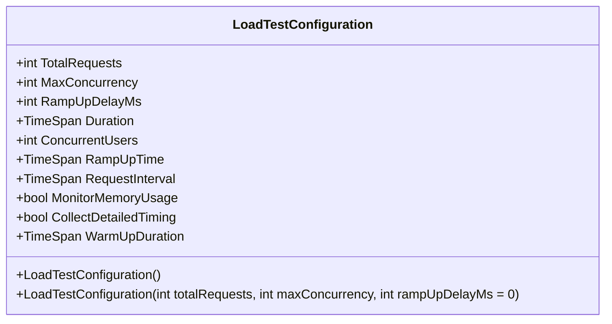
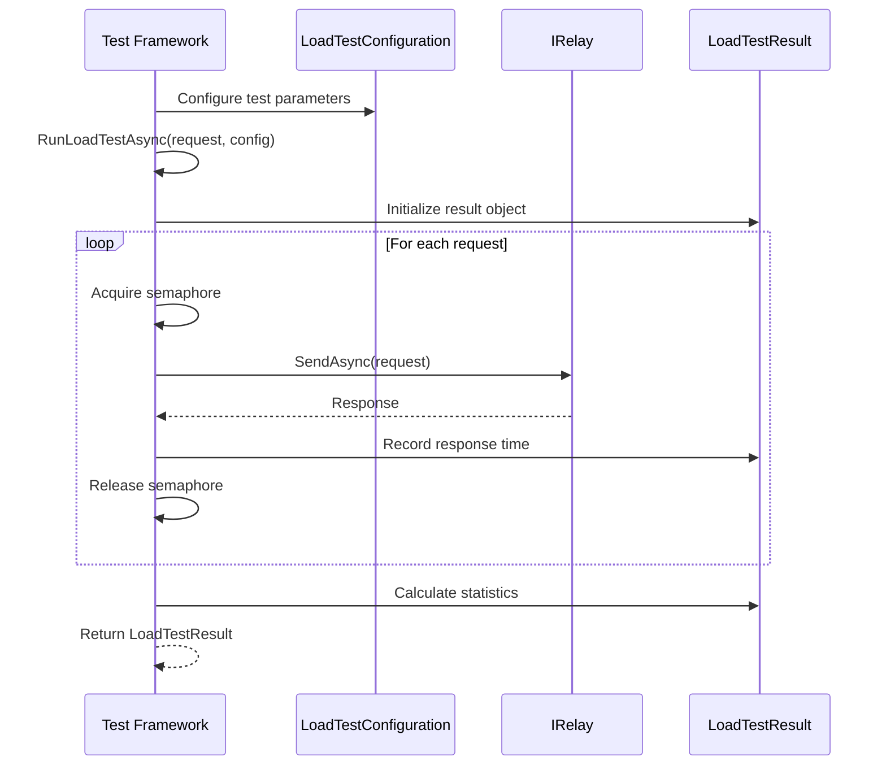
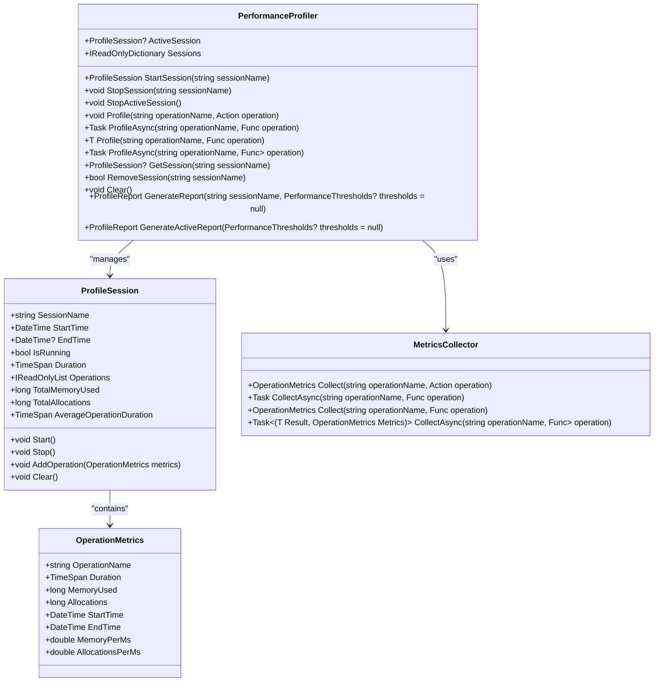
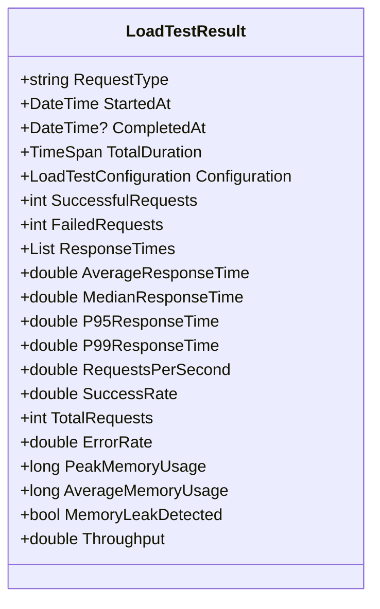
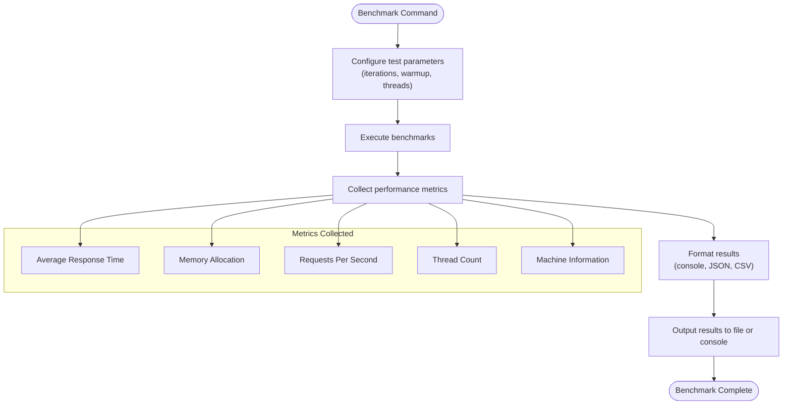
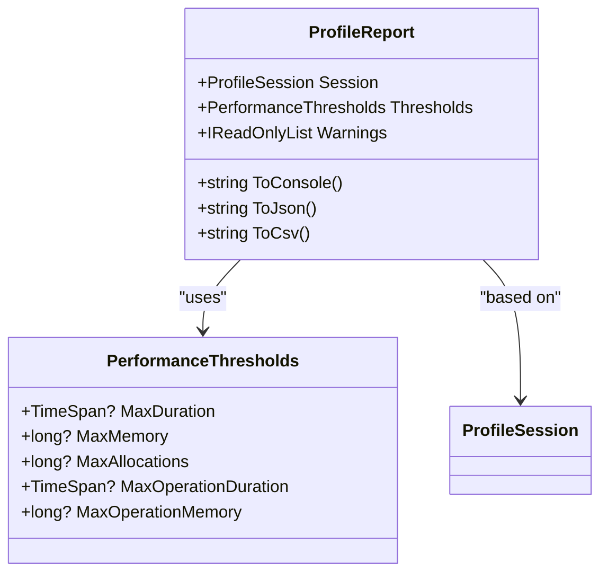

# Load Testing

<cite>
**Referenced Files in This Document**   
- [LoadTestConfiguration.cs](file://src/Relay.Core.Testing/Configuration/LoadTestConfiguration.cs)
- [LoadTestResult.cs](file://src/Relay.Core.Testing/Results/LoadTestResult.cs)
- [RelayTestFramework.cs](file://src/Relay.Core.Testing/Core/RelayTestFramework.cs)
- [PerformanceProfiler.cs](file://src/Relay.Core.Testing/Metrics/PerformanceProfiler.cs)
- [ProfileSession.cs](file://src/Relay.Core.Testing/Metrics/ProfileSession.cs)
- [MetricsCollector.cs](file://src/Relay.Core.Testing/Metrics/MetricsCollector.cs)
- [OperationMetrics.cs](file://src/Relay.Core.Testing/Metrics/OperationMetrics.cs)
- [ProfileReport.cs](file://src/Relay.Core.Testing/Metrics/ProfileReport.cs)
- [RelayXUnitAssertions.cs](file://src/Relay.Core.Testing/Assertions/RelayXUnitAssertions.cs)
- [BenchmarkCommand.cs](file://tools/Relay.CLI/Commands/BenchmarkCommand.cs)
</cite>

## Table of Contents
1. [Introduction](#introduction)
2. [Load Test Configuration](#load-test-configuration)
3. [Executing Load Tests](#executing-load-tests)
4. [Performance Profiling](#performance-profiling)
5. [Result Analysis and Assertions](#result-analysis-and-assertions)
6. [CLI Benchmarking Tools](#cli-benchmarking-tools)
7. [Common Issues and Solutions](#common-issues-and-solutions)
8. [Advanced Topics](#advanced-topics)
9. [Conclusion](#conclusion)

## Introduction

The Relay framework provides comprehensive load testing capabilities designed to help developers identify performance bottlenecks in handler execution and message processing. The load testing system is built around a robust metrics collection infrastructure that captures detailed performance data during test execution. This documentation covers the implementation details of the load testing capabilities, including configuration options, performance profiling tools, and result collection mechanisms.

The load testing framework integrates seamlessly with Relay's core messaging patterns, allowing developers to simulate realistic workloads and measure system performance under various conditions. The framework supports both programmatic load testing through the API and command-line benchmarking through the Relay CLI tools.

**Section sources**
- [LoadTestConfiguration.cs](file://src/Relay.Core.Testing/Configuration/LoadTestConfiguration.cs)
- [LoadTestResult.cs](file://src/Relay.Core.Testing/Results/LoadTestResult.cs)

## Load Test Configuration

The load testing framework provides extensive configuration options through the `LoadTestConfiguration` class, allowing fine-grained control over test parameters. These configuration options enable developers to simulate various load patterns and stress conditions to thoroughly test system performance.

### Core Configuration Parameters

The primary configuration parameters include:

- **TotalRequests**: The total number of requests to execute during the load test (default: 100)
- **MaxConcurrency**: The maximum number of concurrent requests (default: 10)
- **RampUpDelayMs**: Delay between starting concurrent requests during ramp-up (default: 0)
- **Duration**: Total duration of the load test (default: 1 minute)
- **ConcurrentUsers**: Number of concurrent users to simulate (default: 1)
- **RampUpTime**: Time to ramp up to full concurrency (default: 0)
- **RequestInterval**: Interval between requests for each virtual user (default: 1 second)

**Diagram sources**
- [LoadTestConfiguration.cs](file://src/Relay.Core.Testing/Configuration/LoadTestConfiguration.cs)

### Advanced Monitoring Options

The framework also supports advanced monitoring options for comprehensive performance analysis:

- **MonitorMemoryUsage**: Enables memory usage monitoring during the test (default: false)
- **CollectDetailedTiming**: Controls collection of detailed timing metrics (default: true)
- **WarmUpDuration**: Specifies warm-up duration before collecting metrics (default: 10 seconds)

These options allow developers to gather detailed performance data while minimizing the impact of cold-start effects on test results. The warm-up period ensures that the system reaches a steady state before metrics collection begins, providing more accurate performance measurements.

**Section sources**
- [LoadTestConfiguration.cs](file://src/Relay.Core.Testing/Configuration/LoadTestConfiguration.cs)

## Executing Load Tests

Load tests are executed through the `RelayTestFramework` class, which provides a comprehensive API for running performance tests against Relay request handlers. The framework manages concurrency, collects metrics, and generates detailed performance reports.

### Load Test Execution Flow

The load test execution follows a structured pattern:

1. Initialize test configuration with desired parameters
2. Start the load test using `RunLoadTestAsync`
3. Execute requests with controlled concurrency using SemaphoreSlim
4. Collect response times and success/failure metrics
5. Calculate statistical aggregates (average, median, percentiles)
6. Generate comprehensive performance report

**Diagram sources**
- [RelayTestFramework.cs](file://src/Relay.Core.Testing/Core/RelayTestFramework.cs)
- [LoadTestResult.cs](file://src/Relay.Core.Testing/Results/LoadTestResult.cs)

### Concurrency Management

The framework uses `SemaphoreSlim` to manage request concurrency, ensuring that the specified maximum concurrency level is not exceeded. This approach prevents overwhelming the system under test while still providing realistic load patterns. The ramp-up delay parameter allows for gradual increase in load, simulating real-world user behavior more accurately.

**Section sources**
- [RelayTestFramework.cs](file://src/Relay.Core.Testing/Core/RelayTestFramework.cs)

## Performance Profiling

The Relay framework includes a sophisticated performance profiling system that captures detailed metrics about handler execution and resource utilization. This system is built around the `PerformanceProfiler` class and its associated components.

### Profiling Architecture

The profiling system consists of several key components:

- **PerformanceProfiler**: Main class for managing profiling sessions
- **ProfileSession**: Represents a profiling session that tracks multiple operations
- **MetricsCollector**: Collects performance metrics for individual operations
- **OperationMetrics**: Contains metrics for a single operation
- **ProfileReport**: Generates reports from profiling data

**Diagram sources**
- [PerformanceProfiler.cs](file://src/Relay.Core.Testing/Metrics/PerformanceProfiler.cs)
- [ProfileSession.cs](file://src/Relay.Core.Testing/Metrics/ProfileSession.cs)
- [MetricsCollector.cs](file://src/Relay.Core.Testing/Metrics/MetricsCollector.cs)
- [OperationMetrics.cs](file://src/Relay.Core.Testing/Metrics/OperationMetrics.cs)

### Metric Collection Process

The metric collection process uses high-resolution timing through `Stopwatch.GetTimestamp()` to ensure accurate duration measurements. Memory usage is tracked using `GC.GetTotalMemory()` before and after operation execution. The system captures:

- Operation duration with high precision
- Memory usage delta for each operation
- Start and end timestamps
- Allocation counts (placeholder for advanced profiling)

This comprehensive data collection enables detailed performance analysis and bottleneck identification.

**Section sources**
- [MetricsCollector.cs](file://src/Relay.Core.Testing/Metrics/MetricsCollector.cs)

## Result Analysis and Assertions

The load testing framework provides robust result analysis capabilities through the `LoadTestResult` class and integrated assertion helpers. These tools enable developers to validate performance expectations and identify regressions.

### Load Test Results Structure

The `LoadTestResult` class captures comprehensive performance data:

- **RequestType**: Type of request tested
- **StartedAt/CompletedAt**: Test execution timestamps
- **TotalDuration**: Overall test duration
- **Configuration**: Test configuration used
- **Successful/FailedRequests**: Request success/failure counts
- **ResponseTimes**: Individual response times in milliseconds
- **Statistical Metrics**: Average, median, P95, and P99 response times
- **Throughput**: Requests per second
- **Success/Error Rates**: Percentage metrics
- **Memory Usage**: Peak and average memory consumption

**Diagram sources**
- [LoadTestResult.cs](file://src/Relay.Core.Testing/Results/LoadTestResult.cs)

### Performance Assertions

The framework includes assertion helpers in `RelayXUnitAssertions` that allow developers to validate performance expectations:

- **ShouldMeetPerformanceExpectations**: Validates multiple performance criteria
- **maxAverageResponseTime**: Maximum allowed average response time
- **maxErrorRate**: Maximum allowed error rate (0.0 to 1.0)
- **minRequestsPerSecond**: Minimum required requests per second

These assertions integrate with xUnit's assertion framework, providing clear failure messages when performance expectations are not met. This enables automated performance regression detection in CI/CD pipelines.

**Section sources**
- [LoadTestResult.cs](file://src/Relay.Core.Testing/Results/LoadTestResult.cs)
- [RelayXUnitAssertions.cs](file://src/Relay.Core.Testing/Assertions/RelayXUnitAssertions.cs)

## CLI Benchmarking Tools

The Relay CLI provides benchmarking commands that enable command-line performance testing and comparison. These tools are particularly useful for continuous performance monitoring and regression detection.

### Benchmark Command Features

The `BenchmarkCommand` in the Relay CLI offers:

- Iteration-based testing with configurable warm-up
- Multi-threaded execution support
- Multiple output formats (console, JSON, CSV)
- Comprehensive test configuration recording
- Machine and runtime information capture

The command supports various test types including "all", "relay", and "comparison" tests, allowing flexible benchmarking scenarios. Results include detailed performance metrics such as average time, memory allocation, and requests per second.

**Diagram sources**
- [BenchmarkCommand.cs](file://tools/Relay.CLI/Commands/BenchmarkCommand.cs)

**Section sources**
- [BenchmarkCommand.cs](file://tools/Relay.CLI/Commands/BenchmarkCommand.cs)

## Common Issues and Solutions

When conducting load tests with the Relay framework, several common issues may arise. Understanding these issues and their solutions is crucial for accurate performance testing.

### Resource Contention

Resource contention can occur when multiple test threads compete for shared resources. The framework addresses this through:

- **SemaphoreSlim**: Controls request concurrency to prevent overwhelming the system
- **Thread-safe collections**: Uses concurrent collections for metric storage
- **Locking mechanisms**: Protects shared state during metric updates

### Memory Monitoring Limitations

The current memory monitoring approach using `GC.GetTotalMemory()` provides a high-level view of memory usage but has limitations:

- **Garbage collection interference**: GC runs can skew memory measurements
- **Process-wide metrics**: Measures total process memory, not just operation-specific usage
- **Allocation tracking**: Current implementation uses memory delta as a proxy for allocations

For more detailed memory analysis, consider integrating with external profiling tools or enhancing the framework with allocation profiling capabilities.

### Warm-up Period Importance

The warm-up period is critical for obtaining accurate performance measurements. Without proper warm-up:

- **JIT compilation effects**: Initial requests may be slower due to JIT compilation
- **Cache population**: Caches may be cold, affecting performance
- **Connection pooling**: Database and service connections may not be established

The recommended warm-up duration of 10 seconds allows the system to reach a steady state before metrics collection begins.

**Section sources**
- [LoadTestConfiguration.cs](file://src/Relay.Core.Testing/Configuration/LoadTestConfiguration.cs)
- [RelayTestFramework.cs](file://src/Relay.Core.Testing/Core/RelayTestFramework.cs)

## Advanced Topics

The Relay load testing framework supports several advanced scenarios for comprehensive performance analysis.

### Performance Regression Detection

The framework enables automated performance regression detection by:

- **Baseline establishment**: Recording performance metrics for known good versions
- **Threshold validation**: Comparing current results against established baselines
- **CI/CD integration**: Running performance tests as part of the build pipeline
- **Trend analysis**: Tracking performance changes over time

Using the `ShouldMeetPerformanceExpectations` assertion, teams can define performance budgets and automatically detect regressions before they reach production.

### Profiling Session Analysis

The profiling system supports multiple concurrent profiling sessions, enabling:

- **Component-specific profiling**: Isolating performance analysis to specific components
- **Comparative analysis**: Comparing performance across different code paths
- **Threshold-based warnings**: Generating alerts when performance thresholds are exceeded

The `ProfileReport` class can generate reports in multiple formats (console, JSON, CSV), facilitating integration with monitoring and alerting systems.

### Custom Performance Thresholds

Developers can define custom performance thresholds using the `PerformanceThresholds` class:

- **MaxDuration**: Maximum allowed session duration
- **MaxMemory**: Maximum allowed memory usage
- **MaxAllocations**: Maximum allowed allocations
- **MaxOperationDuration**: Maximum allowed operation duration
- **MaxOperationMemory**: Maximum allowed operation memory usage

These thresholds enable proactive performance monitoring and early detection of potential issues.

**Diagram sources**
- [ProfileReport.cs](file://src/Relay.Core.Testing/Metrics/ProfileReport.cs)

**Section sources**
- [ProfileReport.cs](file://src/Relay.Core.Testing/Metrics/ProfileReport.cs)

## Conclusion

The Relay framework provides a comprehensive load testing and performance profiling system that enables developers to identify and address performance bottlenecks in handler execution and message processing. The framework's modular design, extensive configuration options, and rich result analysis capabilities make it suitable for both simple performance validation and complex performance engineering tasks.

Key strengths of the load testing system include:

- **Flexible configuration**: Extensive options for controlling test parameters
- **Comprehensive metrics**: Detailed performance data collection
- **Integrated assertions**: Easy validation of performance expectations
- **CLI integration**: Command-line tools for automated benchmarking
- **Advanced profiling**: Session-based performance analysis with threshold detection

By leveraging these capabilities, development teams can ensure their Relay-based applications meet performance requirements and maintain consistent performance as the system evolves.