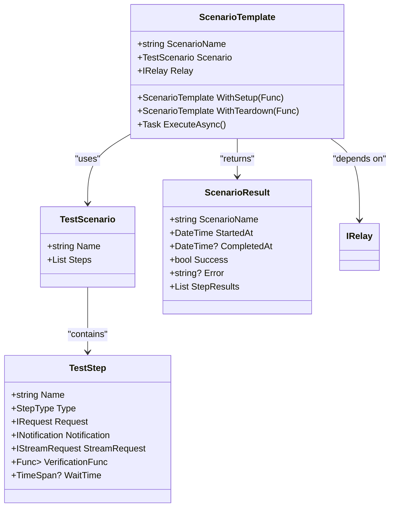
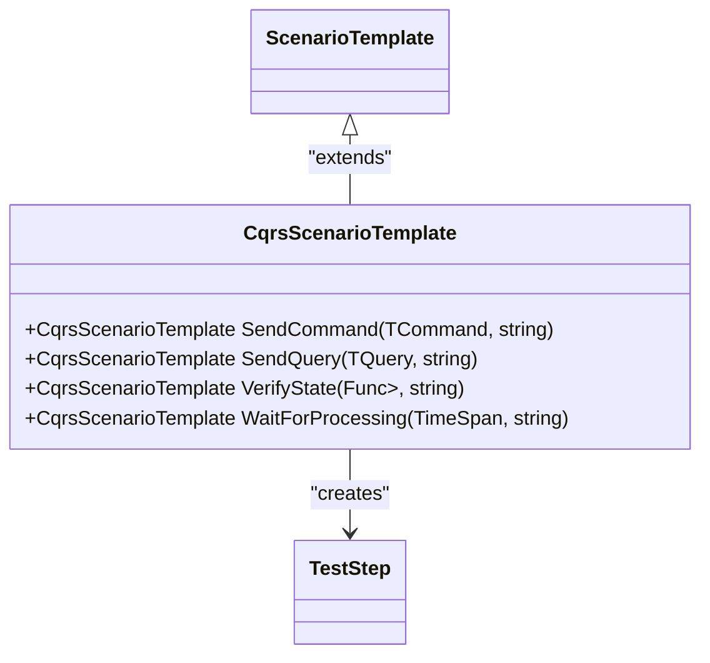
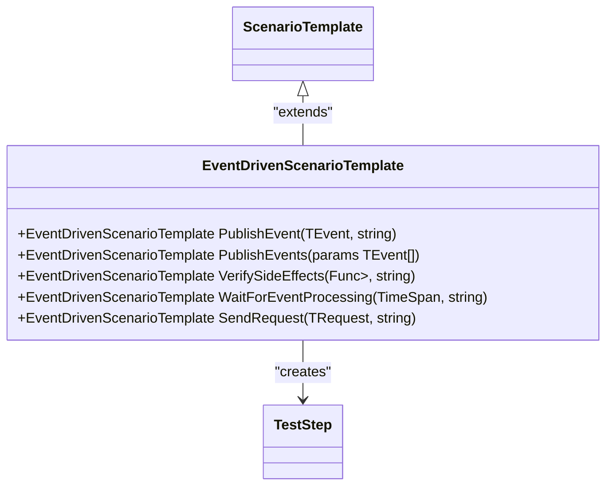
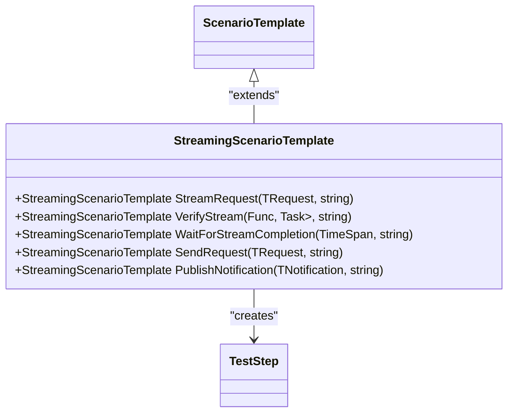
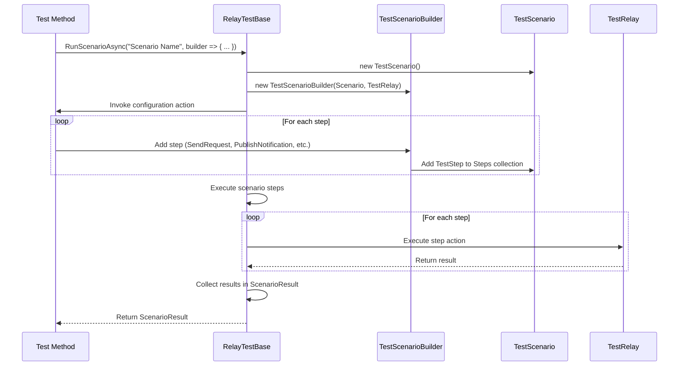
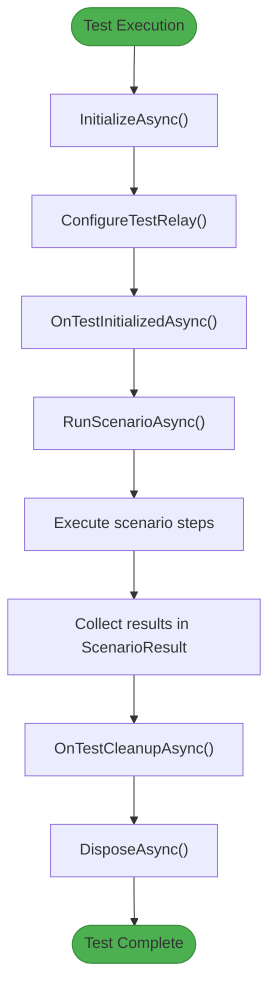
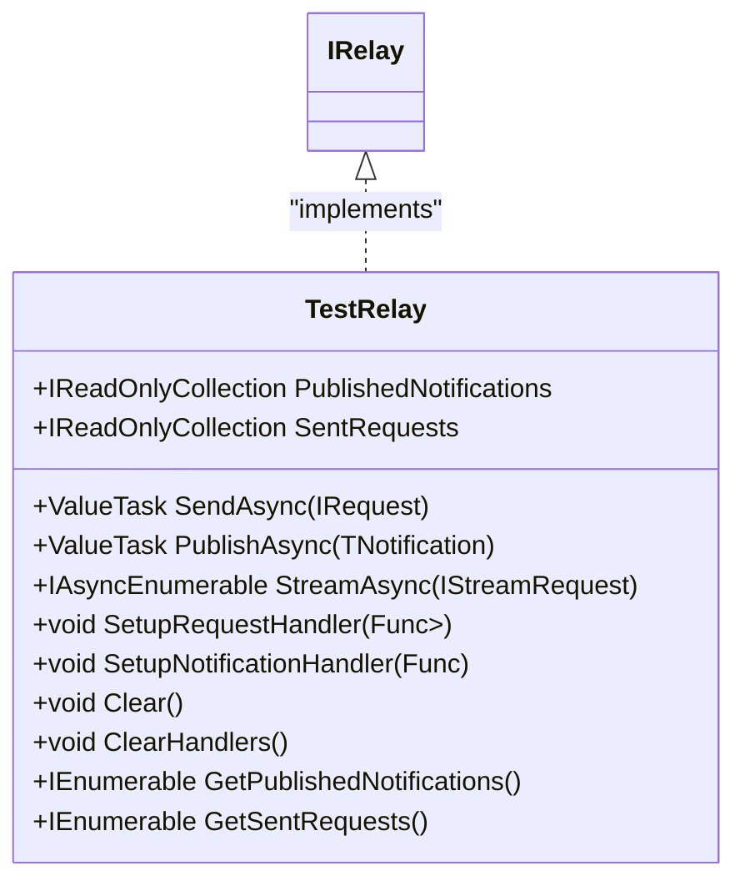
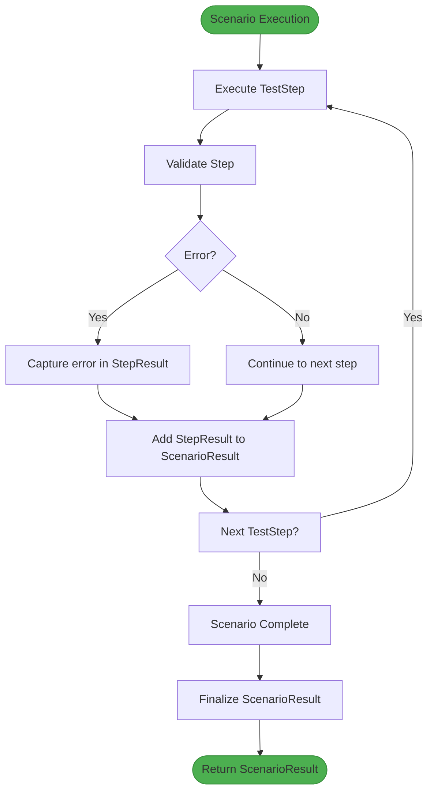
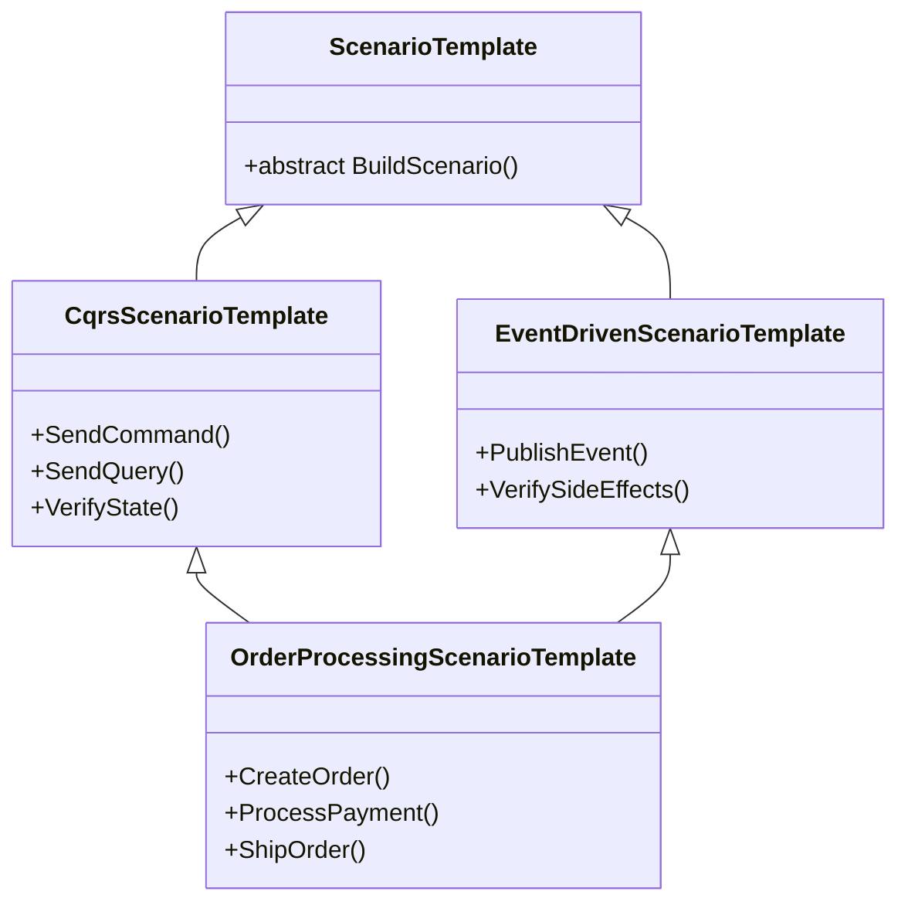

# Scenario Testing

<cite>
**Referenced Files in This Document**   
- [RelayScenario.cs](file://src/Relay/RelayScenario.cs)
- [RelayServiceCollectionExtensions.cs](file://src/Relay/RelayServiceCollectionExtensions.cs)
- [ScenarioTests.cs](file://samples/Relay.Core.Testing.Sample/ScenarioTests.cs)
- [ScenarioTemplate.cs](file://src/Relay.Core.Testing/Scenarios/ScenarioTemplate.cs)
- [CqrsScenarioTemplate.cs](file://src/Relay.Core.Testing/Scenarios/CqrsScenarioTemplate.cs)
- [EventDrivenScenarioTemplate.cs](file://src/Relay.Core.Testing/Scenarios/EventDrivenScenarioTemplate.cs)
- [StreamingScenarioTemplate.cs](file://src/Relay.Core.Testing/Scenarios/StreamingScenarioTemplate.cs)
- [TestScenario.cs](file://src/Relay.Core.Testing/Scenarios/TestScenario.cs)
- [RelayTestBase.cs](file://src/Relay.Core.Testing/Core/RelayTestBase.cs)
- [TestScenarioBuilder.cs](file://src/Relay.Core.Testing/Builders/TestScenarioBuilder.cs)
- [TestRelay.cs](file://src/Relay.Core.Testing/Core/TestRelay.cs)
- [ScenarioResult.cs](file://src/Relay.Core.Testing/Scenarios/ScenarioResult.cs)
</cite>

## Table of Contents
1. [Introduction](#introduction)
2. [Core Concepts](#core-concepts)
3. [Scenario Templates](#scenario-templates)
4. [Creating and Executing Scenarios](#creating-and-executing-scenarios)
5. [Integration with Testing Framework](#integration-with-testing-framework)
6. [Common Issues and Solutions](#common-issues-and-solutions)
7. [Advanced Topics](#advanced-topics)
8. [Conclusion](#conclusion)

## Introduction

The Relay framework provides a comprehensive scenario testing system designed to simulate real-world usage patterns across various architectural styles. This documentation details the implementation of scenario testing capabilities, focusing on reusable templates for common patterns like CQRS, event-driven, and streaming architectures. The framework enables developers to create complex, multi-step test scenarios that validate system behavior under realistic conditions.

The scenario testing infrastructure is built on a foundation of reusable components that allow for both simple and sophisticated testing approaches. From basic command-query verification to complex event-driven workflows, the framework provides the tools needed to ensure application reliability and correctness.

**Section sources**
- [RelayScenario.cs](file://src/Relay/RelayScenario.cs#L1-L33)
- [RelayServiceCollectionExtensions.cs](file://src/Relay/RelayServiceCollectionExtensions.cs#L1-L255)

## Core Concepts

The scenario testing system in Relay is built around several key concepts that enable flexible and powerful testing capabilities. At its core, the system uses a step-based approach where each scenario consists of a sequence of discrete steps that represent specific actions or verifications.

The `TestScenario` class serves as the container for scenario definitions, maintaining a collection of `TestStep` objects that represent individual actions within the scenario. Each step has a type (such as sending a request, publishing a notification, or verifying state) and associated data that defines the specific operation to be performed.

The `ScenarioTemplate` base class provides a foundation for creating reusable scenario patterns, allowing developers to define common testing workflows that can be easily customized for specific use cases. This template system enables consistent testing approaches across different parts of an application while reducing code duplication.



**Diagram sources**
- [TestScenario.cs](file://src/Relay.Core.Testing/Scenarios/TestScenario.cs#L6-L10)
- [ScenarioTemplate.cs](file://src/Relay.Core.Testing/Scenarios/ScenarioTemplate.cs#L14-L220)
- [ScenarioResult.cs](file://src/Relay.Core.Testing/Scenarios/ScenarioResult.cs#L6-L14)

**Section sources**
- [TestScenario.cs](file://src/Relay.Core.Testing/Scenarios/TestScenario.cs#L6-L10)
- [ScenarioTemplate.cs](file://src/Relay.Core.Testing/Scenarios/ScenarioTemplate.cs#L14-L220)
- [ScenarioResult.cs](file://src/Relay.Core.Testing/Scenarios/ScenarioResult.cs#L6-L14)

## Scenario Templates

The Relay framework provides specialized scenario templates for common architectural patterns, enabling developers to quickly create tests that follow established best practices. These templates offer fluent interfaces that make test creation intuitive and readable.

### CQRS Scenario Template

The `CqrsScenarioTemplate` is designed for testing Command Query Responsibility Segregation (CQRS) patterns. It provides methods for sending commands, executing queries, and verifying system state, making it easy to validate the separation of concerns in CQRS architectures.



**Diagram sources**
- [CqrsScenarioTemplate.cs](file://src/Relay.Core.Testing/Scenarios/CqrsScenarioTemplate.cs#L12-L110)

### Event-Driven Scenario Template

The `EventDrivenScenarioTemplate` facilitates testing of event-driven architectures by providing methods for publishing events, waiting for processing, and verifying side effects. This template is particularly useful for validating complex workflows where state changes are triggered by events rather than direct commands.



**Diagram sources**
- [EventDrivenScenarioTemplate.cs](file://src/Relay.Core.Testing/Scenarios/EventDrivenScenarioTemplate.cs#L12-L130)

### Streaming Scenario Template

The `StreamingScenarioTemplate` supports testing of streaming scenarios where data is processed as a continuous flow rather than discrete requests. It provides methods for initiating streaming requests, processing stream responses, and verifying stream behavior.



**Diagram sources**
- [StreamingScenarioTemplate.cs](file://src/Relay.Core.Testing/Scenarios/StreamingScenarioTemplate.cs#L13-L136)

## Creating and Executing Scenarios

Creating and executing scenarios in the Relay framework follows a consistent pattern that emphasizes readability and maintainability. The process involves defining the scenario steps, configuring the test environment, and executing the scenario while capturing results.

### Basic Scenario Creation

The most straightforward way to create a scenario is through the `RunScenarioAsync` method provided by the `RelayTestBase` class. This method accepts a scenario name and a configuration action that uses the `TestScenarioBuilder` to define the steps.



**Diagram sources**
- [RelayTestBase.cs](file://src/Relay.Core.Testing/Core/RelayTestBase.cs#L94-L123)
- [TestScenarioBuilder.cs](file://src/Relay.Core.Testing/Builders/TestScenarioBuilder.cs#L16-L94)

### Multi-Step Scenario Example

The following example demonstrates a complete user lifecycle scenario that includes setup, execution, and verification steps:

```csharp
var result = await RunScenarioAsync("User Lifecycle", builder =>
{
    // Given - Setup initial state
    builder.Given("User repository is available", async () =>
    {
        Services.AddSingleton<IUserRepository, InMemoryUserRepository>();
        Services.AddSingleton<IEmailService, ConsoleEmailService>();
        Services.AddTransient<IRequestHandler<CreateUserCommand, User>, CreateUserHandler>();
    });

    // When - Execute user lifecycle steps
    builder.When("Create user", async () =>
    {
        var createCommand = new CreateUserCommand
        {
            Name = "John Doe",
            Email = "john.doe@example.com"
        };
        await TestRelay.SendAsync(createCommand);
    });

    builder.When("Update user", async () =>
    {
        var updateCommand = new UpdateUserCommand
        {
            UserId = Guid.NewGuid(),
            Name = "Updated Name",
            Email = "updated@example.com"
        };
        await TestRelay.SendAsync(updateCommand);
    });

    // Then - Verify results
    builder.Then("User lifecycle completed successfully", result =>
    {
        Assert.True(result.Success);
    });
});
```

This pattern follows the Given-When-Then structure commonly used in behavior-driven development, making tests easy to understand and maintain.

**Section sources**
- [ScenarioTests.cs](file://samples/Relay.Core.Testing.Sample/ScenarioTests.cs#L20-L74)

## Integration with Testing Framework

The scenario testing system is tightly integrated with the Relay testing framework, providing seamless interaction between scenario execution and test validation. The `RelayTestBase` class serves as the foundation for all scenario tests, handling setup, execution, and teardown automatically.

### Test Lifecycle Management

The `RelayTestBase` class implements the `IAsyncLifetime` interface, ensuring proper initialization and cleanup of test resources. This automatic lifecycle management reduces boilerplate code and ensures consistent test execution.



**Diagram sources**
- [RelayTestBase.cs](file://src/Relay.Core.Testing/Core/RelayTestBase.cs#L31-L86)

### TestRelay Implementation

The `TestRelay` class provides a test-specific implementation of the `IRelay` interface, enabling interception of requests and notifications for verification purposes. It maintains collections of sent requests and published notifications, allowing tests to validate that expected operations occurred.



**Diagram sources**
- [TestRelay.cs](file://src/Relay.Core.Testing/Core/TestRelay.cs#L16-L234)

**Section sources**
- [RelayTestBase.cs](file://src/Relay.Core.Testing/Core/RelayTestBase.cs#L11-L178)
- [TestRelay.cs](file://src/Relay.Core.Testing/Core/TestRelay.cs#L16-L234)

## Common Issues and Solutions

### Scenario State Management

One common challenge in scenario testing is managing state between steps. The Relay framework addresses this through several mechanisms:

1. **Service Collection Access**: The `Services` property in `RelayTestBase` provides access to the service collection, allowing test setup and configuration at any point.

2. **Setup and Teardown Actions**: The `ScenarioTemplate` class supports setup and teardown actions that execute before and after scenario execution, respectively.

3. **TestRelay State**: The `TestRelay` instance maintains state about sent requests and published notifications, enabling verification of system behavior.

### Error Handling in Scenarios

The framework provides robust error handling capabilities through the `ScenarioResult` object, which captures both success/failure status and error messages. This allows for comprehensive validation of expected error conditions.



**Diagram sources**
- [ScenarioTemplate.cs](file://src/Relay.Core.Testing/Scenarios/ScenarioTemplate.cs#L115-L154)

### Performance Testing

The framework supports performance testing through integration with timing assertions and the ability to execute scenarios under load. The `ShouldCompleteWithinAsync` extension method allows tests to verify that scenarios complete within specified time limits.

```csharp
var result = await Task.Run(async () =>
{
    return await RunScenarioAsync("Performance Test", builder =>
    {
        // Scenario steps
    });
}).ShouldCompleteWithinAsync(TimeSpan.FromSeconds(5));
```

This approach enables developers to validate both functional correctness and performance requirements in a single test.

**Section sources**
- [ScenarioTests.cs](file://samples/Relay.Core.Testing.Sample/ScenarioTests.cs#L158-L207)
- [ScenarioTemplate.cs](file://src/Relay.Core.Testing/Scenarios/ScenarioTemplate.cs#L115-L154)

## Advanced Topics

### Custom Scenario Templates

Developers can create custom scenario templates by extending the `ScenarioTemplate` base class. This allows for the creation of domain-specific testing patterns that encapsulate common workflows and validation logic.

```csharp
public class OrderProcessingScenarioTemplate : ScenarioTemplate
{
    public OrderProcessingScenarioTemplate(string scenarioName, IRelay relay)
        : base(scenarioName, relay)
    {
    }

    public OrderProcessingScenarioTemplate CreateOrder(Order order)
    {
        Scenario.Steps.Add(new TestStep
        {
            Name = "Create Order",
            Type = StepType.SendRequest,
            Request = new CreateOrderCommand(order)
        });
        return this;
    }

    public OrderProcessingScenarioTemplate ProcessPayment(decimal amount)
    {
        Scenario.Steps.Add(new TestStep
        {
            Name = "Process Payment",
            Type = StepType.SendRequest,
            Request = new ProcessPaymentCommand(amount)
        });
        return this;
    }

    protected override void BuildScenario()
    {
        // Default order processing workflow
        CreateOrder(new Order())
            .ProcessPayment(100.00m);
    }
}
```

This approach promotes code reuse and consistency across tests while providing the flexibility to customize behavior as needed.

### Step Composition

The framework supports step composition through the use of reusable step definitions and template inheritance. Complex scenarios can be built by combining simpler steps or by extending existing templates.



**Diagram sources**
- [ScenarioTemplate.cs](file://src/Relay.Core.Testing/Scenarios/ScenarioTemplate.cs#L14-L220)

### Integration with Relay Scenarios

The scenario testing system integrates with the broader Relay framework through the `RelayScenario` enum, which defines optimization scenarios for different architectural patterns. Tests can be configured to run under specific scenarios to validate behavior in different contexts.

```csharp
public static IServiceCollection AddRelayForScenario(
    this IServiceCollection services,
    RelayScenario scenario,
    Action<RelayOptions>? configure = null)
{
    return scenario switch
    {
        RelayScenario.Minimal => services.AddRelayCore(configure),
        RelayScenario.WebApi => services
            .AddRelayCore(configure)
            .AddRelayValidation()
            .AddRelayTelemetry(),
        RelayScenario.EventDriven => services
            .AddRelayCore(configure)
            .AddRelayTransactions()
            .AddRelayTelemetry(),
        // Additional scenarios...
    };
}
```

This integration ensures that tests can validate system behavior under the same conditions as production deployments.

**Section sources**
- [RelayScenario.cs](file://src/Relay/RelayScenario.cs#L6-L32)
- [RelayServiceCollectionExtensions.cs](file://src/Relay/RelayServiceCollectionExtensions.cs#L83-L127)

## Conclusion

The scenario testing capabilities in the Relay framework provide a comprehensive and flexible system for validating application behavior across various architectural patterns. By leveraging reusable templates, fluent interfaces, and tight integration with the testing framework, developers can create robust tests that simulate real-world usage patterns.

The system supports a wide range of testing scenarios, from simple command-query verification to complex event-driven workflows and streaming operations. With built-in support for state management, error handling, and performance testing, the framework enables thorough validation of both functional correctness and non-functional requirements.

By following the patterns and practices outlined in this documentation, developers can create maintainable, readable, and effective tests that ensure the reliability and correctness of their Relay-based applications.