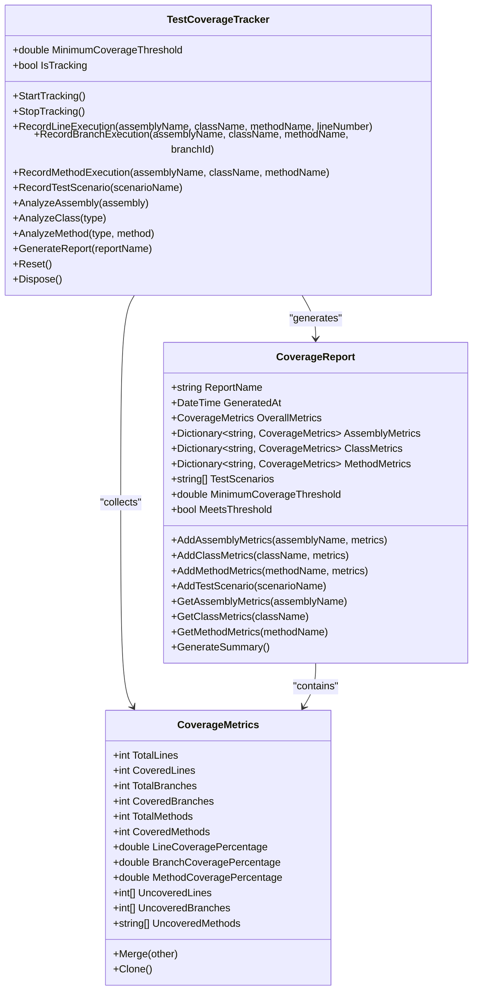
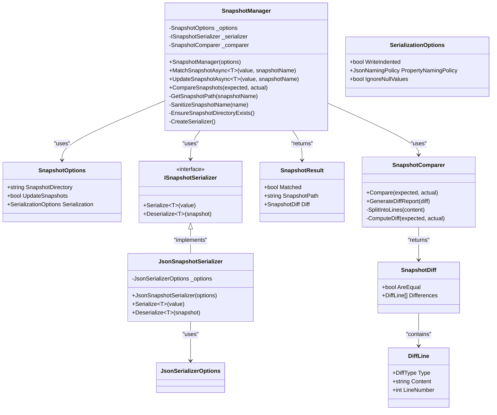

# Test Coverage and Snapshots

<cite>
**Referenced Files in This Document**   
- [TestCoverageTracker.cs](file://src/Relay.Core.Testing/Coverage/TestCoverageTracker.cs)
- [CoverageReport.cs](file://src/Relay.Core.Testing/Coverage/CoverageReport.cs)
- [CoverageMetrics.cs](file://src/Relay.Core.Testing/Coverage/CoverageMetrics.cs)
- [SnapshotManager.cs](file://src/Relay.Core.Testing/Snapshots/SnapshotManager.cs)
- [SnapshotOptions.cs](file://src/Relay.Core.Testing/Snapshots/SnapshotOptions.cs)
- [SnapshotComparer.cs](file://src/Relay.Core.Testing/Snapshots/SnapshotComparer.cs)
- [SnapshotSerializer.cs](file://src/Relay.Core.Testing/Snapshots/SnapshotSerializer.cs)
- [README.md](file://src/Relay.Core.Testing/README.md)
- [coverlet.runsettings](file://coverlet.runsettings)
- [vs-coverage.runsettings](file://vs-coverage.runsettings)
- [codecov.yml](file://codecov.yml)
</cite>

## Table of Contents
1. [Introduction](#introduction)
2. [Test Coverage Tracking](#test-coverage-tracking)
3. [Snapshot Testing](#snapshot-testing)
4. [Configuration and Integration](#configuration-and-integration)
5. [Best Practices and Troubleshooting](#best-practices-and-troubleshooting)
6. [Conclusion](#conclusion)

## Introduction

The Relay framework provides comprehensive testing capabilities through its Relay.Core.Testing library, offering robust test coverage tracking and snapshot testing features. These tools enable developers to ensure code quality, maintain consistency in data structures, and validate system behavior across different environments and test scenarios. The framework supports multiple testing frameworks including xUnit, NUnit, and MSTest, making it versatile for various development workflows.

The test coverage system tracks line, branch, and method coverage during test execution, providing detailed reports that help identify untested code paths. Meanwhile, the snapshot testing functionality allows developers to capture and validate the structure of complex data objects, ensuring that changes to data structures are intentional and properly reviewed. Both features are designed to be developer-friendly, with fluent APIs and comprehensive configuration options.

**Section sources**
- [README.md](file://src/Relay.Core.Testing/README.md#L1-L800)

## Test Coverage Tracking

The test coverage tracking system in Relay is implemented through the `TestCoverageTracker` class, which monitors code execution during test runs and generates detailed coverage reports. The system tracks three primary metrics: line coverage, branch coverage, and method coverage, providing a comprehensive view of test effectiveness.

The `TestCoverageTracker` operates by recording execution events such as line execution, branch execution, and method invocation. When coverage tracking is active, the system captures these events and aggregates them into coverage metrics. The tracking process is initiated with the `StartTracking` method and concluded with `StopTracking`, ensuring that only relevant test code is measured.

Coverage data is organized hierarchically, with metrics collected at the assembly, class, and method levels. The `CoverageMetrics` class encapsulates these measurements, providing properties for total and covered lines, branches, and methods, along with calculated percentages for each coverage type. The system also maintains lists of uncovered elements to help identify areas requiring additional test coverage.

When generating a coverage report, the `TestCoverageTracker` compiles all collected metrics into a `CoverageReport` object. This report includes overall coverage statistics, detailed metrics by code element, and information about executed test scenarios. The report can be configured with a minimum coverage threshold, and the `MeetsThreshold` property indicates whether the current coverage level satisfies this requirement.

**Diagram sources**
- [TestCoverageTracker.cs](file://src/Relay.Core.Testing/Coverage/TestCoverageTracker.cs)
- [CoverageReport.cs](file://src/Relay.Core.Testing/Coverage/CoverageReport.cs)
- [CoverageMetrics.cs](file://src/Relay.Core.Testing/Coverage/CoverageMetrics.cs)

**Section sources**
- [TestCoverageTracker.cs](file://src/Relay.Core.Testing/Coverage/TestCoverageTracker.cs#L1-L338)
- [CoverageReport.cs](file://src/Relay.Core.Testing/Coverage/CoverageReport.cs#L1-L162)
- [CoverageMetrics.cs](file://src/Relay.Core.Testing/Coverage/CoverageMetrics.cs#L1-L109)

## Snapshot Testing

The Relay framework's snapshot testing system provides a reliable mechanism for validating the structure and content of complex data objects. Implemented through the `SnapshotManager` class, this system captures the serialized representation of objects and compares them against previously stored snapshots to detect unintended changes.

The snapshot testing workflow begins with the `MatchSnapshotAsync` method, which takes a value and a snapshot name as parameters. If a snapshot with the given name does not exist, it is created automatically. Otherwise, the current value is serialized and compared against the stored snapshot. The comparison is performed by the `SnapshotComparer` class, which analyzes the differences between the expected and actual content at the line level.

Snapshots are stored as JSON files in a designated directory (default: `__snapshots__`), with filenames derived from the snapshot name. The `SnapshotManager` handles file system operations, including directory creation and path sanitization to ensure compatibility across different operating systems. The serialization process is managed by the `JsonSnapshotSerializer`, which uses configurable `JsonSerializerOptions` to control formatting, naming policies, and null value handling.

When a snapshot mismatch occurs, the system generates a detailed diff report that highlights added, removed, and modified lines. This information is encapsulated in the `SnapshotDiff` class and can be used to understand the nature of the changes. The diff report includes line numbers and visual indicators (+, -, ~) to make the differences easily identifiable.

The snapshot system supports configurable options through the `SnapshotOptions` class, allowing developers to customize the snapshot directory, update behavior, and serialization settings. One key feature is the `UpdateSnapshots` flag, which when enabled, automatically updates snapshots when they don't match, facilitating intentional changes to expected output.

**Diagram sources**
- [SnapshotManager.cs](file://src/Relay.Core.Testing/Snapshots/SnapshotManager.cs)
- [SnapshotOptions.cs](file://src/Relay.Core.Testing/Snapshots/SnapshotOptions.cs)
- [SnapshotComparer.cs](file://src/Relay.Core.Testing/Snapshots/SnapshotComparer.cs)
- [SnapshotSerializer.cs](file://src/Relay.Core.Testing/Snapshots/SnapshotSerializer.cs)

**Section sources**
- [SnapshotManager.cs](file://src/Relay.Core.Testing/Snapshots/SnapshotManager.cs#L1-L142)
- [SnapshotOptions.cs](file://src/Relay.Core.Testing/Snapshots/SnapshotOptions.cs#L1-L50)
- [SnapshotComparer.cs](file://src/Relay.Core.Testing/Snapshots/SnapshotComparer.cs#L1-L148)
- [SnapshotSerializer.cs](file://src/Relay.Core.Testing/Snapshots/SnapshotSerializer.cs#L1-L59)

## Configuration and Integration

The Relay testing framework integrates with standard .NET testing tools and CI/CD pipelines through configuration files that define coverage settings and reporting options. The framework supports multiple configuration approaches, including code-based configuration and external configuration files.

For code coverage, the framework works with popular coverage tools like Coverlet and Visual Studio's built-in coverage analysis. The `coverlet.runsettings` and `vs-coverage.runsettings` files provide configuration for these tools, specifying parameters such as coverage format, output directory, and source inclusion/exclusion patterns. These settings ensure consistent coverage measurement across different development and CI environments.

The `codecov.yml` file configures integration with Codecov, a cloud-based code coverage analysis service. This configuration specifies how coverage reports are generated, formatted, and uploaded, enabling teams to track coverage trends over time and enforce coverage thresholds in pull requests.

In test code, coverage tracking is typically configured through the `TestRelayOptions` class, which provides a fluent API for setting up coverage parameters. Developers can specify the minimum coverage threshold, enable or disable tracking, and configure other coverage-related options. The README.md file provides examples of how to configure these options for different environments, such as development, CI/CD, and performance testing.

The snapshot testing system is configured through the `SnapshotOptions` class, which allows customization of the snapshot directory, update behavior, and serialization settings. These options can be set programmatically or through dependency injection, making it easy to adapt the snapshot behavior to different testing scenarios.

Integration with test frameworks like xUnit, NUnit, and MSTest is achieved through base classes (`RelayTestBase`, `RelayTestFixture`, `RelayTestClass`) that provide access to the testing utilities. These base classes handle the setup and teardown of test environments, ensuring proper isolation and cleanup.

**Section sources**
- [coverlet.runsettings](file://coverlet.runsettings)
- [vs-coverage.runsettings](file://vs-coverage.runsettings)
- [codecov.yml](file://codecov.yml)
- [README.md](file://src/Relay.Core.Testing/README.md#L1-L800)

## Best Practices and Troubleshooting

When working with the Relay framework's test coverage and snapshot testing features, several best practices can help ensure effective and maintainable tests. For coverage tracking, it's recommended to set appropriate minimum coverage thresholds in CI/CD environments to prevent coverage regression. The threshold should be high enough to ensure quality but realistic enough to be maintainable.

For snapshot testing, it's important to use descriptive snapshot names that clearly indicate the purpose of the snapshot. This makes it easier to understand the context when reviewing snapshot changes. Snapshots should focus on structural aspects of data rather than incidental details that might change frequently.

Common issues with snapshot testing include snapshot drift, where snapshots become outdated due to code changes. The framework addresses this through the `UpdateSnapshots` option, which allows controlled updates to snapshots. However, it's recommended to review all snapshot changes carefully to ensure they represent intentional modifications rather than bugs.

Another common issue is overly broad snapshots that capture too much information, making them brittle to changes. To avoid this, consider using snapshot serializers that can filter or transform data before serialization, focusing on the essential aspects of the object.

For coverage tracking, a common challenge is achieving high branch coverage in complex conditional logic. The framework's coverage metrics can help identify specific branches that are not being tested, allowing developers to create targeted test cases. It's also important to remember that high coverage percentage alone doesn't guarantee quality tests—tests should also validate correct behavior, not just exercise code paths.

When troubleshooting coverage issues, examine the `UncoveredMethods`, `UncoveredLines`, and `UncoveredBranches` properties of the `CoverageMetrics` class to identify specific areas needing attention. For snapshot issues, review the diff output to understand exactly what has changed and whether the change is expected.

**Section sources**
- [README.md](file://src/Relay.Core.Testing/README.md#L1-L800)
- [TestCoverageTracker.cs](file://src/Relay.Core.Testing/Coverage/TestCoverageTracker.cs#L1-L338)
- [SnapshotManager.cs](file://src/Relay.Core.Testing/Snapshots/SnapshotManager.cs#L1-L142)

## Conclusion

The Relay framework's test coverage and snapshot testing capabilities provide a comprehensive solution for ensuring code quality and maintaining consistency in data structures. The coverage tracking system offers detailed insights into test effectiveness, measuring line, branch, and method coverage across the codebase. This information helps teams identify untested code paths and maintain high-quality test suites.

The snapshot testing functionality enables reliable validation of complex data objects, ensuring that changes to data structures are intentional and properly reviewed. With configurable options for serialization, comparison, and update behavior, the system adapts to various testing scenarios and team workflows.

Together, these features form a robust testing foundation that integrates seamlessly with popular .NET testing frameworks and CI/CD tools. By following best practices and leveraging the framework's capabilities, development teams can maintain high code quality, catch regressions early, and build confidence in their software's reliability.