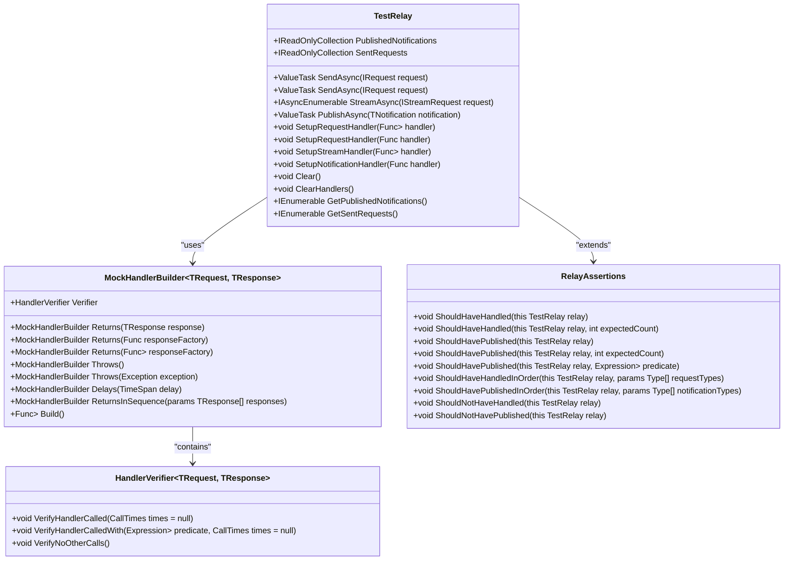
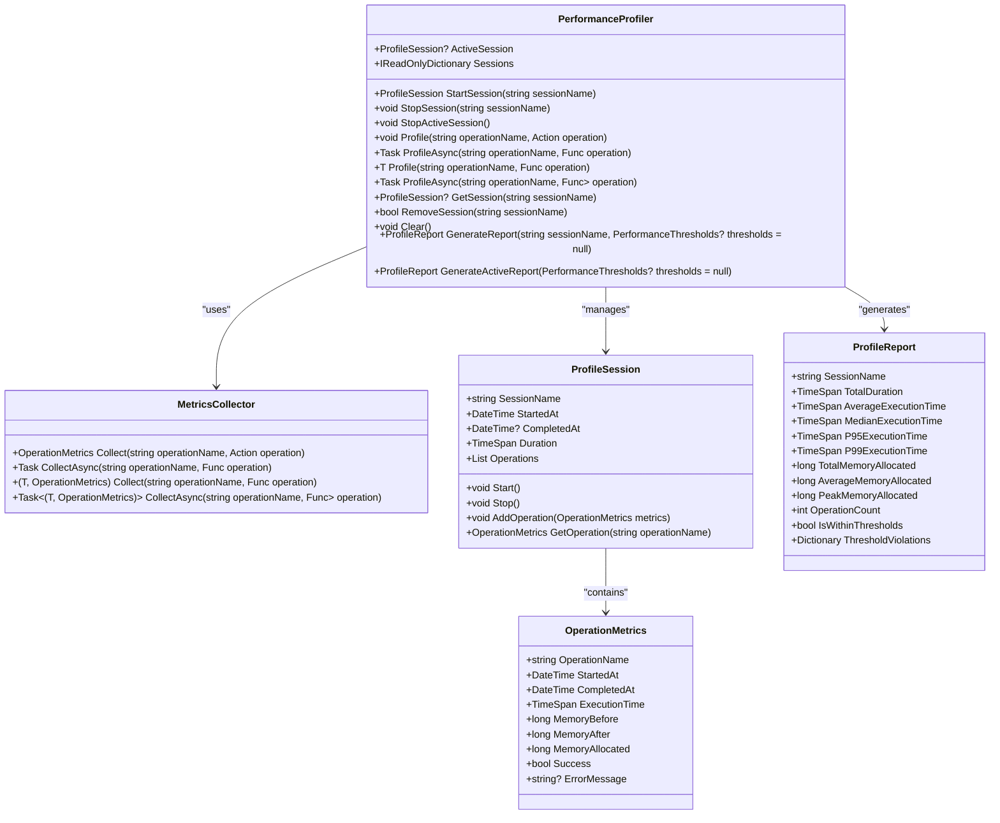

# Testing

<cite>
**Referenced Files in This Document**   
- [README.md](file://src/Relay.Core.Testing/README.md)
- [TestRelay.cs](file://src/Relay.Core.Testing/Core/TestRelay.cs)
- [TestRelayOptions.cs](file://src/Relay.Core.Testing/Configuration/TestRelayOptions.cs)
- [RelayAssertions.cs](file://src/Relay.Core.Testing/Assertions/RelayAssertions.cs)
- [MockHandlerBuilder.cs](file://src/Relay.Core.Testing/Builders/MockHandlerBuilder.cs)
- [CqrsScenarioTemplate.cs](file://src/Relay.Core.Testing/Scenarios/CqrsScenarioTemplate.cs)
- [PerformanceProfiler.cs](file://src/Relay.Core.Testing/Metrics/PerformanceProfiler.cs)
- [LoadTestConfiguration.cs](file://src/Relay.Core.Testing/Configuration/LoadTestConfiguration.cs)
- [LoadTestResult.cs](file://src/Relay.Core.Testing/Results/LoadTestResult.cs)
- [RelayTestBase.cs](file://src/Relay.Core.Testing/Core/RelayTestBase.cs)
- [TestDataIsolationHelper.cs](file://src/Relay.Core.Testing/Helpers/TestDataIsolationHelper.cs)
- [UserTests.cs](file://samples/Relay.Core.Testing.Sample/UserTests.cs)
- [ScenarioTests.cs](file://samples/Relay.Core.Testing.Sample/ScenarioTests.cs)
- [MockHandlerBuilderTests.cs](file://tests/Relay.Core.Testing.Tests/Builders/MockHandlerBuilderTests.cs)
</cite>

## Table of Contents
1. [Introduction](#introduction)
2. [Unit Testing Framework](#unit-testing-framework)
3. [Integration Testing Support](#integration-testing-support)
4. [Scenario Testing Capabilities](#scenario-testing-capabilities)
5. [Load Testing Features](#load-testing-features)
6. [Test Isolation Mechanisms](#test-isolation-mechanisms)
7. [Performance Profiling Tools](#performance-profiling-tools)
8. [Test Organization and Best Practices](#test-organization-and-best-practices)
9. [Examples of Complex Scenario Testing](#examples-of-complex-scenario-testing)
10. [Conclusion](#conclusion)

## Introduction
The Relay framework provides a comprehensive testing ecosystem designed to support various testing methodologies including unit, integration, scenario, and load testing. The framework's testing capabilities are built around the `Relay.Core.Testing` package, which offers specialized assertions, builders, and utilities for testing request handlers, notification handlers, and complex distributed systems. This document explores the full spectrum of testing features available in the Relay framework, from basic unit testing to advanced performance profiling and load testing.

**Section sources**
- [README.md](file://src/Relay.Core.Testing/README.md#L1-L800)

## Unit Testing Framework
The Relay framework's unit testing framework provides specialized assertions and builders for testing request handlers and notification handlers. At the core of this framework is the `TestRelay` class, which serves as a test implementation of the `IRelay` interface, allowing developers to simulate the behavior of the actual Relay system in a controlled environment.

The framework includes a rich set of assertion methods through the `RelayAssertions` class, which extends the functionality of `TestRelay` with fluent assertion methods. These assertions allow developers to verify that specific request types were handled, notifications were published, and that they occurred in the expected order or count. For example, the `ShouldHaveHandled<TRequest>` method asserts that a specific request type was processed by the TestRelay, while `ShouldHavePublished<TNotification>` verifies that a notification was published.

The framework also provides a `MockHandlerBuilder<TRequest, TResponse>` class that enables the creation of mock request handlers with a fluent configuration API. This builder allows developers to configure handlers to return specific responses, throw exceptions, introduce delays, or return responses in sequence for multiple calls. The builder also includes verification capabilities through the `HandlerVerifier<TRequest, TResponse>` class, which can be used to assert call patterns and verify interactions with mock handlers.



**Diagram sources**
- [TestRelay.cs](file://src/Relay.Core.Testing/Core/TestRelay.cs#L1-L234)
- [MockHandlerBuilder.cs](file://src/Relay.Core.Testing/Builders/MockHandlerBuilder.cs#L1-L242)
- [RelayAssertions.cs](file://src/Relay.Core.Testing/Assertions/RelayAssertions.cs#L1-L222)

**Section sources**
- [TestRelay.cs](file://src/Relay.Core.Testing/Core/TestRelay.cs#L1-L234)
- [RelayAssertions.cs](file://src/Relay.Core.Testing/Assertions/RelayAssertions.cs#L1-L222)
- [MockHandlerBuilder.cs](file://src/Relay.Core.Testing/Builders/MockHandlerBuilder.cs#L1-L242)

## Integration Testing Support
The Relay framework provides robust support for integration testing, enabling the testing of complex scenarios involving multiple components. The framework's integration testing capabilities are built on the `RelayTestBase` class, which serves as a base class for xUnit-based tests and provides common setup and teardown functionality.

The `RelayTestBase` class manages the lifecycle of the `TestRelay` instance and provides access to a service provider for dependency injection. It includes virtual methods such as `InitializeAsync` and `DisposeAsync` that can be overridden to customize test setup and teardown. The class also provides utility methods like `RunScenarioAsync` for creating and executing test scenarios with a fluent configuration API.

Integration testing in Relay is facilitated by the ability to register mock implementations of dependencies through the service provider. This allows developers to isolate the component under test while still maintaining the integration points with other components. The framework supports multiple test frameworks including xUnit, NUnit, and MSTest, providing base classes like `RelayTestFixture` for NUnit and `RelayTestClass` for MSTest.

The integration testing capabilities also include support for testing distributed systems and message brokers. The framework provides specialized test scenarios for event-driven architectures, allowing developers to test the flow of events through the system and verify that notifications are published and handled correctly.


**Diagram sources**
- [RelayTestBase.cs](file://src/Relay.Core.Testing/Core/RelayTestBase.cs#L1-L178)

**Section sources**
- [RelayTestBase.cs](file://src/Relay.Core.Testing/Core/RelayTestBase.cs#L1-L178)

## Scenario Testing Capabilities
The Relay framework offers powerful scenario testing capabilities that allow developers to simulate real-world usage patterns and complex workflows. At the heart of this functionality is the `ScenarioTemplate` class, which serves as a base class for scenario templates that provide higher-level abstractions for common testing patterns.

The framework includes specialized scenario templates such as `CqrsScenarioTemplate`, `EventDrivenScenarioTemplate`, and `StreamingScenarioTemplate`, each designed for specific architectural patterns. These templates provide a fluent API for defining test scenarios using the Given-When-Then pattern, making tests more readable and maintainable.

The `CqrsScenarioTemplate` is particularly useful for testing Command Query Responsibility Segregation (CQRS) patterns, providing methods for sending commands and queries, verifying state, and waiting for asynchronous operations to complete. Developers can use methods like `SendCommand`, `SendQuery`, `VerifyState`, and `WaitForProcessing` to build comprehensive test scenarios that simulate real user interactions.

Scenario templates support setup and teardown actions through the `WithSetup` and `WithTeardown` methods, allowing developers to configure the test environment before execution and clean up resources afterward. The templates also support customization through the `CustomizeScenario` method, which can be overridden to modify the scenario builder before execution.


**Diagram sources**
- [ScenarioTemplate.cs](file://src/Relay.Core.Testing/Scenarios/ScenarioTemplate.cs#L1-L220)
- [CqrsScenarioTemplate.cs](file://src/Relay.Core.Testing/Scenarios/CqrsScenarioTemplate.cs#L1-L110)

**Section sources**
- [ScenarioTemplate.cs](file://src/Relay.Core.Testing/Scenarios/ScenarioTemplate.cs#L1-L220)
- [CqrsScenarioTemplate.cs](file://src/Relay.Core.Testing/Scenarios/CqrsScenarioTemplate.cs#L1-L110)

## Load Testing Features
The Relay framework includes comprehensive load testing features that help identify performance bottlenecks and ensure system stability under high load. The load testing capabilities are centered around the `LoadTestConfiguration` class, which defines the settings for load testing scenarios, and the `LoadTestRunner` class, which executes the tests and collects performance metrics.

The `LoadTestConfiguration` class allows developers to specify various parameters for load tests, including the total number of requests, maximum concurrency, ramp-up time, request interval, and duration. It also supports monitoring memory usage and collecting detailed timing metrics. The configuration can be customized to simulate different load patterns, such as gradually increasing the number of concurrent users or maintaining a steady load over time.

The `LoadTestResult` class captures the results of a load test execution, including metrics such as successful and failed requests, response times, throughput, success rate, and memory usage. These metrics provide valuable insights into the system's performance characteristics and help identify potential bottlenecks.

The framework supports both time-based and request-based load testing, allowing developers to choose the most appropriate approach for their use case. Time-based testing runs for a specified duration, while request-based testing executes a fixed number of requests. Both approaches provide detailed performance metrics that can be used to optimize the system.


**Diagram sources**
- [LoadTestConfiguration.cs](file://src/Relay.Core.Testing/Configuration/LoadTestConfiguration.cs#L1-L106)
- [LoadTestResult.cs](file://src/Relay.Core.Testing/Results/LoadTestResult.cs#L1-L130)

**Section sources**
- [LoadTestConfiguration.cs](file://src/Relay.Core.Testing/Configuration/LoadTestConfiguration.cs#L1-L106)
- [LoadTestResult.cs](file://src/Relay.Core.Testing/Results/LoadTestResult.cs#L1-L130)

## Test Isolation Mechanisms
The Relay framework provides robust test isolation mechanisms to ensure reliable test results by preventing interference between tests. The primary tool for test isolation is the `TestDataIsolationHelper` class, which manages test data isolation across different storage mechanisms and ensures cleanup of test data.

The `TestDataIsolationHelper` supports multiple isolation levels defined by the `IsolationLevel` enum, including `None`, `Memory`, `DatabaseTransaction`, and `Full`. These levels allow developers to choose the appropriate degree of isolation based on their testing requirements. The helper provides utilities for creating isolated database contexts, in-memory data stores, and temporary files with unique naming to prevent conflicts.

The framework also includes automatic cleanup management through the `TestCleanupHelper` class, which allows developers to register disposable resources, temporary files, and cleanup actions that are automatically executed when the test completes. This ensures that all test resources are properly cleaned up, even if the test fails.

Test isolation is further enhanced by the ability to create isolated service providers for each test, preventing dependency injection conflicts between tests. The `TestRelay` instance itself maintains isolated collections of sent requests and published notifications, ensuring that test state does not leak between tests.

```mermaid
classDiagram
class TestDataIsolationHelper {
+string TestId
+IsolationLevel Level
+void RegisterCleanupAction(Func<Task> cleanupAction)
+void RegisterDisposable(IDisposable disposable)
+void RegisterAsyncDisposable(IAsyncDisposable asyncDisposable)
+IsolatedDatabaseContext<TDbContext> CreateIsolatedDatabaseContext<TDbContext>(Func<TDbContext> createContext)
+IsolatedMemoryStore<TData> CreateIsolatedMemoryStore<TData>()
+string CreateIsolatedTempFile(string extension = "tmp")
+Task ExecuteIsolatedAsync(Func<Task> action)
+Task<TResult> ExecuteIsolatedAsync<TResult>(Func<Task<TResult>> function)
}
class IsolatedDatabaseContext~TDbContext~ {
+TDbContext Context
+string TestId
+IsolationLevel Level
}
class IsolatedMemoryStore~TData~ {
+string TestId
+IEnumerable<TData> Items
+void Store(string key, TData item)
+TData? Retrieve(string key)
+bool Remove(string key)
+void Clear()
}
class TestCleanupHelper {
+void RegisterTempFile(string path)
+void RegisterTempDirectory(string path)
+void RegisterDisposable(IDisposable disposable)
+void RegisterCleanupAction(Action action)
+void RegisterAsyncCleanupAction(Func<Task> action)
}
enum IsolationLevel {
None
Memory
DatabaseTransaction
Full
}
TestDataIsolationHelper --> IsolatedDatabaseContext : "creates"
TestDataIsolationHelper --> IsolatedMemoryStore : "creates"
TestDataIsolationHelper --> TestCleanupHelper : "uses"
TestDataIsolationHelper --> IsolationLevel : "references"
```

**Diagram sources**
- [TestDataIsolationHelper.cs](file://src/Relay.Core.Testing/Helpers/TestDataIsolationHelper.cs#L1-L391)

**Section sources**
- [TestDataIsolationHelper.cs](file://src/Relay.Core.Testing/Helpers/TestDataIsolationHelper.cs#L1-L391)

## Performance Profiling Tools
The Relay framework includes comprehensive performance profiling tools that help developers optimize code and identify performance bottlenecks. The primary tool for performance profiling is the `PerformanceProfiler` class, which provides session management and metrics collection for profiling operations.

The `PerformanceProfiler` allows developers to start and stop profiling sessions, profile individual operations, and generate performance reports. It supports both synchronous and asynchronous operations through methods like `Profile`, `ProfileAsync`, `Profile<T>`, and `ProfileAsync<T>`. These methods automatically collect metrics such as execution time and memory usage, which can be used to identify performance issues.

The profiler integrates with the `MetricsCollector` class, which handles the actual collection of performance metrics. The collected metrics are stored in `OperationMetrics` objects and organized within `ProfileSession` instances. Developers can generate detailed performance reports using the `ProfileReport` class, which can include performance thresholds for automated performance validation.

The framework also supports performance assertions through the `PerformanceAssertions` class, which provides extension methods for validating that execution times and memory usage are within acceptable thresholds. These assertions can be used in unit tests to ensure that performance requirements are met.



**Diagram sources**
- [PerformanceProfiler.cs](file://src/Relay.Core.Testing/Metrics/PerformanceProfiler.cs#L1-L232)

**Section sources**
- [PerformanceProfiler.cs](file://src/Relay.Core.Testing/Metrics/PerformanceProfiler.cs#L1-L232)

## Test Organization and Best Practices
The Relay framework promotes effective test organization and adherence to best practices for maintaining a comprehensive test suite. The framework encourages the use of base test classes like `RelayTestBase`, `RelayTestFixture`, and `RelayTestClass` to provide consistent setup and teardown functionality across tests.

Best practices for test organization include using descriptive test names that clearly communicate the scenario being tested, following the Given-When-Then pattern for structuring test logic, and keeping tests focused on a single responsibility. The framework's scenario templates and fluent APIs make it easy to implement these best practices.

The framework also supports test configuration through the `TestRelayOptions` class, which allows developers to customize the behavior of the test environment. This includes settings for default timeouts, parallel execution, test isolation, performance profiling, and coverage tracking. Configuration can be environment-specific, with different settings for development, CI/CD, and performance testing environments.

For maintaining a comprehensive test suite, the framework recommends using a combination of unit tests, integration tests, scenario tests, and load tests. Unit tests should focus on individual components, integration tests should verify the interaction between components, scenario tests should simulate real-world usage patterns, and load tests should validate system performance under stress.


**Diagram sources**
- [TestRelayOptions.cs](file://src/Relay.Core.Testing/Configuration/TestRelayOptions.cs#L1-L395)

**Section sources**
- [TestRelayOptions.cs](file://src/Relay.Core.Testing/Configuration/TestRelayOptions.cs#L1-L395)

## Examples of Complex Scenario Testing
The Relay framework provides excellent support for testing complex scenarios involving pipelines, message brokers, and distributed systems. The framework's scenario testing capabilities make it easy to simulate real-world usage patterns and verify the behavior of complex workflows.

For example, the `UserLifecycleScenario` demonstrates how to test a complete user workflow involving multiple steps such as creating a user, updating user information, and retrieving user data. The scenario uses the `RunScenarioAsync` method to define a sequence of steps using the Given-When-Then pattern, making the test logic clear and maintainable.

Another example is the `ProductCreationScenario`, which tests the creation of a product and verifies that it was created successfully. This scenario demonstrates how to set up the test environment with the necessary dependencies and verify the results of the operation.

The framework also supports testing error handling scenarios, as demonstrated by the `ErrorHandlingScenario`. This test configures a failing repository and verifies that the system handles and recovers from errors gracefully. The scenario tests both the expected failure and the error handling mechanisms, ensuring that the system behaves correctly under exceptional conditions.

For performance testing, the `PerformanceScenario` demonstrates how to execute a scenario with timing assertions to ensure that operations complete within acceptable time limits. This test creates multiple users and retrieves all users, verifying that the entire workflow completes within five seconds.


**Diagram sources**
- [ScenarioTests.cs](file://samples/Relay.Core.Testing.Sample/ScenarioTests.cs#L1-L207)

**Section sources**
- [UserTests.cs](file://samples/Relay.Core.Testing.Sample/UserTests.cs#L1-L254)
- [ScenarioTests.cs](file://samples/Relay.Core.Testing.Sample/ScenarioTests.cs#L1-L207)

## Conclusion
The Relay framework provides a comprehensive and powerful testing ecosystem that supports various testing methodologies and complex scenarios. From unit testing with specialized assertions and mock builders to integration testing with full dependency isolation, the framework offers the tools needed to ensure the reliability and performance of applications.

The scenario testing capabilities enable developers to simulate real-world usage patterns and verify complex workflows, while the load testing features help identify performance bottlenecks and ensure system stability under high load. The test isolation mechanisms guarantee reliable test results by preventing interference between tests, and the performance profiling tools provide valuable insights for code optimization.

By following the best practices outlined in this document and leveraging the framework's extensive testing capabilities, developers can create a comprehensive test suite that ensures the quality and reliability of their applications. The combination of specialized assertions, fluent APIs, and comprehensive tooling makes the Relay framework an excellent choice for building robust and maintainable applications.