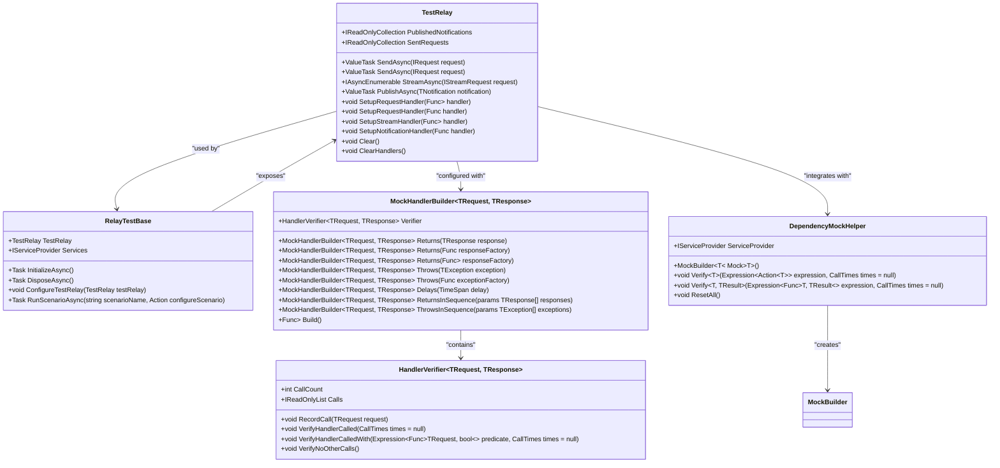

# Unit Testing

<cite>
**Referenced Files in This Document**   
- [RelayTestBase.cs](file://src/Relay.Core.Testing/Core/RelayTestBase.cs)
- [RelayAssertions.cs](file://src/Relay.Core.Testing/Assertions/RelayAssertions.cs)
- [MockHandlerBuilder.cs](file://src/Relay.Core.Testing/Builders/MockHandlerBuilder.cs)
- [TestRelay.cs](file://src/Relay.Core.Testing/Core/TestRelay.cs)
- [TestRelayExtensions.cs](file://src/Relay.Core.Testing/Helpers/TestRelayExtensions.cs)
- [DependencyMockHelper.cs](file://src/Relay.Core.Testing/Helpers/DependencyMockHelper.cs)
- [HandlerVerifier.cs](file://src/Relay.Core.Testing/Verification/HandlerVerifier.cs)
- [UserTests.cs](file://samples/Relay.Core.Testing.Sample/UserTests.cs)
- [ScenarioTests.cs](file://samples/Relay.Core.Testing.Sample/ScenarioTests.cs)
- [README.md](file://src/Relay.Core.Testing/README.md)
</cite>

## Table of Contents
1. [Introduction](#introduction)
2. [Core Testing Components](#core-testing-components)
3. [Specialized Assertion Libraries](#specialized-assertion-libraries)
4. [Mock Builders for Handlers](#mock-builders-for-handlers)
5. [Test Base Classes](#test-base-classes)
6. [Creating Isolated Handler Tests](#creating-isolated-handler-tests)
7. [Testing Request Handlers](#testing-request-handlers)
8. [Testing Notification Handlers](#testing-notification-handlers)
9. [Testing Pipeline Behaviors](#testing-pipeline-behaviors)
10. [Integration with Dependency Injection](#integration-with-dependency-injection)
11. [Asynchronous Test Handling](#asynchronous-test-handling)
12. [Advanced Testing Features](#advanced-testing-features)
13. [Troubleshooting Common Issues](#troubleshooting-common-issues)
14. [Conclusion](#conclusion)

## Introduction

The Relay framework provides a comprehensive unit testing ecosystem designed to simplify the testing of request handlers, notification handlers, and pipeline behaviors. This documentation details the implementation of the unit testing capabilities, focusing on specialized assertion libraries, mock builders, test base classes, and practical examples from the codebase. The testing framework enables developers to create isolated tests for individual handlers using MockHandlerBuilder and verify execution patterns with precision. The system integrates seamlessly with the dependency injection framework and addresses common challenges such as asynchronous test handling through robust solutions.

**Section sources**
- [README.md](file://src/Relay.Core.Testing/README.md#L1-L800)

## Core Testing Components

The Relay.Core.Testing library provides a comprehensive suite of components for unit testing Relay-based applications. At the core of this system is the TestRelay class, which serves as a test implementation of the IRelay interface, allowing for the simulation of request handling, notification publishing, and streaming operations in a controlled environment. The framework includes specialized assertion libraries, mock builders for creating test doubles, and base classes that integrate with popular testing frameworks like xUnit, NUnit, and MSTest.

The testing infrastructure is organized into several key namespaces:
- **Assertions**: Contains specialized assertion methods for validating handler execution and notification publishing
- **Builders**: Provides fluent APIs for creating mock handlers and test scenarios
- **Core**: Houses the fundamental testing classes including TestRelay and base test classes
- **Helpers**: Offers utilities for dependency mocking and test setup
- **Verification**: Contains classes for verifying handler call patterns and execution sequences

This modular design enables developers to create isolated tests for individual components while maintaining the ability to verify complex interaction patterns between handlers and services.



**Diagram sources**
- [TestRelay.cs](file://src/Relay.Core.Testing/Core/TestRelay.cs#L1-L234)
- [RelayTestBase.cs](file://src/Relay.Core.Testing/Core/RelayTestBase.cs#L1-L178)
- [MockHandlerBuilder.cs](file://src/Relay.Core.Testing/Builders/MockHandlerBuilder.cs#L1-L242)
- [HandlerVerifier.cs](file://src/Relay.Core.Testing/Verification/HandlerVerifier.cs#L1-L40)
- [DependencyMockHelper.cs](file://src/Relay.Core.Testing/Helpers/DependencyMockHelper.cs#L1-L94)

**Section sources**
- [TestRelay.cs](file://src/Relay.Core.Testing/Core/TestRelay.cs#L1-L234)
- [RelayTestBase.cs](file://src/Relay.Core.Testing/Core/RelayTestBase.cs#L1-L178)
- [MockHandlerBuilder.cs](file://src/Relay.Core.Testing/Builders/MockHandlerBuilder.cs#L1-L242)
- [HandlerVerifier.cs](file://src/Relay.Core.Testing/Verification/HandlerVerifier.cs#L1-L40)
- [DependencyMockHelper.cs](file://src/Relay.Core.Testing/Helpers/DependencyMockHelper.cs#L1-L94)

## Specialized Assertion Libraries

The Relay testing framework provides a comprehensive set of specialized assertion methods through the RelayAssertions class, enabling precise validation of handler execution and notification publishing patterns. These assertions extend the TestRelay class with fluent methods that verify various aspects of the testing environment, making test code more readable and expressive.

The assertion library includes methods for verifying that specific request types were handled, ensuring notifications were published, and confirming the order of operations. These assertions automatically provide detailed error messages when they fail, including information about the actual requests sent and notifications published, which greatly simplifies debugging test failures.

Key assertion methods include:
- `ShouldHaveHandled<TRequest>()` - Verifies that a specific request type was processed
- `ShouldHavePublished<TNotification>()` - Confirms that a notification of the specified type was published
- `ShouldHaveHandledInOrder()` - Validates that requests were processed in the expected sequence
- `ShouldHavePublishedInOrder()` - Ensures notifications were published in the correct order
- `ShouldNotHaveHandled<TRequest>()` - Asserts that a request type was not processed
- `ShouldNotHavePublished<TNotification>()` - Confirms that a notification type was not published

These assertions integrate seamlessly with popular test frameworks and provide clear, descriptive failure messages that help developers quickly identify the source of test failures.


**Diagram sources**
- [RelayAssertions.cs](file://src/Relay.Core.Testing/Assertions/RelayAssertions.cs#L1-L222)
- [TestRelay.cs](file://src/Relay.Core.Testing/Core/TestRelay.cs#L1-L234)

**Section sources**
- [RelayAssertions.cs](file://src/Relay.Core.Testing/Assertions/RelayAssertions.cs#L1-L222)

## Mock Builders for Handlers

The MockHandlerBuilder class provides a fluent API for creating mock request handlers with configurable behavior, enabling isolated testing of individual components. This builder allows developers to specify how a handler should respond to requests, including returning specific values, throwing exceptions, or introducing delays to simulate real-world conditions.

The MockHandlerBuilder supports several configuration options:
- `Returns()` - Configures the handler to return a specific response
- `Returns()` with a factory function - Configures the handler to return a response generated by a function
- `Returns()` with an asynchronous factory - Configures the handler to return a response from an async function
- `Throws()` - Configures the handler to throw a specific exception
- `Throws()` with an exception factory - Configures the handler to throw an exception created by a function
- `Delays()` - Configures the handler to delay its response by a specified duration
- `ReturnsInSequence()` - Configures the handler to return different responses for successive calls
- `ThrowsInSequence()` - Configures the handler to throw different exceptions for successive calls

Each MockHandlerBuilder instance includes a HandlerVerifier that tracks calls to the handler, allowing for verification of execution patterns such as call count and parameter values. The builder's `Build()` method returns a function that can be registered with the TestRelay, making it easy to substitute real handlers with test doubles.


**Diagram sources**
- [MockHandlerBuilder.cs](file://src/Relay.Core.Testing/Builders/MockHandlerBuilder.cs#L1-L242)
- [HandlerVerifier.cs](file://src/Relay.Core.Testing/Verification/HandlerVerifier.cs#L1-L40)

**Section sources**
- [MockHandlerBuilder.cs](file://src/Relay.Core.Testing/Builders/MockHandlerBuilder.cs#L1-L242)

## Test Base Classes

The Relay testing framework provides base classes that integrate with popular testing frameworks, simplifying test setup and teardown. The primary base class is RelayTestBase, which is designed for use with xUnit but can be adapted for other frameworks. This class implements IAsyncLifetime, ensuring proper initialization and cleanup of test resources.

RelayTestBase provides several key features:
- Automatic creation and disposal of the TestRelay instance
- Access to the test relay through the TestRelay property
- Access to the service provider through the Services property
- Virtual methods for customizing test setup and teardown
- Built-in support for running test scenarios

The base class handles the lifecycle of the testing environment, calling InitializeAsync() before each test and DisposeAsync() after each test. Developers can override ConfigureTestRelay() to customize the TestRelay setup, OnTestInitializedAsync() to perform additional setup, and OnTestCleanupAsync() to perform additional cleanup.

For other testing frameworks, similar base classes are available:
- RelayTestFixture for NUnit
- RelayTestClass for MSTest

These base classes provide a consistent testing experience across different frameworks while leveraging the specific features of each framework.


**Diagram sources**
- [RelayTestBase.cs](file://src/Relay.Core.Testing/Core/RelayTestBase.cs#L1-L178)
- [TestRelay.cs](file://src/Relay.Core.Testing/Core/TestRelay.cs#L1-L234)

**Section sources**
- [RelayTestBase.cs](file://src/Relay.Core.Testing/Core/RelayTestBase.cs#L1-L178)

## Creating Isolated Handler Tests

The Relay testing framework enables the creation of isolated tests for individual handlers using the MockHandlerBuilder and TestRelay classes. This isolation allows developers to test handlers independently of their dependencies, ensuring that tests are focused and reliable.

To create an isolated test, developers typically follow these steps:
1. Create a TestRelay instance (automatically provided by RelayTestBase)
2. Configure mock handlers for any dependencies using MockHandlerBuilder
3. Send requests to the system under test
4. Verify the results using specialized assertions

The MockHandlerBuilder allows for precise control over the behavior of dependencies, enabling tests to cover various scenarios including success cases, error conditions, and edge cases. For example, a test can configure a repository mock to return a specific value, throw an exception, or introduce a delay to simulate network latency.

The isolation provided by this approach ensures that tests are not affected by changes in other parts of the system, making them more maintainable and less prone to false failures. Additionally, the ability to verify execution patterns through the HandlerVerifier enables comprehensive testing of complex interaction scenarios.


**Diagram sources**
- [MockHandlerBuilder.cs](file://src/Relay.Core.Testing/Builders/MockHandlerBuilder.cs#L1-L242)
- [TestRelay.cs](file://src/Relay.Core.Testing/Core/TestRelay.cs#L1-L234)
- [HandlerVerifier.cs](file://src/Relay.Core.Testing/Verification/HandlerVerifier.cs#L1-L40)

**Section sources**
- [MockHandlerBuilder.cs](file://src/Relay.Core.Testing/Builders/MockHandlerBuilder.cs#L1-L242)
- [TestRelay.cs](file://src/Relay.Core.Testing/Core/TestRelay.cs#L1-L234)

## Testing Request Handlers

Testing request handlers in the Relay framework involves creating isolated tests that verify the behavior of individual handlers. The framework provides several approaches for testing request handlers, from simple unit tests to comprehensive integration tests.

For unit testing, developers can use MockHandlerBuilder to create mock implementations of dependencies and register them with the TestRelay. This allows for testing the handler logic in isolation, without relying on real implementations of services or repositories.

The following example demonstrates testing a CreateUserCommand handler:

```csharp
[Fact]
public async Task CreateUser_ShouldCreateUserAndSendWelcomeEmail()
{
    // Arrange
    var command = new CreateUserCommand
    {
        Name = "John Doe",
        Email = "john.doe@example.com"
    };

    // Setup mocks
    var mockUserRepo = new Mock<IUserRepository>();
    var mockEmailService = new Mock<IEmailService>();

    mockUserRepo
        .Setup(x => x.CreateAsync(It.IsAny<User>()))
        .ReturnsAsync((User u) => { u.Id = Guid.NewGuid(); u.CreatedAt = DateTime.UtcNow; u.IsActive = true; return u; });

    mockEmailService
        .Setup(x => x.SendWelcomeEmailAsync(command.Email, command.Name))
        .Returns(Task.CompletedTask);

    Services.AddSingleton(mockUserRepo.Object);
    Services.AddSingleton(mockEmailService.Object);

    // Act
    var result = await TestRelay.SendAsync(command);

    // Assert
    Assert.NotNull(result);
    Assert.Equal(command.Name, result.Name);
    Assert.Equal(command.Email, result.Email);
    Assert.True(result.IsActive);
    Assert.True(result.CreatedAt > DateTime.UtcNow.AddMinutes(-1));

    // Verify mocks
    mockUserRepo.Verify(x => x.CreateAsync(It.Is<User>(u =>
        u.Name == command.Name && u.Email == command.Email)), Times.Once);
    mockEmailService.Verify(x => x.SendWelcomeEmailAsync(command.Email, command.Name), Times.Once);
}
```

This test verifies that the handler correctly processes the command, creates a user with the expected properties, and triggers the appropriate side effects (sending a welcome email). The use of mocks ensures that the test is isolated and does not depend on external systems.

**Section sources**
- [UserTests.cs](file://samples/Relay.Core.Testing.Sample/UserTests.cs#L1-L254)

## Testing Notification Handlers

Testing notification handlers in the Relay framework follows a similar pattern to testing request handlers but focuses on verifying that notifications are published correctly and that notification handlers respond appropriately. The TestRelay class provides methods for both publishing notifications and verifying that they were published.

To test notification publishing, developers can use the specialized assertions provided by RelayAssertions:

```csharp
// Verify that a notification was published
TestRelay.ShouldHavePublished<UserCreatedNotification>();

// Verify that a notification was published a specific number of times
TestRelay.ShouldHavePublished<UserCreatedNotification>(1);

// Verify that a notification matching specific criteria was published
TestRelay.ShouldHavePublished<UserCreatedNotification>(n => n.UserId == expectedUserId);
```

For testing notification handlers, developers can register mock handlers using MockHandlerBuilder and verify their execution:

```csharp
[Fact]
public async Task UserCreatedNotification_ShouldSendWelcomeEmail()
{
    // Arrange
    var notification = new UserCreatedNotification
    {
        UserId = Guid.NewGuid(),
        UserName = "John Doe",
        UserEmail = "john.doe@example.com"
    };

    // Setup mock email service
    var mockEmailService = new Mock<IEmailService>();
    mockEmailService
        .Setup(x => x.SendWelcomeEmailAsync(notification.UserEmail, notification.UserName))
        .Returns(Task.CompletedTask);

    Services.AddSingleton(mockEmailService.Object);

    // Register mock notification handler
    TestRelay.SetupNotificationHandler<UserCreatedNotification>(async (n, ct) =>
    {
        await mockEmailService.Object.SendWelcomeEmailAsync(n.UserEmail, n.UserName);
    });

    // Act
    await TestRelay.PublishAsync(notification);

    // Assert
    mockEmailService.Verify(x => x.SendWelcomeEmailAsync(notification.UserEmail, notification.UserName), Times.Once);
}
```

The framework also supports testing the order of notification publishing, which is important for workflows that depend on specific sequences of events:

```csharp
// Verify notifications were published in the expected order
TestRelay.ShouldHavePublishedInOrder(
    typeof(UserCreatedNotification),
    typeof(WelcomeEmailSentNotification)
);
```

These testing capabilities ensure that notification-based workflows are reliable and behave as expected.

**Section sources**
- [UserTests.cs](file://samples/Relay.Core.Testing.Sample/UserTests.cs#L1-L254)

## Testing Pipeline Behaviors

Pipeline behaviors in the Relay framework can be tested using the same infrastructure as request and notification handlers. Pipeline behaviors are executed before or after handlers and can modify the request, response, or execution flow. Testing these behaviors requires verifying that they execute in the correct order and perform their intended functions.

To test pipeline behaviors, developers can use several approaches:

1. **Testing behavior execution order**: Verify that pipeline behaviors execute in the expected sequence.

```csharp
[Fact]
public async Task PipelineBehaviors_ShouldExecuteInCorrectOrder()
{
    // Arrange
    var command = new TestCommand();
    var executionOrder = new List<string>();

    // Register pipeline behaviors that record their execution
    TestRelay.SetupPipelineBehavior<TestCommand, TestResult>(async (request, next, ct) =>
    {
        executionOrder.Add("Authorization");
        return await next(request, ct);
    });

    TestRelay.SetupPipelineBehavior<TestCommand, TestResult>(async (request, next, ct) =>
    {
        executionOrder.Add("Validation");
        return await next(request, ct);
    });

    TestRelay.SetupPipelineBehavior<TestCommand, TestResult>(async (request, next, ct) =>
    {
        executionOrder.Add("Logging");
        return await next(request, ct);
    });

    // Configure main handler
    TestRelay.SetupRequestHandler<TestCommand, TestResult>(async (request, ct) =>
    {
        executionOrder.Add("Handler");
        return new TestResult();
    });

    // Act
    await TestRelay.SendAsync(command);

    // Assert
    Assert.Equal(new[] { "Authorization", "Validation", "Logging", "Handler" }, executionOrder);
}
```

2. **Testing behavior logic**: Verify that pipeline behaviors perform their intended functions, such as authorization, validation, or logging.

```csharp
[Fact]
public async Task AuthorizationBehavior_ShouldPreventUnauthorizedAccess()
{
    // Arrange
    var command = new SensitiveCommand();
    var userContext = new UserContext { IsAuthenticated = false, Roles = new List<string>() };

    // Setup authorization behavior
    TestRelay.SetupPipelineBehavior<SensitiveCommand, CommandResult>(async (request, next, ct) =>
    {
        if (!userContext.IsAuthenticated)
            throw new UnauthorizedAccessException("User is not authenticated");
        
        return await next(request, ct);
    });

    // Act & Assert
    var exception = await Assert.ThrowsAsync<UnauthorizedAccessException>(() =>
        TestRelay.SendAsync(command));
    
    Assert.Equal("User is not authenticated", exception.Message);
}
```

3. **Testing behavior interaction with handlers**: Verify that pipeline behaviors correctly modify requests or responses.

```csharp
[Fact]
public async Task LoggingBehavior_ShouldLogRequestAndResponse()
{
    // Arrange
    var command = new TestCommand();
    var logEntries = new List<string>();

    // Setup logging behavior
    TestRelay.SetupPipelineBehavior<TestCommand, TestResult>(async (request, next, ct) =>
    {
        logEntries.Add($"Request received: {request.GetType().Name}");
        var result = await next(request, ct);
        logEntries.Add($"Response sent: {result.GetType().Name}");
        return result;
    });

    // Setup handler
    TestRelay.SetupRequestHandler<TestCommand, TestResult>(async (request, ct) =>
        new TestResult());

    // Act
    await TestRelay.SendAsync(command);

    // Assert
    Assert.Contains("Request received: TestCommand", logEntries);
    Assert.Contains("Response sent: TestResult", logEntries);
}
```

These testing approaches ensure that pipeline behaviors function correctly and integrate properly with the rest of the system.

**Section sources**
- [ScenarioTests.cs](file://samples/Relay.Core.Testing.Sample/ScenarioTests.cs#L1-L207)

## Integration with Dependency Injection

The Relay testing framework integrates seamlessly with the dependency injection system, allowing developers to easily register mock services and test the interaction between components. The TestRelay class works in conjunction with a test service provider that supports the registration of services and their dependencies.

The framework provides several mechanisms for integrating with dependency injection:

1. **Service registration**: Developers can register services directly with the test service provider using the Services property available in test classes that inherit from RelayTestBase.

```csharp
// Register a mock service
Services.AddSingleton(mockUserRepo.Object);
Services.AddSingleton(mockEmailService.Object);

// Register real services for integration testing
Services.AddTransient<IRequestHandler<CreateUserCommand, User>, CreateUserHandler>();
Services.AddSingleton<IUserRepository, InMemoryUserRepository>();
```

2. **Mock registration with DependencyMockHelper**: The DependencyMockHelper class provides a fluent API for creating and managing dependency mocks.

```csharp
// Create a mock helper
var mockHelper = new DependencyMockHelper();

// Create mocks for dependencies
var userRepoMock = mockHelper.Mock<IUserRepository>();
var emailServiceMock = mockHelper.Mock<IEmailService>();

// Configure mock behavior
userRepoMock.Setup(x => x.CreateAsync(It.IsAny<User>()), createdUser);
emailServiceMock.Setup(x => x.SendWelcomeEmailAsync(It.IsAny<string>(), It.IsAny<string>()), Task.CompletedTask);

// Access the service provider containing the mocks
var services = mockHelper.ServiceProvider;
```

3. **Verification of service interactions**: The framework allows for verification that services were called with the expected parameters and the correct number of times.

```csharp
// Verify that a service method was called
mockHelper.Verify(x => x.CreateAsync(It.Is<User>(u => 
    u.Name == "John Doe" && u.Email == "john.doe@example.com")), 
    CallTimes.Once());

// Verify that a service method was not called
mockHelper.Verify(x => x.SendWelcomeEmailAsync(It.IsAny<string>(), It.IsAny<string>()), 
    CallTimes.Never());
```

4. **Resetting mocks between tests**: The DependencyMockHelper provides a ResetAll() method to reset all mocks to their initial state between tests.

```csharp
// Reset all mocks
mockHelper.ResetAll();
```

This integration with dependency injection enables comprehensive testing of component interactions while maintaining the ability to isolate individual components when needed.

**Section sources**
- [UserTests.cs](file://samples/Relay.Core.Testing.Sample/UserTests.cs#L1-L254)
- [ScenarioTests.cs](file://samples/Relay.Core.Testing.Sample/ScenarioTests.cs#L1-L207)

## Asynchronous Test Handling

The Relay testing framework provides robust support for asynchronous test handling, addressing common challenges such as race conditions, timeouts, and proper disposal of resources. The framework is designed to work seamlessly with async/await patterns, making it easy to test asynchronous handlers and services.

Key features for asynchronous test handling include:

1. **Async test lifecycle**: The RelayTestBase class implements IAsyncLifetime, ensuring that initialization and cleanup operations are properly awaited.

```csharp
public override async Task InitializeAsync()
{
    // Async initialization
    await base.InitializeAsync();
    await InitializeDatabaseAsync();
}

public override async Task DisposeAsync()
{
    // Async cleanup
    await CleanupDatabaseAsync();
    await base.DisposeAsync();
}
```

2. **Timeout handling**: The framework includes utilities for handling test timeouts and ensuring that tests do not hang indefinitely.

```csharp
// Test that should complete within a specified time
await (async () => await LongRunningOperationAsync())
    .ShouldCompleteWithin(TimeSpan.FromSeconds(30));
```

3. **Task-based assertions**: The assertion library includes methods for working with tasks and async operations.

```csharp
// Assert that an async operation throws an exception
var exception = await Assert.ThrowsAsync<InvalidOperationException>(() =>
    TestRelay.SendAsync(failingCommand));

// Assert that an async operation completes successfully
await Assert.ThrowsAsync<InvalidOperationException>(() =>
    TestRelay.SendAsync(invalidCommand));
```

4. **Proper cancellation handling**: The framework ensures that cancellation tokens are properly propagated through the handler pipeline.

```csharp
[Fact]
public async Task Cancellation_ShouldStopLongRunningOperation()
{
    // Arrange
    var cts = new CancellationTokenSource();
    var command = new LongRunningCommand();

    // Start the operation and cancel it after a short delay
    var task = TestRelay.SendAsync(command, cts.Token);
    cts.CancelAfter(TimeSpan.FromMilliseconds(100));

    // Act & Assert
    var exception = await Assert.ThrowsAsync<TaskCanceledException>(() => task);
}
```

5. **Async verification**: The framework supports asynchronous verification of side effects and external interactions.

```csharp
[Fact]
public async Task AsyncSideEffect_ShouldCompleteSuccessfully()
{
    // Arrange
    var command = new CommandWithAsyncSideEffect();
    
    // Act
    await TestRelay.SendAsync(command);
    
    // Assert - verify async side effect
    await EventuallyAsync(() => 
        mockEmailService.Verify(x => x.SendEmailAsync(It.IsAny<string>()), Times.Once()),
        TimeSpan.FromSeconds(5));
}
```

These features ensure that asynchronous code can be tested reliably and that tests accurately reflect the behavior of the system under real-world conditions.

**Section sources**
- [UserTests.cs](file://samples/Relay.Core.Testing.Sample/UserTests.cs#L1-L254)
- [ScenarioTests.cs](file://samples/Relay.Core.Testing.Sample/ScenarioTests.cs#L1-L207)

## Advanced Testing Features

The Relay testing framework includes several advanced features that enable comprehensive testing of complex scenarios and edge cases. These features extend the basic testing capabilities to support more sophisticated testing requirements.

### Scenario-Based Testing

The framework supports scenario-based testing through the RunScenarioAsync method, which allows developers to define and execute multi-step test scenarios.

```csharp
[Fact]
public async Task UserLifecycleScenario_ShouldHandleCompleteUserWorkflow()
{
    var result = await RunScenarioAsync("User Lifecycle", builder =>
    {
        // Given - Setup initial state
        builder.Given("User repository is available", async () =>
        {
            Services.AddSingleton<IUserRepository, InMemoryUserRepository>();
            Services.AddSingleton<IEmailService, ConsoleEmailService>();
            Services.AddTransient<IRequestHandler<CreateUserCommand, User>, CreateUserHandler>();
        });

        // When - Execute user lifecycle steps
        builder.When("Create user", async () =>
        {
            var createCommand = new CreateUserCommand
            {
                Name = "John Doe",
                Email = "john.doe@example.com"
            };
            await TestRelay.SendAsync(createCommand);
        });

        builder.When("Update user", async () =>
        {
            var updateCommand = new UpdateUserCommand
            {
                UserId = Guid.NewGuid(),
                Name = "Updated Name",
                Email = "updated@example.com"
            };
            await TestRelay.SendAsync(updateCommand);
        });

        // Then - Verify results
        builder.Then("User lifecycle completed successfully", result =>
        {
            Assert.True(result.Success);
        });
    });

    AssertScenarioSuccess(result);
}
```

### Custom Assertion Extensions

Developers can extend the assertion library with custom assertions tailored to their specific domain.

```csharp
public static class UserAssertions
{
    public static void ShouldBeActiveUser(this User user)
    {
        Assert.NotNull(user);
        Assert.True(user.IsActive);
        Assert.NotNull(user.CreatedAt);
        Assert.True(user.CreatedAt <= DateTime.UtcNow);
    }
    
    public static void ShouldHaveRole(this User user, string role)
    {
        Assert.Contains(role, user.Roles);
    }
}
```

### Mock Verification

The framework provides advanced mock verification capabilities, including verification of call patterns and parameter values.

```csharp
// Verify that a method was called with specific parameters
mockUserRepo.Verify(x => x.CreateAsync(It.Is<User>(u =>
    u.Name == "John Doe" && u.Email == "john.doe@example.com")), 
    Times.Once);

// Verify the order of method calls
mockEmailService.InOrder(x => x.SendWelcomeEmailAsync("john.doe@example.com", "John Doe"))
                .Then(x => x.SendAccountConfirmationEmail("john.doe@example.com"));
```

### Performance Testing

The framework includes support for performance testing, allowing developers to verify that operations meet performance requirements.

```csharp
[Fact]
public async Task PerformanceScenario_ShouldMeetPerformanceRequirements()
{
    var result = await Task.Run(async () =>
    {
        var scenarioResult = await RunScenarioAsync("Performance Test", builder =>
        {
            // Given - Setup performance test environment
            builder.Given("User repository is available", async () =>
            {
                Services.AddSingleton<IUserRepository, InMemoryUserRepository>();
                Services.AddTransient<IRequestHandler<CreateUserCommand, User>, CreateUserHandler>();
            });

            // When - Perform operations under load
            builder.When("Create multiple users", async () =>
            {
                for (int i = 0; i < 100; i++)
                {
                    var command = new CreateUserCommand
                    {
                        Name = $"User {i}",
                        Email = $"user{i}@example.com"
                    };
                    await TestRelay.SendAsync(command);
                }
            });

            // Then - Verify performance requirements
            builder.Then("Operations completed successfully", result =>
            {
                Assert.True(result.Success);
            });
        });

        return scenarioResult;
    }).ShouldCompleteWithinAsync(TimeSpan.FromSeconds(5));

    AssertScenarioSuccess(result);
}
```

These advanced features enable developers to create comprehensive test suites that cover not only basic functionality but also complex workflows, performance requirements, and edge cases.

**Section sources**
- [ScenarioTests.cs](file://samples/Relay.Core.Testing.Sample/ScenarioTests.cs#L1-L207)

## Troubleshooting Common Issues

When working with the Relay unit testing framework, developers may encounter several common issues. This section provides guidance on identifying and resolving these problems.

### Issue 1: Handler Not Found

**Symptom**: The test fails with a message indicating that no handler was found for a request.

**Solution**: Ensure that the handler is properly registered with the TestRelay. This can be done in several ways:

```csharp
// Option 1: Register a real handler
Services.AddTransient<IRequestHandler<MyCommand, MyResult>, MyCommandHandler>();

// Option 2: Register a mock handler
TestRelay.SetupRequestHandler<MyCommand, MyResult>(async (command, ct) =>
    new MyResult());

// Option 3: Use MockHandlerBuilder
TestRelay.WithMockHandler<MyCommand, MyResult>(builder =>
    builder.Returns(new MyResult()));
```

### Issue 2: Mock Verification Fails

**Symptom**: The mock verification fails, indicating that a method was not called when expected.

**Solution**: Check the following:
1. Ensure the mock is properly registered with the service provider
2. Verify that the method signature matches exactly, including parameter types
3. Check that the mock is being used by the system under test

```csharp
// Correct mock setup
var mockService = new Mock<IMyService>();
mockService.Setup(x => x.ProcessAsync(It.IsAny<string>())).Returns(Task.CompletedTask);
Services.AddSingleton(mockService.Object);

// Correct verification
mockService.Verify(x => x.ProcessAsync(It.IsAny<string>()), Times.Once);
```

### Issue 3: Asynchronous Test Hangs

**Symptom**: The test appears to hang and eventually times out.

**Solution**: This is often caused by a missing await or a deadlock. Check the following:
1. Ensure all async methods are properly awaited
2. Avoid using .Result or .Wait() on tasks
3. Use ConfigureAwait(false) in library code when appropriate

```csharp
// Correct - properly awaited
await TestRelay.SendAsync(command);

// Incorrect - can cause deadlock
TestRelay.SendAsync(command).Wait();
```

### Issue 4: Test Pollution Between Tests

**Symptom**: Tests pass when run individually but fail when run together.

**Solution**: Ensure proper isolation between tests by:
1. Resetting mocks between tests
2. Clearing the TestRelay state
3. Using fresh instances of services

```csharp
public override async Task DisposeAsync()
{
    // Clear all handlers and recorded requests/notifications
    TestRelay.Clear();
    TestRelay.ClearHandlers();
    
    await base.DisposeAsync();
}
```

### Issue 5: Pipeline Behavior Order Issues

**Symptom**: Pipeline behaviors execute in an unexpected order.

**Solution**: Explicitly configure the order of pipeline behaviors:

```csharp
// Configure behaviors in the desired order
TestRelay.SetupPipelineBehavior<Command, Result>(authorizationBehavior);
TestRelay.SetupPipelineBehavior<Command, Result>(validationBehavior);
TestRelay.SetupPipelineBehavior<Command, Result>(loggingBehavior);
```

### Issue 6: Memory Leaks in Long-Running Tests

**Symptom**: Memory usage increases over time during test execution.

**Solution**: Ensure proper disposal of resources:

```csharp
public override async Task DisposeAsync()
{
    // Dispose any disposable resources
    _disposableResource?.Dispose();
    
    // Clear large data structures
    _testData.Clear();
    
    await base.DisposeAsync();
}
```

By following these troubleshooting guidelines, developers can quickly identify and resolve common issues encountered when testing with the Relay framework.

**Section sources**
- [UserTests.cs](file://samples/Relay.Core.Testing.Sample/UserTests.cs#L1-L254)
- [ScenarioTests.cs](file://samples/Relay.Core.Testing.Sample/ScenarioTests.cs#L1-L207)

## Conclusion

The Relay framework provides a comprehensive and robust unit testing ecosystem that enables developers to create isolated, reliable, and maintainable tests for their applications. The framework's specialized assertion libraries, mock builders, and test base classes simplify the testing process while providing the flexibility needed to test complex scenarios.

Key strengths of the Relay testing framework include:
- **Isolation**: The ability to test individual components in isolation using mock handlers and dependency injection
- **Expressiveness**: Fluent APIs for configuring mocks and assertions that make test code readable and maintainable
- **Comprehensiveness**: Support for testing request handlers, notification handlers, pipeline behaviors, and complex workflows
- **Integration**: Seamless integration with popular testing frameworks and dependency injection systems
- **Advanced features**: Support for scenario-based testing, performance testing, and custom assertion extensions

The framework addresses common testing challenges such as asynchronous test handling, mock verification, and test pollution through robust solutions that ensure tests are reliable and accurate. By leveraging these capabilities, developers can create comprehensive test suites that provide confidence in the correctness and reliability of their applications.

The examples and patterns demonstrated in this documentation provide a solid foundation for effective unit testing with the Relay framework, enabling developers to build high-quality software with confidence.