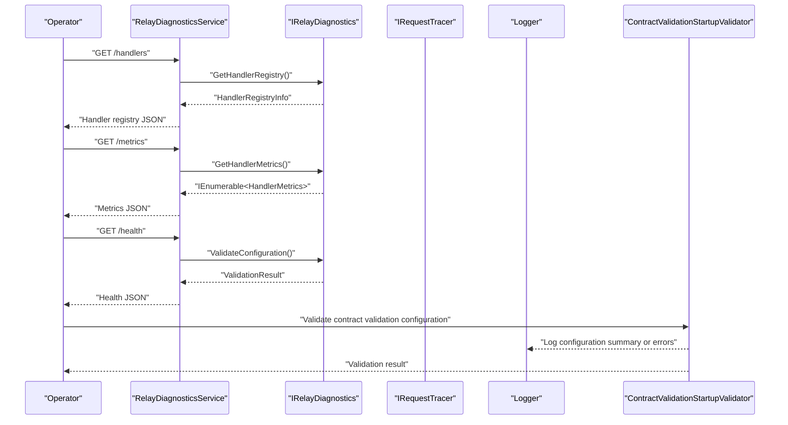
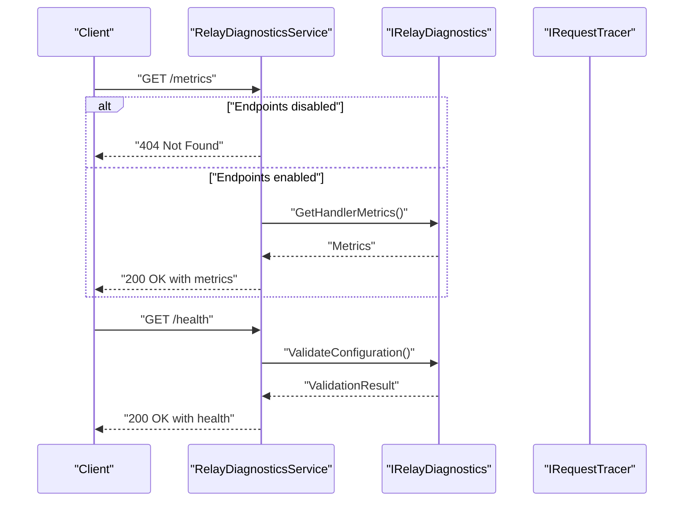
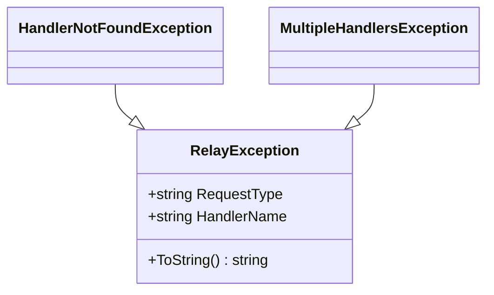
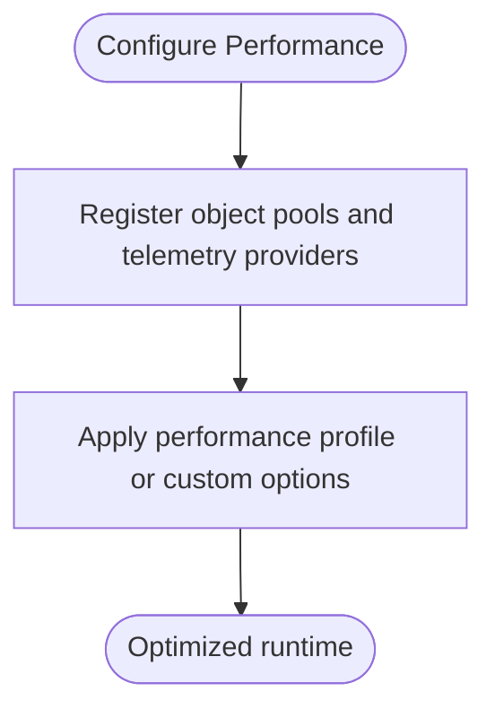
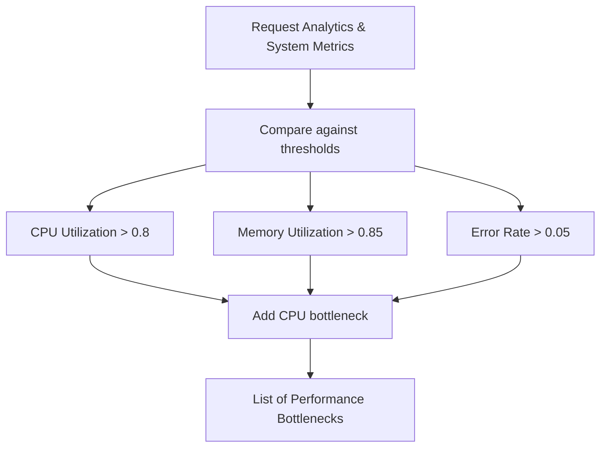
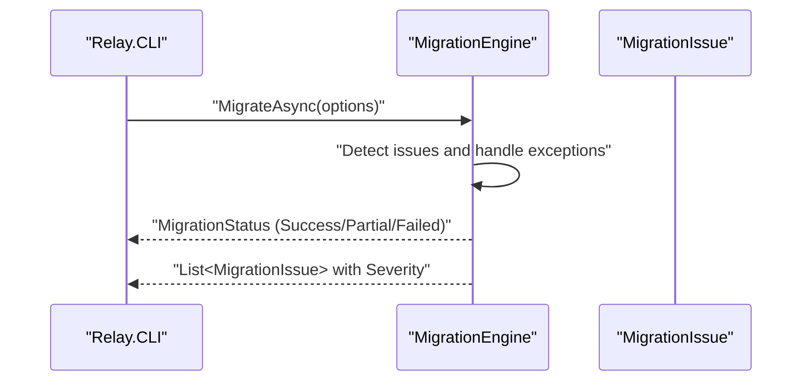
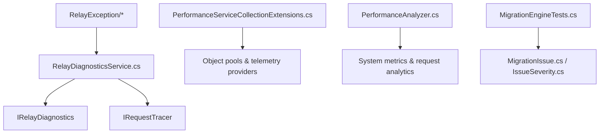

# Troubleshooting

<cite>
**Referenced Files in This Document**
- [TROUBLESHOOTING.md](file://docs/MessageBroker/TROUBLESHOOTING.md)
- [CONFIGURATION.md](file://docs/MessageBroker/CONFIGURATION.md)
- [BEST_PRACTICES.md](file://docs/MessageBroker/BEST_PRACTICES.md)
- [HandlerNotFoundException.cs](file://src/Relay.Core/Exceptions/HandlerNotFoundException.cs)
- [MultipleHandlersException.cs](file://src/Relay.Core/Exceptions/MultipleHandlersException.cs)
- [RelayException.cs](file://src/Relay.Core/Exceptions/RelayException.cs)
- [PerformanceServiceCollectionExtensions.cs](file://src/Relay.Core/Performance/PerformanceServiceCollectionExtensions.cs)
- [PerformanceAnalyzer.cs](file://src/Relay.Core.AI/AI/Analysis/Engines/Analyzers/PerformanceAnalyzer.cs)
- [AIOptimizationEngine.cs](file://src/Relay.Core.AI/AI/Optimization/Engines/AIOptimizationEngine.cs)
- [RelayDiagnosticsService.cs](file://src/Relay.Core/Diagnostics/Services/RelayDiagnosticsService.cs)
- [RelayDiagnosticsServiceMetricsTests.cs](file://tests/Relay.Core.Tests/Diagnostics/RelayDiagnosticsServiceMetricsTests.cs)
- [RelayDiagnosticsServiceSummaryTests.cs](file://tests/Relay.Core.Tests/Diagnostics/RelayDiagnosticsServiceSummaryTests.cs)
- [RelayDiagnosticsServiceHealthTests.cs](file://tests/Relay.Core.Tests/Diagnostics/RelayDiagnosticsServiceHealthTests.cs)
- [ContractValidationStartupValidator.cs](file://src/Relay.Core/ContractValidation/Configuration/ContractValidationStartupValidator.cs)
- [README.md (ContractValidation)](file://src/Relay.Core/ContractValidation/Configuration/README.md)
- [README.md (Observability)](file://src/Relay.Core/ContractValidation/Observability/README.md)
- [MigrationEngineTests.cs](file://tools/Relay.CLI.Tests/Migration/MigrationEngineTests.cs)
- [MigrationIssue.cs](file://tools/Relay.CLI/Migration/MigrationIssue.cs)
- [IssueSeverity.cs](file://tools/Relay.CLI/Migration/IssueSeverity.cs)
- [MigrateCommandTests.cs](file://tools/Relay.CLI.Tests/Commands/MigrateCommandTests.cs)
- [DOCKER_DEPLOYMENT.md](file://docs/MessageBroker/deployment/DOCKER_DEPLOYMENT.md)
- [KUBERNETES_DEPLOYMENT.md](file://docs/MessageBroker/deployment/KUBERNETES_DEPLOYMENT.md)
</cite>

## Table of Contents
1. [Introduction](#introduction)
2. [Project Structure](#project-structure)
3. [Core Components](#core-components)
4. [Architecture Overview](#architecture-overview)
5. [Detailed Component Analysis](#detailed-component-analysis)
6. [Dependency Analysis](#dependency-analysis)
7. [Performance Considerations](#performance-considerations)
8. [Troubleshooting Guide](#troubleshooting-guide)
9. [Conclusion](#conclusion)
10. [Appendices](#appendices)

## Introduction
This section provides a comprehensive troubleshooting guide for the Relay framework focusing on setup, configuration, and runtime issues. It covers common symptoms, root cause diagnosis, actionable solutions, and best practices for logging, metrics, and tracing. It also includes guidance for diagnosing performance bottlenecks, interpreting logs and metrics, and isolating issues in distributed systems. Finally, it outlines a systematic troubleshooting checklist and version-specific considerations.

## Project Structure
The troubleshooting content is primarily documented in the Message Broker documentation set and validated by tests and core components across the codebase. The most relevant sources include:
- Troubleshooting guide for Message Broker enhancements
- Configuration reference for all components
- Best practices for production deployments
- Diagnostics and error handling infrastructure
- Performance and AI-driven optimization engines
- CLI migration and validation utilities

```mermaid
graph TB
A["Troubleshooting Guide<br/>docs/MessageBroker/TROUBLESHOOTING.md"]
B["Configuration Guide<br/>docs/MessageBroker/CONFIGURATION.md"]
C["Best Practices<br/>docs/MessageBroker/BEST_PRACTICES.md"]
D["Diagnostics Service<br/>src/Relay.Core/Diagnostics/Services/RelayDiagnosticsService.cs"]
E["Exceptions<br/>src/Relay.Core/Exceptions/*"]
F["Performance Optimizations<br/>src/Relay.Core/Performance/PerformanceServiceCollectionExtensions.cs"]
G["AI Performance Analyzer<br/>src/Relay.Core.AI/.../PerformanceAnalyzer.cs"]
H["CLI Migration & Validation<br/>tools/Relay.CLI/*"]
I["Deployment Guides<br/>docs/MessageBroker/deployment/*"]
A --> B
A --> C
A --> D
A --> E
A --> F
A --> G
A --> H
A --> I
```

**Diagram sources**
- [TROUBLESHOOTING.md](file://docs/MessageBroker/TROUBLESHOOTING.md#L1-L1021)
- [CONFIGURATION.md](file://docs/MessageBroker/CONFIGURATION.md#L1-L925)
- [BEST_PRACTICES.md](file://docs/MessageBroker/BEST_PRACTICES.md#L1-L935)
- [RelayDiagnosticsService.cs](file://src/Relay.Core/Diagnostics/Services/RelayDiagnosticsService.cs#L1-L200)
- [HandlerNotFoundException.cs](file://src/Relay.Core/Exceptions/HandlerNotFoundException.cs#L1-L27)
- [MultipleHandlersException.cs](file://src/Relay.Core/Exceptions/MultipleHandlersException.cs#L1-L16)
- [RelayException.cs](file://src/Relay.Core/Exceptions/RelayException.cs#L1-L51)
- [PerformanceServiceCollectionExtensions.cs](file://src/Relay.Core/Performance/PerformanceServiceCollectionExtensions.cs#L1-L68)
- [PerformanceAnalyzer.cs](file://src/Relay.Core.AI/AI/Analysis/Engines/Analyzers/PerformanceAnalyzer.cs#L82-L112)
- [MigrationEngineTests.cs](file://tools/Relay.CLI.Tests/Migration/MigrationEngineTests.cs#L432-L459)
- [DOCKER_DEPLOYMENT.md](file://docs/MessageBroker/deployment/DOCKER_DEPLOYMENT.md#L556-L568)
- [KUBERNETES_DEPLOYMENT.md](file://docs/MessageBroker/deployment/KUBERNETES_DEPLOYMENT.md#L661-L673)

**Section sources**
- [TROUBLESHOOTING.md](file://docs/MessageBroker/TROUBLESHOOTING.md#L1-L1021)
- [CONFIGURATION.md](file://docs/MessageBroker/CONFIGURATION.md#L1-L925)
- [BEST_PRACTICES.md](file://docs/MessageBroker/BEST_PRACTICES.md#L1-L935)

## Core Components
- Diagnostics Service: Provides endpoints to inspect handler registry, metrics, health, and clear diagnostic data. It validates configuration and surfaces errors with detailed diagnostics.
- Exception Types: Specialized exceptions for missing or conflicting handlers help pinpoint registration/configuration issues.
- Performance Optimizations: Service collection extensions register pools and telemetry providers to reduce overhead and improve throughput.
- AI Performance Analyzer: Identifies performance bottlenecks based on request analytics and system metrics.
- CLI Migration and Validation: Validates migration issues and handles unexpected exceptions gracefully, aiding in version-specific troubleshooting.

**Section sources**
- [RelayDiagnosticsService.cs](file://src/Relay.Core/Diagnostics/Services/RelayDiagnosticsService.cs#L1-L200)
- [HandlerNotFoundException.cs](file://src/Relay.Core/Exceptions/HandlerNotFoundException.cs#L1-L27)
- [MultipleHandlersException.cs](file://src/Relay.Core/Exceptions/MultipleHandlersException.cs#L1-L16)
- [RelayException.cs](file://src/Relay.Core/Exceptions/RelayException.cs#L1-L51)
- [PerformanceServiceCollectionExtensions.cs](file://src/Relay.Core/Performance/PerformanceServiceCollectionExtensions.cs#L1-L68)
- [PerformanceAnalyzer.cs](file://src/Relay.Core.AI/AI/Analysis/Engines/Analyzers/PerformanceAnalyzer.cs#L82-L112)
- [MigrationEngineTests.cs](file://tools/Relay.CLI.Tests/Migration/MigrationEngineTests.cs#L432-L459)

## Architecture Overview
The troubleshooting workflow integrates diagnostics, configuration validation, and performance analysis to isolate and resolve issues quickly.

**Diagram sources**
- [RelayDiagnosticsService.cs](file://src/Relay.Core/Diagnostics/Services/RelayDiagnosticsService.cs#L1-L200)
- [ContractValidationStartupValidator.cs](file://src/Relay.Core/ContractValidation/Configuration/ContractValidationStartupValidator.cs#L1-L67)

**Section sources**
- [RelayDiagnosticsService.cs](file://src/Relay.Core/Diagnostics/Services/RelayDiagnosticsService.cs#L1-L200)
- [ContractValidationStartupValidator.cs](file://src/Relay.Core/ContractValidation/Configuration/ContractValidationStartupValidator.cs#L1-L67)

## Detailed Component Analysis

### Diagnostics Service
- Purpose: Exposes endpoints to inspect handlers, metrics, and health; wraps exceptions with detailed error information.
- Key behaviors:
  - Validates whether diagnostic endpoints are enabled.
  - Returns structured error responses with exception details when operations fail.
  - Supports retrieving diagnostic summaries and clearing diagnostic data.

**Diagram sources**
- [RelayDiagnosticsService.cs](file://src/Relay.Core/Diagnostics/Services/RelayDiagnosticsService.cs#L1-L200)
- [RelayDiagnosticsServiceMetricsTests.cs](file://tests/Relay.Core.Tests/Diagnostics/RelayDiagnosticsServiceMetricsTests.cs#L122-L154)
- [RelayDiagnosticsServiceSummaryTests.cs](file://tests/Relay.Core.Tests/Diagnostics/RelayDiagnosticsServiceSummaryTests.cs#L95-L167)
- [RelayDiagnosticsServiceHealthTests.cs](file://tests/Relay.Core.Tests/Diagnostics/RelayDiagnosticsServiceHealthTests.cs#L187-L214)

**Section sources**
- [RelayDiagnosticsService.cs](file://src/Relay.Core/Diagnostics/Services/RelayDiagnosticsService.cs#L1-L200)
- [RelayDiagnosticsServiceMetricsTests.cs](file://tests/Relay.Core.Tests/Diagnostics/RelayDiagnosticsServiceMetricsTests.cs#L122-L154)
- [RelayDiagnosticsServiceSummaryTests.cs](file://tests/Relay.Core.Tests/Diagnostics/RelayDiagnosticsServiceSummaryTests.cs#L95-L167)
- [RelayDiagnosticsServiceHealthTests.cs](file://tests/Relay.Core.Tests/Diagnostics/RelayDiagnosticsServiceHealthTests.cs#L187-L214)

### Exception Types
- HandlerNotFoundException: Indicates a missing handler for a request type.
- MultipleHandlersException: Indicates multiple handlers registered for a single-handler expectation.
- RelayException: Base exception with request type and handler name metadata for richer diagnostics.

**Diagram sources**
- [RelayException.cs](file://src/Relay.Core/Exceptions/RelayException.cs#L1-L51)
- [HandlerNotFoundException.cs](file://src/Relay.Core/Exceptions/HandlerNotFoundException.cs#L1-L27)
- [MultipleHandlersException.cs](file://src/Relay.Core/Exceptions/MultipleHandlersException.cs#L1-L16)

**Section sources**
- [RelayException.cs](file://src/Relay.Core/Exceptions/RelayException.cs#L1-L51)
- [HandlerNotFoundException.cs](file://src/Relay.Core/Exceptions/HandlerNotFoundException.cs#L1-L27)
- [MultipleHandlersException.cs](file://src/Relay.Core/Exceptions/MultipleHandlersException.cs#L1-L16)

### Performance Optimizations
- Registers object pools and pooled telemetry providers to reduce GC pressure and improve throughput.
- Provides performance profiles and custom configuration hooks.

**Diagram sources**
- [PerformanceServiceCollectionExtensions.cs](file://src/Relay.Core/Performance/PerformanceServiceCollectionExtensions.cs#L1-L68)

**Section sources**
- [PerformanceServiceCollectionExtensions.cs](file://src/Relay.Core/Performance/PerformanceServiceCollectionExtensions.cs#L1-L68)

### AI Performance Analyzer
- Identifies performance bottlenecks by analyzing request execution times and system metrics.
- Flags high CPU/memory/utilization and high error rates as critical or high severity.

**Diagram sources**
- [PerformanceAnalyzer.cs](file://src/Relay.Core.AI/AI/Analysis/Engines/Analyzers/PerformanceAnalyzer.cs#L82-L112)
- [AIOptimizationEngine.cs](file://src/Relay.Core.AI/AI/Optimization/Engines/AIOptimizationEngine.cs#L375-L441)

**Section sources**
- [PerformanceAnalyzer.cs](file://src/Relay.Core.AI/AI/Analysis/Engines/Analyzers/PerformanceAnalyzer.cs#L82-L112)
- [AIOptimizationEngine.cs](file://src/Relay.Core.AI/AI/Optimization/Engines/AIOptimizationEngine.cs#L375-L441)

### CLI Migration and Validation
- Handles migration with graceful error handling and reports migration issues with severity levels.
- Supports progress callbacks and validation of MediatR version compatibility.

**Diagram sources**
- [MigrationEngineTests.cs](file://tools/Relay.CLI.Tests/Migration/MigrationEngineTests.cs#L432-L459)
- [MigrationIssue.cs](file://tools/Relay.CLI/Migration/MigrationIssue.cs#L1-L13)
- [IssueSeverity.cs](file://tools/Relay.CLI/Migration/IssueSeverity.cs#L1-L27)
- [MigrateCommandTests.cs](file://tools/Relay.CLI.Tests/Commands/MigrateCommandTests.cs#L925-L952)

**Section sources**
- [MigrationEngineTests.cs](file://tools/Relay.CLI.Tests/Migration/MigrationEngineTests.cs#L432-L459)
- [MigrationIssue.cs](file://tools/Relay.CLI/Migration/MigrationIssue.cs#L1-L13)
- [IssueSeverity.cs](file://tools/Relay.CLI/Migration/IssueSeverity.cs#L1-L27)
- [MigrateCommandTests.cs](file://tools/Relay.CLI.Tests/Commands/MigrateCommandTests.cs#L925-L952)

## Dependency Analysis
- Diagnostics Service depends on IRelayDiagnostics and IRequestTracer; it validates configuration and returns structured responses.
- Exception types are part of the core framework and surface metadata useful for diagnostics.
- Performance optimizations rely on object pooling and telemetry providers to reduce overhead.
- AI analyzer consumes request analytics and system metrics to produce bottleneck insights.
- CLI migration integrates with validation and reporting to manage version-specific issues.

**Diagram sources**
- [RelayDiagnosticsService.cs](file://src/Relay.Core/Diagnostics/Services/RelayDiagnosticsService.cs#L1-L200)
- [RelayException.cs](file://src/Relay.Core/Exceptions/RelayException.cs#L1-L51)
- [PerformanceServiceCollectionExtensions.cs](file://src/Relay.Core/Performance/PerformanceServiceCollectionExtensions.cs#L1-L68)
- [PerformanceAnalyzer.cs](file://src/Relay.Core.AI/AI/Analysis/Engines/Analyzers/PerformanceAnalyzer.cs#L82-L112)
- [MigrationEngineTests.cs](file://tools/Relay.CLI.Tests/Migration/MigrationEngineTests.cs#L432-L459)
- [MigrationIssue.cs](file://tools/Relay.CLI/Migration/MigrationIssue.cs#L1-L13)
- [IssueSeverity.cs](file://tools/Relay.CLI/Migration/IssueSeverity.cs#L1-L27)

**Section sources**
- [RelayDiagnosticsService.cs](file://src/Relay.Core/Diagnostics/Services/RelayDiagnosticsService.cs#L1-L200)
- [RelayException.cs](file://src/Relay.Core/Exceptions/RelayException.cs#L1-L51)
- [PerformanceServiceCollectionExtensions.cs](file://src/Relay.Core/Performance/PerformanceServiceCollectionExtensions.cs#L1-L68)
- [PerformanceAnalyzer.cs](file://src/Relay.Core.AI/AI/Analysis/Engines/Analyzers/PerformanceAnalyzer.cs#L82-L112)
- [MigrationEngineTests.cs](file://tools/Relay.CLI.Tests/Migration/MigrationEngineTests.cs#L432-L459)
- [MigrationIssue.cs](file://tools/Relay.CLI/Migration/MigrationIssue.cs#L1-L13)
- [IssueSeverity.cs](file://tools/Relay.CLI/Migration/IssueSeverity.cs#L1-L27)

## Performance Considerations
- Connection pooling: Tune min/max pool size and timeouts based on workload characteristics.
- Batch processing: Adjust batch size and flush intervals to balance latency and throughput.
- Deduplication: Set appropriate window and cache size to minimize duplicate processing overhead.
- Prefetch count: Align with average processing time to avoid backpressure or starvation.
- Compression: Enable compression for large messages to reduce bandwidth and storage costs.
- Circuit breaker: Configure thresholds and timeouts to protect upstream systems.
- Bulkhead: Isolate critical operations to prevent cascading failures.
- Backpressure: Dynamically throttle traffic under load to recover stability.
- Metrics and tracing: Enable appropriate sampling and labels; monitor p95/p99 latencies and error rates.

[No sources needed since this section provides general guidance]

## Troubleshooting Guide

### Setup and Configuration Issues
- Symptoms:
  - Messages not publishing or consuming.
  - Health checks failing continuously.
  - Encryption/authentication misconfigurations.
  - Rate limiting too restrictive or ineffective.
- Diagnosis steps:
  - Verify broker connectivity and lifecycle.
  - Confirm configuration profiles and environment variables.
  - Validate encryption keys and rotation settings.
  - Check authentication/authorization settings and JWT claims.
  - Inspect rate limiting configuration and tenant limits.
- Solutions:
  - Start the broker before health checks.
  - Use configuration profiles for dev/prod differences.
  - Ensure encryption key provider and rotation grace period are set.
  - Configure JWT issuer/audience and roles.
  - Adjust rate limiting strategy and per-tenant limits.

**Section sources**
- [TROUBLESHOOTING.md](file://docs/MessageBroker/TROUBLESHOOTING.md#L21-L118)
- [CONFIGURATION.md](file://docs/MessageBroker/CONFIGURATION.md#L23-L126)
- [CONFIGURATION.md](file://docs/MessageBroker/CONFIGURATION.md#L485-L553)
- [CONFIGURATION.md](file://docs/MessageBroker/CONFIGURATION.md#L555-L610)
- [CONFIGURATION.md](file://docs/MessageBroker/CONFIGURATION.md#L612-L666)
- [BEST_PRACTICES.md](file://docs/MessageBroker/BEST_PRACTICES.md#L41-L51)

### Outbox and Inbox Patterns
- Symptoms:
  - Outbox messages stuck or failing repeatedly.
  - Duplicate messages processed.
  - Inbox table growing too large.
- Diagnosis:
  - Check pending/outbox counts and worker status.
  - Inspect failed messages and error patterns.
  - Verify inbox retention and cleanup intervals.
- Solutions:
  - Ensure OutboxWorker is registered and polling interval is reasonable.
  - Increase retry attempts and enable exponential backoff.
  - Reset failed messages for reprocessing when appropriate.
  - Enable inbox and ensure unique message IDs.
  - Adjust retention and cleanup intervals; run manual cleanup if needed.

**Section sources**
- [TROUBLESHOOTING.md](file://docs/MessageBroker/TROUBLESHOOTING.md#L93-L190)
- [TROUBLESHOOTING.md](file://docs/MessageBroker/TROUBLESHOOTING.md#L191-L277)

### Connection Pool and Network Issues
- Symptoms:
  - Connection pool exhaustion or stale connections.
  - Timeouts acquiring connections.
- Diagnosis:
  - Inspect pool metrics (active/idle/wait time).
  - Validate connection validation and idle timeouts.
- Solutions:
  - Increase pool size and adjust connection timeout.
  - Enable connection validation and reduce idle timeout.
  - Fix connection leaks by ensuring proper disposal.

**Section sources**
- [TROUBLESHOOTING.md](file://docs/MessageBroker/TROUBLESHOOTING.md#L278-L353)

### Batch Processing and Compression
- Symptoms:
  - Batches not flushing or compression not working.
- Diagnosis:
  - Check batch processor metrics and flush intervals.
  - Verify compression settings and message sizes.
- Solutions:
  - Reduce flush interval or batch size to meet latency targets.
  - Enable compression and choose appropriate algorithm/level.
  - Manually flush on shutdown to prevent data loss.

**Section sources**
- [TROUBLESHOOTING.md](file://docs/MessageBroker/TROUBLESHOOTING.md#L354-L446)

### Deduplication and Duplicate Detection
- Symptoms:
  - Duplicates not being detected or cache growing too large.
- Diagnosis:
  - Check deduplication metrics and hit rate.
- Solutions:
  - Enable deduplication and adjust window/cache size.
  - Choose content-hash strategy for content-based deduplication.
  - Reduce cache size or window to control memory usage.

**Section sources**
- [TROUBLESHOOTING.md](file://docs/MessageBroker/TROUBLESHOOTING.md#L447-L518)

### Health Checks and Circuit Breaker
- Symptoms:
  - Health checks always unhealthy or circuit breaker stuck open.
- Diagnosis:
  - Inspect health check details and broker state.
  - Check circuit breaker state and metrics.
- Solutions:
  - Increase timeout and ensure broker is started before health checks.
  - Reset circuit breaker if needed and adjust timeout.

**Section sources**
- [TROUBLESHOOTING.md](file://docs/MessageBroker/TROUBLESHOOTING.md#L518-L605)
- [TROUBLESHOOTING.md](file://docs/MessageBroker/TROUBLESHOOTING.md#L786-L807)

### Metrics, Tracing, and Observability
- Symptoms:
  - Metrics not appearing in Prometheus or traces not in Jaeger.
- Diagnosis:
  - Test metrics endpoint and scrape targets.
  - Verify tracing configuration and sampling rate.
- Solutions:
  - Enable Prometheus exporter and correct endpoint.
  - Enable tracing and adjust sampling rate.
  - Configure exporters and agent endpoints correctly.

**Section sources**
- [TROUBLESHOOTING.md](file://docs/MessageBroker/TROUBLESHOOTING.md#L563-L649)
- [README.md (Observability)](file://src/Relay.Core/ContractValidation/Observability/README.md#L213-L226)

### Security and Authentication
- Symptoms:
  - Encryption errors or authentication failures.
- Diagnosis:
  - Check encryption configuration and key provider.
  - Validate JWT token and claims.
- Solutions:
  - Verify encryption key presence and rotation settings.
  - Correct issuer/audience and token expiration.
  - Use secure key providers and rotate keys with grace period.

**Section sources**
- [TROUBLESHOOTING.md](file://docs/MessageBroker/TROUBLESHOOTING.md#L650-L734)
- [CONFIGURATION.md](file://docs/MessageBroker/CONFIGURATION.md#L485-L553)
- [CONFIGURATION.md](file://docs/MessageBroker/CONFIGURATION.md#L555-L610)

### Rate Limiting and Resilience
- Symptoms:
  - Too many rate limit exceeded errors or rate limiting not working.
  - Circuit breaker stuck or bulkhead rejections.
- Diagnosis:
  - Inspect rate limiting configuration and tenant extraction.
  - Monitor circuit breaker and bulkhead states.
- Solutions:
  - Increase requests per second and burst size.
  - Enable rate limiting and verify tenant ID extraction.
  - Configure circuit breaker and bulkhead thresholds appropriately.

**Section sources**
- [TROUBLESHOOTING.md](file://docs/MessageBroker/TROUBLESHOOTING.md#L735-L807)
- [CONFIGURATION.md](file://docs/MessageBroker/CONFIGURATION.md#L612-L666)
- [BEST_PRACTICES.md](file://docs/MessageBroker/BEST_PRACTICES.md#L548-L615)

### Performance Problems and Mitigation
- Symptoms:
  - High latency, high memory usage, or frequent errors.
- Diagnosis:
  - Use metrics to identify p95/p99 latencies and error rates.
  - Run AI performance analyzer to detect bottlenecks.
- Mitigation:
  - Enable connection pooling, batch processing, and prefetch tuning.
  - Reduce cache sizes and connection pool if memory pressure occurs.
  - Enable cleanup workers for inbox and deduplication caches.
  - Apply performance profiles and custom configurations.

**Section sources**
- [TROUBLESHOOTING.md](file://docs/MessageBroker/TROUBLESHOOTING.md#L856-L1007)
- [BEST_PRACTICES.md](file://docs/MessageBroker/BEST_PRACTICES.md#L232-L340)
- [PerformanceAnalyzer.cs](file://src/Relay.Core.AI/AI/Analysis/Engines/Analyzers/PerformanceAnalyzer.cs#L82-L112)
- [AIOptimizationEngine.cs](file://src/Relay.Core.AI/AI/Optimization/Engines/AIOptimizationEngine.cs#L375-L441)

### Diagnosing and Interpreting Logs and Metrics
- Enable debug logging for detailed diagnostics.
- Dump configuration to confirm runtime settings.
- Use diagnostic endpoints to inspect broker, circuit breaker, connection pool, outbox, and inbox status.
- Monitor key metrics: throughput, latency, error rate, queue depth, pool utilization, circuit breaker state, duplicate rate, and backpressure events.

**Section sources**
- [TROUBLESHOOTING.md](file://docs/MessageBroker/TROUBLESHOOTING.md#L942-L1007)
- [BEST_PRACTICES.md](file://docs/MessageBroker/BEST_PRACTICES.md#L472-L547)

### Isolating Issues in Distributed Scenarios
- Use correlation IDs across services.
- Implement graceful shutdown to prevent message loss.
- Employ consumer groups for parallel processing and blue-green deployments.
- Handle version compatibility by adding message headers and version-aware consumers.
- Use feature flags for gradual rollout.

**Section sources**
- [BEST_PRACTICES.md](file://docs/MessageBroker/BEST_PRACTICES.md#L695-L766)

### Version-Specific Issues and Workarounds
- CLI migration supports progress callbacks and validates MediatR version compatibility.
- Migration engine handles unexpected exceptions gracefully and reports issues with severity levels.
- Use configuration validation at startup to fail fast on invalid configuration.

**Section sources**
- [MigrateCommandTests.cs](file://tools/Relay.CLI.Tests/Commands/MigrateCommandTests.cs#L925-L952)
- [MigrationEngineTests.cs](file://tools/Relay.CLI.Tests/Migration/MigrationEngineTests.cs#L432-L459)
- [MigrationIssue.cs](file://tools/Relay.CLI/Migration/MigrationIssue.cs#L1-L13)
- [IssueSeverity.cs](file://tools/Relay.CLI/Migration/IssueSeverity.cs#L1-L27)
- [ContractValidationStartupValidator.cs](file://src/Relay.Core/ContractValidation/Configuration/ContractValidationStartupValidator.cs#L1-L67)
- [README.md (ContractValidation)](file://src/Relay.Core/ContractValidation/Configuration/README.md#L191-L206)

### Getting Help and Resources
- Check GitHub Issues and Discussions for community support.
- Review the documentation index and configuration/performance guides.
- Use deployment best practices for Docker and Kubernetes.

**Section sources**
- [TROUBLESHOOTING.md](file://docs/MessageBroker/TROUBLESHOOTING.md#L1007-L1021)
- [DOCKER_DEPLOYMENT.md](file://docs/MessageBroker/deployment/DOCKER_DEPLOYMENT.md#L556-L568)
- [KUBERNETES_DEPLOYMENT.md](file://docs/MessageBroker/deployment/KUBERNETES_DEPLOYMENT.md#L661-L673)

## Conclusion
Effective troubleshooting in Relay involves validating configuration, leveraging diagnostics endpoints, monitoring metrics and traces, and applying targeted mitigations for performance and reliability. Use the provided checklists and best practices to systematically isolate and resolve issues, especially in distributed environments. For version-specific concerns, rely on CLI migration tools and configuration validation to ensure smooth upgrades.

[No sources needed since this section summarizes without analyzing specific files]

## Appendices

### Troubleshooting Checklist
- Setup and configuration
  - Confirm broker is started before health checks.
  - Validate encryption keys and rotation settings.
  - Verify authentication/authorization and JWT claims.
  - Check rate limiting configuration and tenant limits.
- Patterns
  - Ensure OutboxWorker is registered and polling interval is appropriate.
  - Enable inbox and verify unique message IDs.
  - Adjust deduplication window/cache size.
- Performance
  - Enable connection pooling and tune pool size/timeouts.
  - Configure batch processing and compression.
  - Tune prefetch count and monitor latency/error rates.
- Observability
  - Enable Prometheus exporter and verify endpoint.
  - Enable tracing with appropriate sampling.
  - Monitor key metrics and set alerts.
- Distributed scenarios
  - Use correlation IDs and graceful shutdown.
  - Employ consumer groups and version-aware consumers.
  - Gradual rollout with feature flags.

[No sources needed since this section provides general guidance]