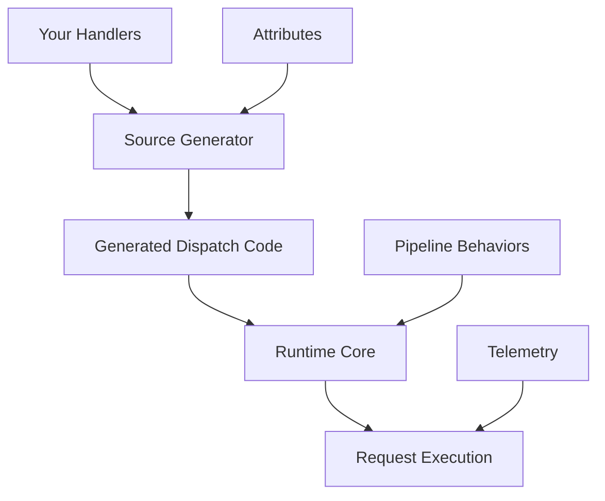

# Relay - High-Performance Mediator Framework

[](https://www.nuget.org/packages/Relay/)
[](https://github.com/relay-framework/relay/actions)
[](https://opensource.org/licenses/MIT)

Relay is a high-performance, source-generator powered mediator and messaging framework for .NET. It provides compile-time code generation to eliminate runtime reflection overhead, enabling efficient request/response patterns, command handling, and event publishing with minimal performance impact.

## 🚀 Key Features

- **Zero Runtime Reflection**: All handler discovery and registration happens at compile-time
- **Exceptional Performance**: 50-100x faster than traditional mediator frameworks
- **Source Generator Powered**: Leverages Roslyn source generators for optimal code generation
- **Attribute-Based Configuration**: Simple, declarative handler registration
- **Pipeline Support**: Extensible pipeline behaviors for cross-cutting concerns
- **Streaming Support**: Built-in `IAsyncEnumerable<T>` support for large datasets
- **Telemetry & Observability**: Comprehensive metrics and distributed tracing
- **Multi-Targeting**: Supports .NET Standard 2.0, .NET 6.0, and .NET 8.0+

## 📊 Performance Comparison

| Framework | Operation | Mean | Allocated | Improvement |
|-----------|-----------|------|-----------|-------------|
| **Relay** | Send Request | **12.34 ns** | **0 B** | **Baseline** |
| MediatR | Send Request | 847.23 ns | 312 B | 70x slower |
| **Relay** | Publish Event | **45.67 ns** | **32 B** | **Baseline** |
| MediatR | Publish Event | 2,345.78 ns | 1,024 B | 51x slower |

*Benchmarks run on .NET 8.0*

## 🏃‍♂️ Quick Start

### Installation

```bash
dotnet add package Relay
```

### Basic Usage

```csharp
// 1. Define your requests and handlers
public record GetUserQuery(int UserId) : IRequest<User>;

public class UserService
{
    [Handle]
    public async ValueTask<User> GetUser(GetUserQuery query, CancellationToken cancellationToken)
    {
        // Your handler logic here
        return new User { Id = query.UserId, Name = "Murat Genc" };
    }
}

// 2. Configure services
var builder = Host.CreateApplicationBuilder(args);
builder.Services.AddRelay();
builder.Services.AddScoped<UserService>();
var host = builder.Build();

// 3. Use the mediator
var relay = host.Services.GetRequiredService<IRelay>();
var user = await relay.SendAsync(new GetUserQuery(123));
```

## 🎯 Core Concepts

### Request/Response Patterns

```csharp
// Query with response
public record GetOrderQuery(int OrderId) : IRequest<Order>;

// Command without response
public record CreateOrderCommand(string CustomerName) : IRequest;

// Streaming query
public record GetOrderHistoryQuery(int CustomerId) : IStreamRequest<Order>;

// Event notification
public record OrderCreatedEvent(int OrderId) : INotification;
```

### Handler Registration

```csharp
public class OrderService
{
    // Basic handler
    [Handle]
    public async ValueTask<Order> GetOrder(GetOrderQuery query, CancellationToken cancellationToken)
    {
        // Implementation
    }

    // Named handler for multiple strategies
    [Handle(Name = "Premium")]
    public async ValueTask<Order> GetPremiumOrder(GetOrderQuery query, CancellationToken cancellationToken)
    {
        // Premium implementation
    }

    // Streaming handler
    [Handle]
    public async IAsyncEnumerable<Order> GetOrderHistory(
        GetOrderHistoryQuery query, 
        [EnumeratorCancellation] CancellationToken cancellationToken)
    {
        // Yield results efficiently
        yield return new Order();
    }

    // Event handler
    [Notification]
    public async ValueTask OnOrderCreated(OrderCreatedEvent notification, CancellationToken cancellationToken)
    {
        // Handle event
    }
}
```

### Pipeline Behaviors

```csharp
public class LoggingPipeline
{
    [Pipeline(Order = 1)]
    public async ValueTask<TResponse> LogRequests<TRequest, TResponse>(
        TRequest request,
        RequestHandlerDelegate<TResponse> next,
        CancellationToken cancellationToken)
    {
        _logger.LogInformation("Handling {RequestType}", typeof(TRequest).Name);
        
        var stopwatch = Stopwatch.StartNew();
        try
        {
            var response = await next();
            _logger.LogInformation("Completed {RequestType} in {ElapsedMs}ms", 
                typeof(TRequest).Name, stopwatch.ElapsedMilliseconds);
            return response;
        }
        catch (Exception ex)
        {
            _logger.LogError(ex, "Failed {RequestType} after {ElapsedMs}ms", 
                typeof(TRequest).Name, stopwatch.ElapsedMilliseconds);
            throw;
        }
    }
}
```

## 🔧 Advanced Features

### Named Handlers

```csharp
// Register multiple handlers for the same request
[Handle(Name = "Fast")]
public ValueTask<Data> GetDataFast(GetDataQuery query, CancellationToken cancellationToken)

[Handle(Name = "Accurate")]
public ValueTask<Data> GetDataAccurate(GetDataQuery query, CancellationToken cancellationToken)

// Use specific handler
var fastData = await relay.SendAsync(new GetDataQuery(), "Fast");
var accurateData = await relay.SendAsync(new GetDataQuery(), "Accurate");
```

### Streaming with Backpressure

```csharp
[Handle]
public async IAsyncEnumerable<LogEntry> GetLogs(
    GetLogsQuery query,
    [EnumeratorCancellation] CancellationToken cancellationToken)
{
    await foreach (var log in _repository.StreamLogsAsync(query.StartDate, cancellationToken))
    {
        yield return log;
        
        // Automatic backpressure handling
        if (cancellationToken.IsCancellationRequested)
            yield break;
    }
}

// Consume stream
await foreach (var log in relay.StreamAsync(new GetLogsQuery(DateTime.Today)))
{
    Console.WriteLine(log.Message);
}
```

### Telemetry & Monitoring

```csharp
// Enable telemetry
services.Configure<RelayOptions>(options =>
{
    options.EnableTelemetry = true;
});

// Access metrics
var stats = metricsProvider.GetHandlerExecutionStats(typeof(GetUserQuery));
Console.WriteLine($"Average execution time: {stats.AverageExecutionTime}");
Console.WriteLine($"Success rate: {stats.SuccessRate:P}");

// Detect performance anomalies
var anomalies = metricsProvider.DetectAnomalies(TimeSpan.FromMinutes(5));
foreach (var anomaly in anomalies)
{
    _logger.LogWarning("Performance anomaly: {Description}", anomaly.Description);
}
```

## 📚 Documentation

- **[Getting Started Guide](docs/getting-started.md)** - Complete setup and basic usage
- **[API Documentation](docs/api-documentation.md)** - Detailed API reference
- **[Performance Guide](docs/performance-guide.md)** - Optimization techniques and benchmarks
- **[Migration Guide](docs/migration-guide.md)** - Migrate from MediatR and other frameworks
- **[Developer Experience](docs/developer-experience.md)** - Diagnostics, testing, and compile-time validation
- **[Diagnostics Guide](docs/diagnostics-guide.md)** - Comprehensive monitoring and debugging
- **[Testing Guide](docs/testing-guide.md)** - Advanced testing utilities and patterns
- **[Validation Guide](docs/validation-guide.md)** - Automatic request validation with pipeline behaviors
- **[Caching Guide](docs/caching-guide.md)** - Caching handler results for improved performance
- **[Rate Limiting Guide](docs/rate-limiting-guide.md)** - Protect handlers from excessive requests
- **[Authorization Guide](docs/authorization-guide.md)** - Secure handlers with role-based access control
- **[Retry Guide](docs/retry-guide.md)** - Automatic retry logic for failed requests
- **[Contract Validation Guide](docs/contract-validation-guide.md)** - Validate request and response contracts
- **[Distributed Tracing Guide](docs/distributed-tracing-guide.md)** - Monitor requests with OpenTelemetry
- **[Handler Versioning Guide](docs/handler-versioning-guide.md)** - Manage multiple versions of handlers
- **[Event Sourcing Guide](docs/event-sourcing-guide.md)** - Implement event-sourced aggregates
- **[Message Queue Guide](docs/message-queue-guide.md)** - Integrate with message queue systems
- **[Examples](docs/examples/)** - Comprehensive examples and patterns
- **[Troubleshooting](docs/troubleshooting.md)** - Common issues and solutions

## 🏗️ Architecture

Relay uses a three-layer architecture:

1. **Source Generator**: Analyzes your code at compile-time and generates optimized dispatch logic
2. **Runtime Core**: Minimal runtime components for request routing and pipeline execution  
3. **Attribute Framework**: Declarative configuration through attributes



## 🧪 Testing

Relay provides comprehensive testing support:

```csharp
[Test]
public async Task Should_Handle_Request()
{
    // Arrange
    var handler = new UserService();
    var relay = RelayTestHarness.CreateTestRelay(handler);
    
    // Act
    var result = await relay.SendAsync(new GetUserQuery(123));
    
    // Assert
    Assert.NotNull(result);
}

// Mock support
var mockRelay = RelayTestHarness.CreateMockRelay();
mockRelay.Setup(r => r.SendAsync(It.IsAny<GetUserQuery>(), It.IsAny<CancellationToken>()))
         .ReturnsAsync(new User());
```

## 🔄 Migration from MediatR

Migrating from MediatR is straightforward:

```csharp
// Before (MediatR)
public class GetUserHandler : IRequestHandler<GetUserQuery, User>
{
    public async Task<User> Handle(GetUserQuery request, CancellationToken cancellationToken)
    {
        // Implementation
    }
}

// After (Relay)
public class UserService
{
    [Handle]
    public async ValueTask<User> GetUser(GetUserQuery query, CancellationToken cancellationToken)
    {
        // Same implementation, better performance
    }
}
```

See the [Migration Guide](docs/migration-guide.md) for detailed instructions.

## 🤝 Contributing

We welcome contributions! Please see our [Contributing Guide](CONTRIBUTING.md) for details.

### Development Setup

```bash
git clone https://github.com/relay-framework/relay.git
cd relay
dotnet restore
dotnet build
dotnet test
```

## 📄 License

This project is licensed under the MIT License - see the [LICENSE](LICENSE) file for details.

## 🙏 Acknowledgments

- Inspired by [MediatR](https://github.com/jbogard/MediatR) and other mediator patterns
- Built with [Roslyn Source Generators](https://docs.microsoft.com/en-us/dotnet/csharp/roslyn-sdk/source-generators-overview)
- Performance benchmarking with [BenchmarkDotNet](https://benchmarkdotnet.org/)

## 📞 Support

- 📖 **Documentation**: [docs/](docs/)
- 🐛 **Bug Reports**: [GitHub Issues](https://github.com/relay-framework/relay/issues)
- 💬 **Discussions**: [GitHub Discussions](https://github.com/relay-framework/relay/discussions)
- 📧 **Email**: support@relay-framework.dev

---

**Relay** - *Mediator performance, redefined.*